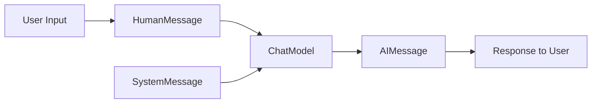

# ChatModels

In LangChain, **ChatModels** are abstractions over large language models that are optimized for conversational use cases. Instead of working only with plain text prompts, ChatModels handle structured conversational inputs such as a series of user and assistant messages. This allows us to build richer, more interactive applications like chatbots, assistants, and dialogue-based systems.

ChatModels differ from regular LLMs in that they expect and return **message objects**, not just strings. These message objects give us more control over how context is preserved and managed.

## Core Concepts of ChatModels

### What ChatModels are

ChatModels wrap around LLMs but use a structured format. Each conversational exchange is represented as a sequence of messages. Messages can belong to different roles such as:

- **System** – defines behavior or context for the assistant.
- **User** – represents human inputs.
- **Assistant** – represents model responses.
- **AI / Function / Tool** – used when integrating with external systems.

### Why ChatModels matter

- They allow multi-turn conversations with structured memory.
- They enable role-specific prompting (system vs user vs assistant).
- They integrate seamlessly with Chains and Agents for conversational AI.

## ChatMessage Abstraction

In LangChain, each message is represented as a `BaseMessage`. Common message types include:

- `SystemMessage` – defines global instructions.
- `HumanMessage` – carries user queries.
- `AIMessage` – carries model replies.

```python
from langchain.schema import SystemMessage, HumanMessage, AIMessage

messages = [
    SystemMessage(content="You are a helpful assistant."),
    HumanMessage(content="Who won the FIFA World Cup in 2018?"),
    AIMessage(content="France won the FIFA World Cup in 2018.")
]
```

This structure is richer than plain strings and lets us encode context more clearly.

## Flow of ChatModels

We can visualize how ChatModels process input and generate output:

<div style={{textAlign: 'center'}}>



</div>

Here:

- A user input is wrapped into a `HumanMessage`.
- Context/instructions come from `SystemMessage`.
- The ChatModel processes everything.
- It returns an `AIMessage`.

## Using ChatModels

A simple usage example with OpenAI’s `gpt-3.5-turbo` (via LangChain):

```python
from langchain_openai import ChatOpenAI
from langchain.schema import HumanMessage, SystemMessage

chat = ChatOpenAI(temperature=0)

messages = [
    SystemMessage(content="You are a wise mentor."),
    HumanMessage(content="Explain recursion in simple terms.")
]

response = chat.invoke(messages)
print(response.content)
```

Output could be:

```text
Recursion is when a function calls itself to solve smaller versions of a problem until it reaches a base case.
```

## Streaming with ChatModels

One advantage of ChatModels is that they can stream responses token by token. This is useful for real-time applications like chat interfaces.

```python
for chunk in chat.stream(messages):
    print(chunk.content, end="")
```

This lets us display responses as they are generated instead of waiting for completion.

## ChatModels in Chains

We can combine ChatModels with **PromptTemplates** and Chains to create more structured workflows. For example, wrapping a prompt inside a conversational flow:

```python
from langchain.prompts import ChatPromptTemplate
from langchain.chains import LLMChain

prompt = ChatPromptTemplate.from_messages([
    ("system", "You are a creative assistant."),
    ("human", "Suggest three taglines for a {product}.")
])

chat_model = ChatOpenAI(temperature=0.7)
chain = LLMChain(llm=chat_model, prompt=prompt)

result = chain.run(product="eco-friendly water bottle")
print(result)
```

This generates a conversational output where the assistant role is automatically handled.

## Benefits of ChatModels

- **Role-based messaging** – clear distinction between system, user, and assistant inputs.
- **Structured conversations** – better for multi-turn dialogue.
- **Streaming support** – suitable for interactive apps.
- **Integration with Chains and Agents** – ideal for complex conversational workflows.
- **Consistency** – ensures prompts are more predictable and context-aware.
