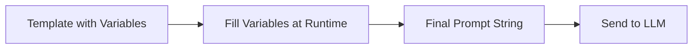
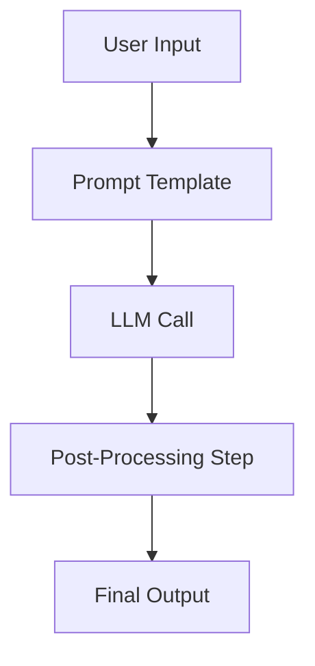

# LangChain Fundamentals

## Prompt Templates

Prompt templates are a fundamental building block in LangChain. They allow developers to define reusable prompts with variables that can be dynamically filled at runtime. Instead of hardcoding prompts as plain strings, prompt templates make the process structured, maintainable, and easier to integrate into applications.

For example, a template could be:

```text
Translate the following text into French: {text}
```

When executed with `{text="Hello, how are you?"}`, the final prompt becomes:

```text
Translate the following text into French: Hello, how are you?
```

Prompt templates improve consistency, reduce errors, and support scaling applications where prompts need to be reused in different contexts.

<div style={{textAlign: 'center'}}>



</div>

## ChatModels

ChatModels are LLMs designed specifically for multi-turn conversations. Unlike base LLMs that take and return plain text, ChatModels handle structured input in the form of messages. Each message has a role (system, user, assistant) and content.

This design makes ChatModels more powerful for tasks requiring context, instruction-following, and back-and-forth interactions.

Example message structure:

```python
[
    {"role": "system", "content": "You are a helpful assistant."},
    {"role": "user", "content": "What is LangChain?"},
    {"role": "assistant", "content": "LangChain is a framework for building LLM applications."}
]
```

Key advantages:

- Better handling of context across multiple turns
- Explicit role separation for instruction vs. query vs. response
- Useful in building chatbots, customer support systems, and virtual assistants

## Chains

Chains are sequences of steps where outputs from one component are fed into the next. They allow combining LLM calls, prompt templates, and external tools into a workflow.

For example, a chain could:

1. Take user input
2. Fill it into a prompt template
3. Send it to an LLM
4. Post-process the result (e.g., parse JSON, store in a database)

<div style={{textAlign: 'center'}}>



</div>

Chains can be:

- Simple: one prompt template + one model call
- Complex: multiple steps, tools, memory, and branching logic

They are essential for building multi-step reasoning pipelines, where the model output guides the next step in the process.

## Sample code: Summarization using LangChain

Below is a minimal example showing how to use Prompt Templates, ChatModels, and Chains together to perform text summarization.

```python
from langchain_openai import ChatOpenAI
from langchain.prompts import PromptTemplate
from langchain.chains import LLMChain

# Step 1: Define the prompt template
template = """
Summarize the following text in 2-3 sentences:
{text}
"""
prompt = PromptTemplate(template=template, input_variables=["text"])

# Step 2: Load a chat model
chat_model = ChatOpenAI(model="gpt-3.5-turbo", temperature=0)

# Step 3: Create a chain combining prompt and model
summarization_chain = LLMChain(llm=chat_model, prompt=prompt)

# Step 4: Provide input text
input_text = """
LangChain is an open-source framework that helps developers build applications using large language models.
It provides abstractions for prompts, chains, agents, and memory, making it easier to create advanced AI systems.
LangChain is widely used for chatbots, question answering, document analysis, and workflow automation.
"""

# Step 5: Run the chain
summary = summarization_chain.run({"text": input_text})
print(summary)
```

### Explanation of the workflow

1. **PromptTemplate** defines the summarization task with a variable `{text}`.
2. **ChatOpenAI** loads the chat model (GPT-3.5 in this case).
3. **LLMChain** connects the prompt with the model, forming a simple chain.
4. The input text is passed into the chain.
5. The model processes the filled-in prompt and returns a concise summary.
