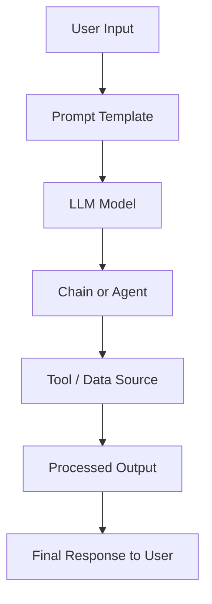

# Introduction to LangChain

LangChain is an open-source framework designed to simplify the development of applications powered by large language models (LLMs). It provides tools and abstractions that allow developers to connect LLMs with external data sources, integrate reasoning steps, and orchestrate complex workflows. The goal of LangChain is to make LLMs not just text generators but useful agents capable of performing tasks, answering questions, and making decisions in real-world applications.

## Core idea of LangChain

At its heart, LangChain is built on the concept of chaining different components together. Each chain may involve LLM calls, data retrieval, and decision-making steps. This modular approach makes it easier to build and extend advanced AI applications.

<div style={{textAlign: 'center'}}>



</div>

## Key components of LangChain

- Models: The foundation, including LLMs, chat models, and embeddings.
- Prompts: Templates and structures that shape how queries are asked to the LLM.
- Chains: Sequences of calls (LLMs, APIs, tools) combined together for multi-step workflows.
- Agents: Decision-making entities that use LLMs to select which tools or steps to execute dynamically.
- Memory: A mechanism to give applications context persistence, allowing them to handle conversations and maintain state.
- Tools and Integrations: External APIs, databases, knowledge bases, or other services that can be plugged in.

## Use cases of LangChain

- Question Answering: Connecting an LLM with a knowledge base (like a vector database) to provide accurate answers from custom data.
- Conversational Agents: Building chatbots with memory that can maintain context across sessions.
- Data Augmented Generation: Combining LLMs with structured or unstructured data sources (SQL databases, APIs, documents) for richer responses.
- Autonomous Agents: Creating agents that can plan tasks, choose the right tools, and execute them in a loop until the goal is met.
- Document Analysis: Summarization, semantic search, and Q\&A over large sets of documents.
- Workflow Automation: Designing pipelines where multiple steps (API calls, calculations, LLM reasoning) are chained together.

## LangChain in practice

LangChain is widely used in research, startups, and enterprises because it abstracts away the complexity of integrating LLMs into practical systems while offering flexibility for customization.

## Hello World code in LangChain

The simplest way to get started with LangChain is to run a “Hello World” example that sends a prompt to an LLM and returns the response.

Here’s a Python example using `langchain` and OpenAI:

```python
from langchain_openai import OpenAI

# Initialize the model
llm = OpenAI(model="gpt-3.5-turbo", temperature=0)

# Run a simple prompt
response = llm.invoke("Hello, world!")
print(response)
```

### Explanation

- The `OpenAI` class loads the LLM model (here `gpt-3.5-turbo`).
- `temperature=0` ensures deterministic output.
- `llm.invoke()` sends the prompt `"Hello, world!"` to the model and returns its response.

This is the most basic way to interact with LangChain. From here, developers can extend the example by adding prompt templates, chaining multiple calls, connecting with tools, and enabling memory for contextual conversations.
