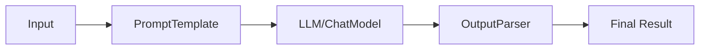

# LCEL

LangChain Expression Language (LCEL) is a declarative way to compose, configure, and run LangChain components. Instead of manually wiring models, prompts, and chains using imperative Python code, LCEL provides a functional and compositional interface. This makes it easier to build, debug, and maintain pipelines that include multiple steps such as prompts, LLMs, retrievers, and custom transformations.

LCEL emphasizes **composability**, **clarity**, and **reusability**, enabling us to express workflows in a simple yet powerful manner.

## Core Concepts of LCEL

### What LCEL is

LCEL provides a unified API that allows us to:

- Chain together prompts, LLMs, retrievers, and output parsers.
- Treat components as composable units.
- Execute workflows with a single `.invoke()`, `.batch()`, or `.stream()` call.

### Why LCEL matters

- It standardizes how we compose pipelines.
- It provides a consistent interface across components.
- It supports both synchronous and asynchronous execution.
- It enables structured debugging by inspecting intermediate states.

## Flow of LCEL

LCEL structures workflows into a pipeline where data flows between components.

<div style={{textAlign: 'center'}}>



</div>

This shows that inputs go into a prompt, then to an LLM, then through an output parser, and finally return as structured results.

## Basic LCEL Example

A simple LCEL pipeline looks like this:

```python
from langchain.prompts import ChatPromptTemplate
from langchain_openai import ChatOpenAI
from langchain.schema import StrOutputParser

# Define a prompt
prompt = ChatPromptTemplate.from_template("Tell me a joke about {topic}")

# Define a model
model = ChatOpenAI(temperature=0)

# Define an output parser
parser = StrOutputParser()

# Compose them into a pipeline
chain = prompt | model | parser

# Run the pipeline
result = chain.invoke({"topic": "programmers"})
print(result)
```

Here:

- `prompt` creates the message structure.
- `model` generates a response.
- `parser` extracts plain text output.
- `|` operator chains everything together.

## Invoking Pipelines

LCEL pipelines can be executed in multiple ways:

- **Single input**

```python
chain.invoke({"topic": "AI"})
```

- **Batch inputs**

```python
chain.batch([{"topic": "AI"}, {"topic": "Python"}])
```

- **Streaming**

```python
for chunk in chain.stream({"topic": "startups"}):
    print(chunk, end="")
```

This flexibility allows LCEL to adapt to different workloads.

## Example of Text Summarization with LCEL

Below is how we can rewrite a summarization task using LCEL.

```python
from langchain_openai import ChatOpenAI
from langchain.prompts import ChatPromptTemplate
from langchain.schema import StrOutputParser

# Step 1: Define the prompt
prompt = ChatPromptTemplate.from_template(
    "Summarize the following text in 2-3 sentences:\n{text}"
)

# Step 2: Load the chat model
chat_model = ChatOpenAI(model="gpt-3.5-turbo", temperature=0)

# Step 3: Define output parser
parser = StrOutputParser()

# Step 4: Build the LCEL chain
summarization_chain = prompt | chat_model | parser

# Step 5: Provide input text
input_text = """
LangChain is an open-source framework that helps developers build applications using large language models.
It provides abstractions for prompts, chains, agents, and memory, making it easier to create advanced AI systems.
LangChain is widely used for chatbots, question answering, document analysis, and workflow automation.
"""

# Step 6: Run the chain
summary = summarization_chain.invoke({"text": input_text})
print(summary)
```

This achieves the same functionality as the non-LCEL approach but with a cleaner, more composable pipeline.

## Composition in LCEL

LCEL supports functional composition, which means we can create complex pipelines by joining smaller ones.

For example:

```python
# Sub-pipeline: question rewriter
rewrite_prompt = ChatPromptTemplate.from_template("Rephrase the question: {question}")
rewrite_chain = rewrite_prompt | chat_model | StrOutputParser()

# Sub-pipeline: answer generator
answer_prompt = ChatPromptTemplate.from_template("Answer the question: {question}")
answer_chain = answer_prompt | chat_model | StrOutputParser()

# Router-style composition
def choose_chain(inputs):
    if "rephrase" in inputs["mode"]:
        return rewrite_chain
    return answer_chain
```

This makes LCEL more expressive than just sequential pipelines.

## Example with Retrieval

We can combine LCEL with a retriever to create a Retrieval-Augmented Generation (RAG) pipeline.

```python
from langchain.vectorstores import FAISS

# Assume retriever is already set up
retriever = FAISS.load_local("my_index").as_retriever()

# Prompt
rag_prompt = ChatPromptTemplate.from_template(
    "Answer the question based on context:\n{context}\n\nQuestion: {question}"
)

# Build pipeline
rag_chain = {"context": retriever, "question": lambda x: x["question"]} | rag_prompt | chat_model | StrOutputParser()

result = rag_chain.invoke({"question": "What is LangChain?"})
print(result)
```

Here we route `question` to both the retriever and the prompt, and then compose everything with LCEL.

## Benefits of LCEL

- **Declarative syntax** – pipelines are defined clearly using `|`.
- **Composability** – smaller chains can be combined into larger workflows.
- **Consistency** – the same interface for prompts, models, and tools.
- **Flexibility** – supports invoke, batch, and streaming modes.
- **Debugging** – easier to inspect intermediate results.
