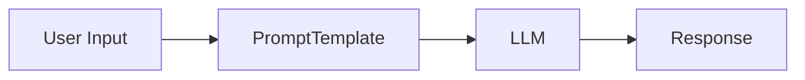

# PromptTemplates

In LangChain, `PromptTemplate` is the building block that helps us structure and manage prompts effectively. Instead of writing static strings, we can create dynamic prompts where placeholders are filled with data at runtime. This makes our applications flexible, reusable, and easier to maintain.

A `PromptTemplate` is particularly useful when we need to build prompts that require multiple inputs, serialization, or integration across different components of a system.

## Core Concepts of PromptTemplates

### Purpose of PromptTemplates

- They separate the **prompt text** from the **data** that goes into it.
- They ensure consistency and clarity across multiple LLM calls.
- They help in debugging and testing since the prompt logic is structured.

### Difference from simple string formatting

While we could directly use Python string formatting, LangChain provides additional features:

- Validation of required input variables.
- Integration with chains, agents, and memory.
- Easier serialization and storage in JSON/YAML for deployment.

## Input Variables

A `PromptTemplate` works on the concept of **input variables**. These are placeholders defined in the template and later replaced with real values when generating prompts.

For example:

```python
from langchain.prompts import PromptTemplate

template = "Translate the following {language} text to English:\n\n{text}"
prompt = PromptTemplate(
    input_variables=["language", "text"],
    template=template
)

final_prompt = prompt.format(language="French", text="Bonjour le monde")
print(final_prompt)
```

Output:

```text
Translate the following French text to English:

Bonjour le monde
```

Here:

- `language` and `text` are input variables.
- The `format` method injects the actual values.

## Reusability and Modularity

We often use the same prompt structure for multiple use cases. By defining a template once, we can pass different inputs without rewriting the entire prompt. This is critical when building larger applications such as chatbots, retrieval-augmented generation systems, or custom agents.

## PromptTemplates in Chains

When we use LangChain **Chains**, the `PromptTemplate` acts as the first step. It ensures that our LLM always receives a well-structured prompt.

<div style={{textAlign: 'center'}}>



</div>

This shows that raw user input goes into the template, which then gets passed to the LLM, producing the final response.

## Partial PromptTemplates

Sometimes, we want to fix part of the prompt and leave other parts dynamic. LangChain allows us to **partially format** a template.

```python
template = "Write a {tone} poem about {topic}"
prompt = PromptTemplate(
    input_variables=["tone", "topic"],
    template=template
)

# Fix tone as "funny"
partial_prompt = prompt.partial(tone="funny")

final_prompt = partial_prompt.format(topic="programming")
print(final_prompt)
```

Output:

```text
Write a funny poem about programming
```

This allows us to reuse prompts with preset context while leaving flexibility for the rest.

## Serialization and Storage

`PromptTemplate` can be easily serialized to and from dictionaries or JSON. This is useful when we want to store prompt definitions outside our codebase and load them dynamically.

```python
prompt = PromptTemplate.from_template("Tell me a joke about {subject}")
print(prompt.dict())
```

Output:

```json
{
  "input_variables": ["subject"],
  "template": "Tell me a joke about {subject}"
}
```

This enables portability and easier integration into larger systems.

## Example of PromptTemplate with an LLM

A full example of using `PromptTemplate` in a chain:

```python
from langchain.prompts import PromptTemplate
from langchain.chains import LLMChain
from langchain_openai import OpenAI

llm = OpenAI(temperature=0)

template = "What is a good name for a company that makes {product}?"
prompt = PromptTemplate(
    input_variables=["product"],
    template=template
)

chain = LLMChain(llm=llm, prompt=prompt)

result = chain.run(product="colorful socks")
print(result)
```

Here:

1. The `PromptTemplate` defines the structure.
2. The LLMChain binds it with a model.
3. We run the chain with a product input.

## Key Benefits of PromptTemplates

- **Consistency** – same structure for multiple LLM calls.
- **Reusability** – define once, use everywhere.
- **Validation** – ensures all required variables are provided.
- **Integration** – fits neatly into Chains, Agents, and memory systems.
- **Portability** – easy to serialize and share.
