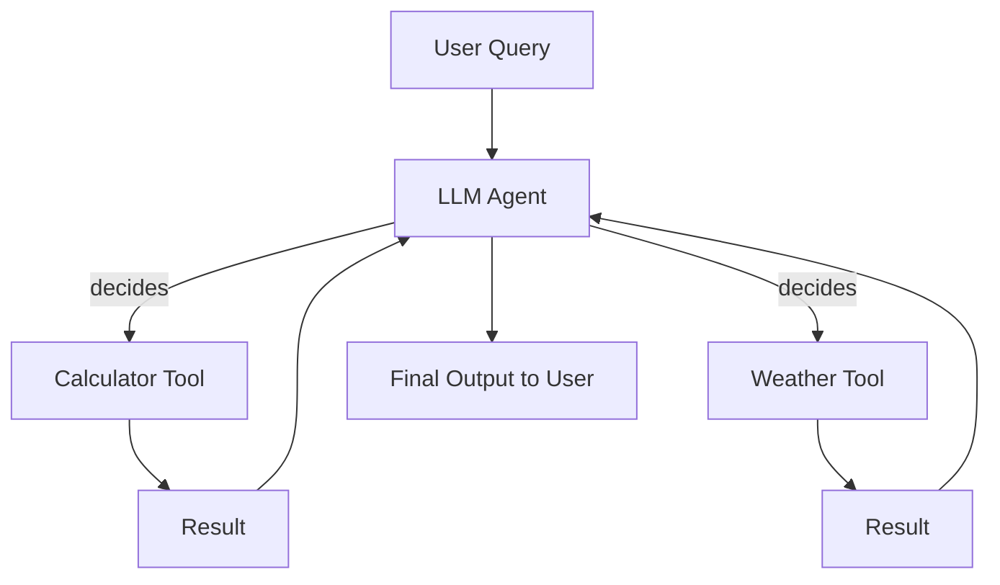

# Tools

LangChain **Tools** are abstractions that represent **external capabilities or APIs** that a language model can call to perform specific actions. These tools allow us to extend an LLM’s abilities beyond text generation, enabling it to interact with external systems like calculators, databases, APIs, or custom functions.

## Core Concepts of Tools

1. **Purpose**
   Tools provide a way for an LLM to:

   - Access structured functionality.
   - Operate on external data sources.
   - Make its outputs actionable beyond generating text.

2. **Components of a Tool**
   A typical LangChain `Tool` has the following components:

   - `name`: Identifier of the tool.
   - `func`: The function that executes the tool’s logic.
   - `description`: Explains to the LLM when and why to use the tool.

   Example:

   ```python
   from langchain.tools import Tool

   def calculator_fn(query: str) -> str:
       return str(eval(query))  # simple calculator

   calculator_tool = Tool(
       name="Calculator",
       func=calculator_fn,
       description="Use this tool to perform arithmetic calculations."
   )
   ```

3. **How Tools Work**

   - The agent receives a user query.
   - The agent decides which tool to use based on the query and the tool's description.
   - The tool executes and returns results to the agent.
   - The agent formats and returns the final output to the user.

## Multi-tool Agents

A **Multi-tool Agent** is an agent configured with multiple tools. It can dynamically choose **the right tool** depending on the user query, essentially acting as a **router between multiple capabilities**.

### Key Concepts

1. **Decision Making**

   - Multi-tool agents use **LLMs as controllers**.
   - The LLM decides which tool to call based on the input query.
   - Example scenario: A user asks a math question or a weather question. The agent selects between `Calculator` and `Weather API` tools.

2. **Agent Types**
   LangChain provides **agent frameworks** like:

   - `initialize_agent`: For creating multi-tool agents with specific LLMs.
   - `AgentType.ZERO_SHOT_REACT_DESCRIPTION`: The agent uses descriptions to decide which tool to call.

3. **Workflow Diagram**

<div style={{textAlign: 'center'}}>



</div>

This diagram illustrates the agent receiving a query, deciding the right tool, calling it, and sending the result back to the user.

### Setting up a Multi-tool Agent

1. **Define Tools**

   ```python
   from langchain.tools import Tool

   def add_numbers(a: int, b: int) -> str:
       return str(a + b)

   def get_weather(location: str) -> str:
       return f"Weather in {location} is sunny"  # placeholder for real API call

   add_tool = Tool(
       name="Addition",
       func=add_numbers,
       description="Use this tool to add two numbers together."
   )

   weather_tool = Tool(
       name="Weather",
       func=get_weather,
       description="Use this tool to get the current weather for a given location."
   )

   tools = [add_tool, weather_tool]
   ```

2. **Initialize the Agent**

   ```python
   from langchain.chat_models import ChatOpenAI
   from langchain.agents import initialize_agent, AgentType

   llm = ChatOpenAI(model="gpt-4", temperature=0)

   agent = initialize_agent(
       tools=tools,
       llm=llm,
       agent=AgentType.ZERO_SHOT_REACT_DESCRIPTION,
       verbose=True
   )
   ```

3. **Running Queries**

   ```python
   query1 = "Add 12 and 30"
   query2 = "What's the weather in Berlin?"

   print(agent.run(query1))  # Output: 42
   print(agent.run(query2))  # Output: Weather in Berlin is sunny
   ```

### Advantages of Multi-tool Agents

1. **Modularity**: New tools can be added without changing the agent logic.
2. **Scalability**: Handles a wide range of queries by delegating to specialized tools.
3. **Maintainability**: Each tool is self-contained.
4. **Intelligence**: LLM decides dynamically which tool is best suited.

### Best Practices

1. **Clear Tool Descriptions**: Ensure each tool has an explicit description so the LLM can understand when to use it.
2. **Limit Scope**: Avoid making one tool do everything; small, focused tools improve accuracy.
3. **Logging**: Track which tool is called for debugging and auditing.
4. **Error Handling**: Ensure tools handle exceptions gracefully to prevent agent failures.

### Example: Multi-tool Agent with Python + API

```python
def fetch_joke(topic: str) -> str:
    import requests
    response = requests.get(f"https://api.chucknorris.io/jokes/random?category={topic}")
    return response.json().get("value", "No joke found")

joke_tool = Tool(
    name="JokeFetcher",
    func=fetch_joke,
    description="Use this tool to fetch a joke about a specific topic."
)

tools.append(joke_tool)

# Re-initialize agent with the new tool
agent = initialize_agent(tools, llm, agent=AgentType.ZERO_SHOT_REACT_DESCRIPTION, verbose=True)

agent.run("Tell me a programming joke")  # LLM will call JokeFetcher tool
```
