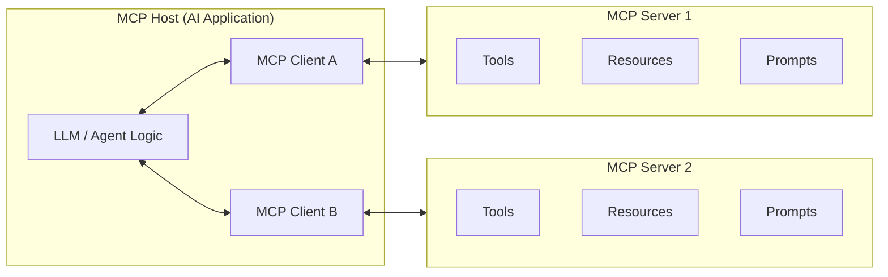
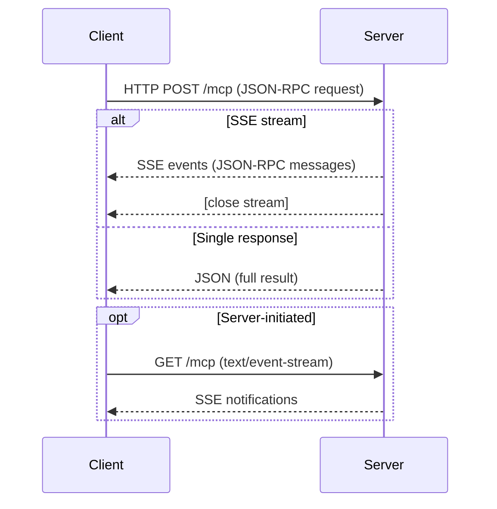
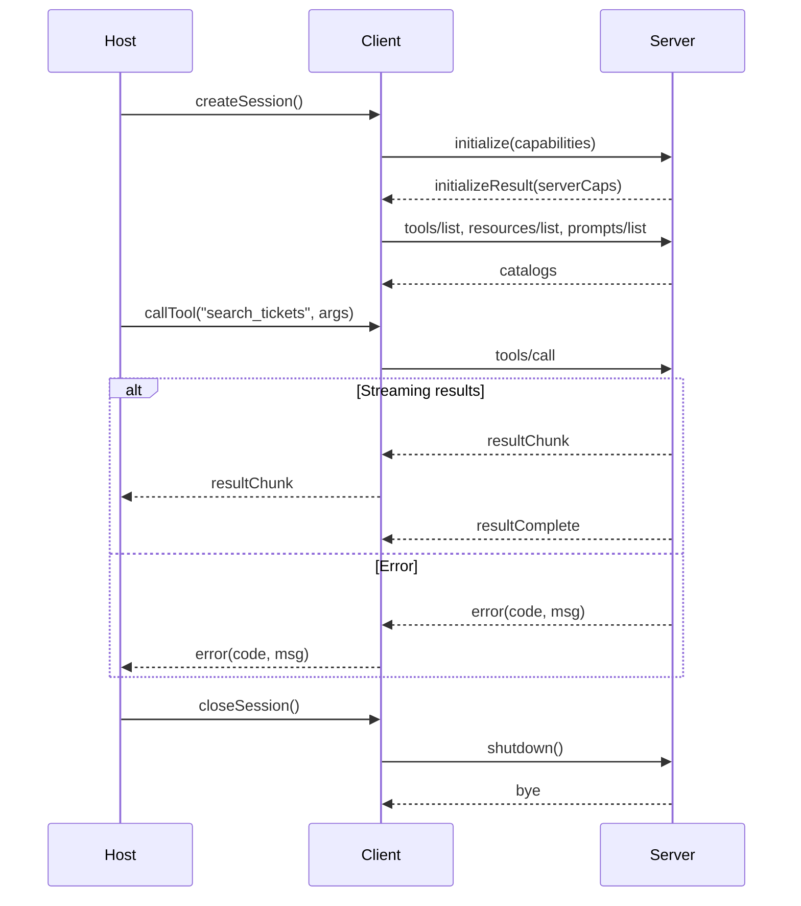
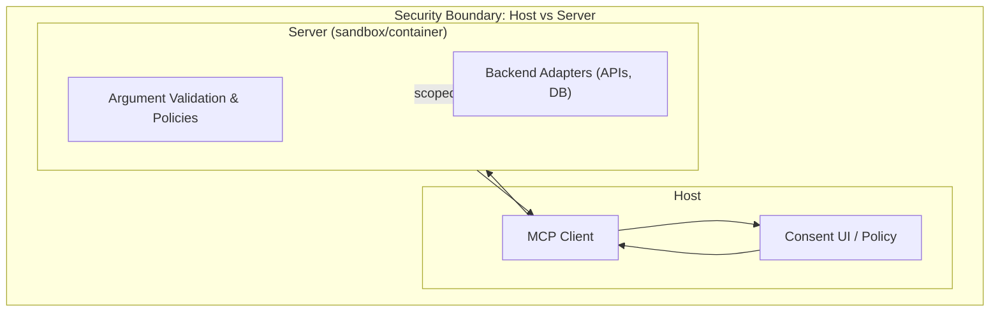

# Architecture

The Model Context Protocol (MCP) is an open, standardized protocol for integrating AI applications with external tools, data sources, and workflows in a secure, discoverable, and extensible way. MCP is designed to work across multiple transport mechanisms and follows a layered architecture, separating message semantics from transport.

## Core Architectural Roles

MCP defines three main participants:

### Host

- The AI application that orchestrates interaction with the model and end-user.
- Examples: chatbot, IDE extension, CLI interface, or any LLM-enabled application.
- Manages multiple Clients, each connected to a different Server.
- Responsible for presenting capabilities, managing permissions, and deciding which Client/Server to call for a request.

### Client

- Lives inside or alongside the Host.
- Maintains a 1:1 connection with a specific Server.
- Handles session management, message routing, error handling, and transport (STDIO, HTTP, SSE).
- A Host can have multiple Clients to talk to multiple Servers simultaneously.

### Server

- A separate process or service that exposes capabilities in MCP format.
- Implements capability discovery and execution.
- Three main capability types:
  - Tools: Executable actions (e.g., `create_ticket`, `run_query`).
  - Resources: Read-only data sources (e.g., files, DB rows, API endpoints).
  - Prompts: Parameterized templates for structured model input.

## MCP Layers

MCP separates what is communicated from how it is transported.

### Data Layer

- Protocol: JSON-RPC 2.0 over a chosen transport.
- Capabilities: request/response, notifications, streaming, cancellation, error codes.
- Key concept: Same message format works across all transports.

### Transport Layer

- Defines how JSON-RPC messages are exchanged.
- Standard transports: STDIO (local), Streamable HTTP (remote).
- Custom transports are possible but must preserve data layer semantics.

## Communication Mechanisms

### STDIO Transport

- Client spawns Server as a subprocess.
- Client writes JSON-RPC messages to Server’s stdin; Server writes responses to stdout; stderr is for logs/errors.
- Use for local integrations; fastest and simplest transport.

### Streamable HTTP Transport

- Client sends JSON-RPC requests via HTTP POST /mcp.
- Responses can be standard JSON or SSE stream for partial results.
- Security: validate Origin headers, bind to localhost for local usage, require authentication for remote usage.

## Capabilities

### Tools

- Executable actions the model can invoke.
- Defined with name, input schema, description.

### Resources

- Read-only references to data.
- Accessed via `resources/list` and `resources/read`.
- Often paginated or streamed.

### Prompts

- Parameterized text templates for structured requests.
- Accessed via `prompts/list` and `prompts/get`.

## Session Lifecycle

Defines the full flow of interaction between a Client and a Server:

1. **Session Creation**: Host requests capability, Client creates session, establishes transport.
2. **Initialization**: Client sends `initialize` request; Server responds with capabilities and metadata.
3. **Discovery**: Client queries available capabilities (`tools/list`, `resources/list`, `prompts/list`).
4. **Execution**: Host selects capability, Client sends MCP request, Server returns result or error.
5. **Streaming Results**: Server sends partial chunks if streaming, final message signals end.
6. **Error Handling**: Server responds with structured error code/message.
7. **Teardown**: Host signals end of session, Server cleans up and closes connection.

## Security & Isolation

- Servers run in separate processes or containers.
- Only required capabilities exposed (least privilege).
- Server enforces input schemas and manages backend credentials.
- Host presents permissions/consent before access.

## Key Points

- **Host**: Orchestrator, user-facing.
- **Client**: Session & transport manager.
- **Server**: Capability provider.
- **Transports**: STDIO (local) or Streamable HTTP (remote).
- **Protocol**: JSON-RPC 2.0 with streaming and error handling.
- **Security**: Sandbox isolation, explicit capability listing, auth control.
