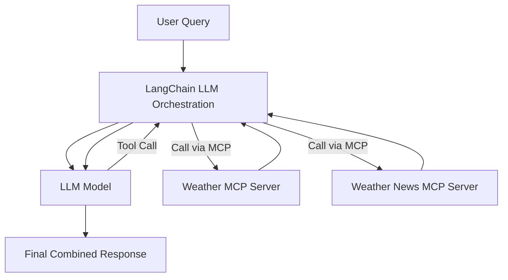
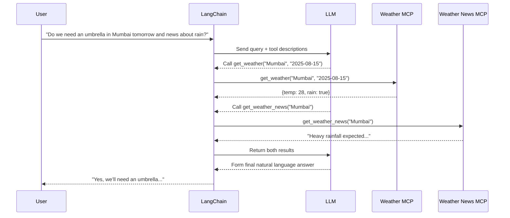

# LangChain

This note explains how LangChain can be used with MCP servers, using a Weather + Weather News example, and provides a technical overview with diagrams.

## Introduction to LangChain

LangChain is a framework that helps Large Language Models (LLMs) interact with external data sources, tools, and APIs in a structured way. Its main functions are:

- Wrapping APIs/tools so LLMs can understand and call them.
- Deciding which tool to call and when, based on user requests.
- Orchestrating multi-step reasoning so LLMs can chain different tool calls together.

Without LangChain, an LLM would need a custom integration for every API. With LangChain, we can register APIs (including MCP servers) as "tools," describe what they do, and let LangChain handle tool selection, argument parsing, and result formatting.

## MCP Recap

MCP (Model Context Protocol) is a protocol that allows us to create servers exposing capabilities (e.g., `get_weather`, `get_weather_news`) with metadata so an LLM knows:

- What functions exist
- What parameters they take
- What they return

When we connect an MCP server to an LLM, the LLM can directly call those MCP tools.

## Where LangChain Fits

If we have multiple MCP servers or want more control and reasoning, LangChain acts as:

1. A middle layer between the LLM and MCP servers.
2. A tool manager — it registers MCP functions as LangChain tools.
3. An orchestrator — if a query needs multiple calls, LangChain figures that out.

## Example: Weather + Weather News

**We have:**

- Weather MCP Server: `get_weather(city, date)` → Returns temperature and rain status.
- Weather News MCP Server: `get_weather_news(city)` → Returns latest rain-related news.

**User query:**

> Do we need an umbrella in Mumbai tomorrow and what’s the latest news about the rain?

## How LangChain Handles It

### Step-by-Step Flow

1. **User Input → LangChain LLM Chain**
   - LangChain sends the user’s query to the LLM with a system prompt listing all tools from both MCP servers.
2. **LLM Decides Tools to Call**
   - The LLM parses the query and decides:
     - Call `get_weather("Mumbai", "2025-08-15")` to check rain.
     - Call `get_weather_news("Mumbai")` for latest news.
3. **LangChain Executes Calls**
   - LangChain uses its registered tool definitions to call the Weather MCP Server and the Weather News MCP Server.
4. **Results Returned**
   - Weather MCP → `{ "temp": 28, "rain": true }`
   - News MCP → `"Heavy rainfall expected in Mumbai tomorrow…"`
5. **LLM Final Response**
   - LangChain passes both results back to the LLM, which combines them into a natural response:
     > Yes, we’ll need an umbrella tomorrow in Mumbai. Heavy rainfall is expected according to the latest news.

## Under the Hood

LangChain internally does:

- **Tool Registration:**

  ```python
  from langchain.tools import Tool

  Tool(
      name="get_weather",
      func=get_weather_from_mcp,
      description="Get temperature and rain status for a city and date."
  )
  ```

  It wraps the MCP API so the LLM can call it.

- **Prompt Engineering:**
  It generates a system message like:

  ```text
  We are an assistant with access to the following tools:
  1. get_weather(city, date) → Get temperature and rain status.
  2. get_weather_news(city) → Get latest weather news.
  ```

- **Tool Selection:**
  The LLM uses few-shot examples and descriptions to choose the right tool.

- **Execution Orchestration:**
  LangChain intercepts the tool call JSON, executes it, and returns the result to the LLM for the next step.

## Architecture Diagram



## Detailed Flow Diagram



## Why LangChain is Useful with MCP

- Combines multiple MCP servers without writing glue code.
- Multi-step reasoning — LLM can call tools in sequence.
- Consistent interface — MCP just becomes another “tool source.”
- Easy to swap LLMs — LangChain works with OpenAI, Anthropic, etc.
- Extra features — logging, retries, parallel calls, caching.
