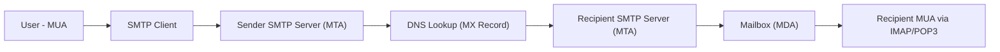
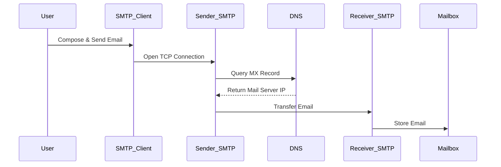
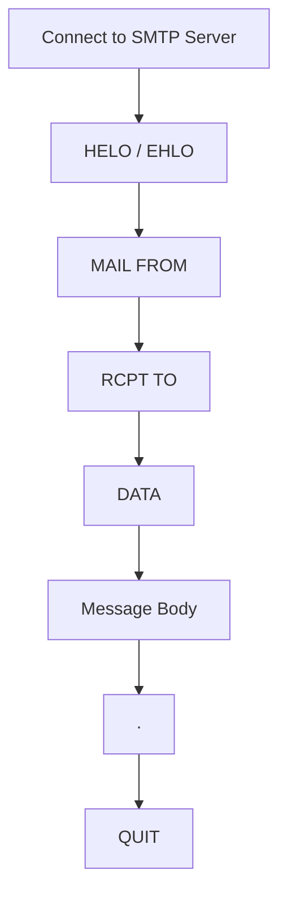
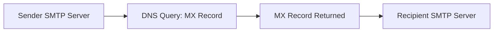

# SMTP

:::tip[Status]

This note is complete, reviewed, and considered stable.

:::

**SMTP (Simple Mail Transfer Protocol)** is an **application-layer protocol** used for **sending and relaying emails across networks**.

* Works on top of **TCP**
* Default port: **25** (server-to-server), **587** (submission)
* It is a **push protocol** (used to send emails, not retrieve)

Important distinction:

* **SMTP → Sending emails**
* **IMAP / POP3 → Retrieving emails**

SMTP defines:

* Message transfer rules
* Command/response format
* Mail routing between servers

## High-Level Architecture

SMTP operates using a **client-server model**

### Key Components

| Component                     | Description                   |
| ----------------------------- | ----------------------------- |
| **MUA (Mail User Agent)**     | Email client (Gmail, Outlook) |
| **MTA (Mail Transfer Agent)** | SMTP server handling transfer |
| **MDA (Mail Delivery Agent)** | Final storage (mailbox)       |
| **DNS (MX records)**          | Finds recipient mail server   |

### Architecture Flow

<div style={{textAlign: 'center'}}>



</div>

## How SMTP Works (Step-by-Step)

SMTP follows a **store-and-forward model**

### Step-by-step flow

1. User composes email in client (MUA)
2. Client connects to SMTP server via TCP
3. Email is submitted to sender’s SMTP server
4. Server queries DNS for recipient’s mail server
5. Email is relayed through one or more MTAs
6. Final server stores email in mailbox
7. Recipient retrieves via IMAP/POP3

### End-to-End Flow

<div style={{textAlign: 'center'}}>



</div>

## SMTP Session Phases

SMTP communication consists of **three main phases**

### Connection Establishment

* TCP connection opened
* Client sends `HELO` / `EHLO`

### Mail Transfer

* Sender & recipient defined
* Message body transmitted

### Connection Termination

* Session ends with `QUIT`

### Lifecycle Diagram

<div style={{textAlign: 'center'}}>



</div>

## SMTP Commands & Responses

SMTP is a **text-based protocol** using commands and replies

### Common Commands

| Command         | Description        |
| --------------- | ------------------ |
| `HELO` / `EHLO` | Identify client    |
| `MAIL FROM`     | Sender address     |
| `RCPT TO`       | Recipient address  |
| `DATA`          | Start message body |
| `QUIT`          | End session        |

### Example SMTP Conversation

```text
Client: HELO example.com
Server: 250 Hello

Client: MAIL FROM:<alice@example.com>
Server: 250 OK

Client: RCPT TO:<bob@example.com>
Server: 250 OK

Client: DATA
Server: 354 Start mail input

Client: Hello Bob!
Client: .
Server: 250 Message accepted

Client: QUIT
Server: 221 Bye
```

### Response Codes

| Code | Meaning                 |
| ---- | ----------------------- |
| 2xx  | Success                 |
| 3xx  | Intermediate (continue) |
| 4xx  | Temporary failure       |
| 5xx  | Permanent failure       |

## Message Routing & DNS (Critical Part)

SMTP does **not directly know where to send email**.

It relies on **DNS MX (Mail Exchange) records**:

<div style={{textAlign: 'center'}}>



</div>

* If same domain → local delivery
* If different domain → DNS lookup required

## SMTP Modes of Delivery

### End-to-End Delivery

* Direct sender → receiver
* Used across organizations

### Store-and-Forward

* Email passes through multiple servers
* Most common on the internet

## SMTP Ports

| Port | Usage                              |
| ---- | ---------------------------------- |
| 25   | Server-to-server communication     |
| 587  | Email submission (modern standard) |
| 465  | SMTPS (deprecated but used)        |

## Extended SMTP (ESMTP)

Enhancement over SMTP:

* Introduced via `EHLO`
* Supports:

  * Authentication (AUTH)
  * TLS encryption (STARTTLS)
  * Attachments (MIME)
  * Pipelining

## Security in SMTP

### Problems (Original SMTP)

* No encryption
* No authentication
* Vulnerable to spoofing

### Modern Fixes

* **STARTTLS** → Encrypt connection
* **SMTP AUTH** → Authenticate users
* **SPF, DKIM, DMARC** → Prevent spoofing

## Limitations of SMTP

* Cannot retrieve emails
* Originally plaintext (security issues)
* No built-in spam protection
* Depends on other protocols (IMAP/POP3)

## SMTP vs IMAP vs POP3

| Feature   | SMTP                 | IMAP            | POP3                |
| --------- | -------------------- | --------------- | ------------------- |
| Purpose   | Send email           | Retrieve & sync | Retrieve (download) |
| Direction | Push                 | Pull            | Pull                |
| Storage   | Server-side transfer | Server-side     | Local               |
