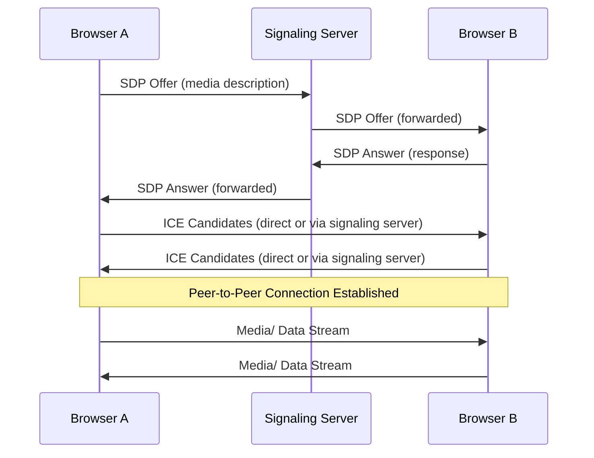
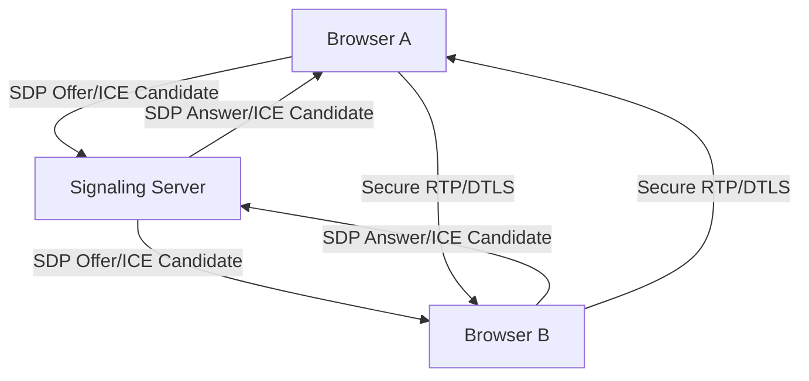

# WebRTC

WebRTC (Web Real-Time Communication) is an open-source project that provides web browsers and mobile applications with real-time communication (RTC) capabilities via simple APIs. It supports peer-to-peer audio, video, and data sharing without requiring any additional plugins.

## Key Features of WebRTC

1. **Real-time Communication**: Enables low-latency streaming of audio, video, and arbitrary data.
2. **Cross-Platform**: Works seamlessly across different platforms and devices.
3. **Secure**: Uses encryption (DTLS/SRTP) to ensure secure communication.
4. **NAT Traversal**: Includes mechanisms for handling NAT (Network Address Translation) and firewalls using technologies like STUN, TURN, and ICE.
5. **Open Standards**: Built on open web standards.

## How WebRTC Works

WebRTC involves several core components:

1. **Signaling**: Establishes a connection by exchanging metadata between peers (e.g., session descriptions and network information).
2. **Peer-to-Peer Connection**: Enables direct communication between devices using the ICE framework.
3. **Media and Data Transmission**: Streams audio, video, and data over the established peer-to-peer connection.

## WebRTC Components

1. **Signaling**:

   - Not part of WebRTC itself. It requires an external mechanism (e.g., WebSockets, HTTP) to exchange signaling messages.
   - Used for:
     - **Session Description Protocol (SDP)**: Exchange media configuration (e.g., codecs, formats).
     - **Network Information**: Exchange ICE candidates.

2. **Interactive Connectivity Establishment (ICE)**:

   - Manages NAT traversal and finds the best path between peers.
   - Relies on:
     - **STUN (Session Traversal Utilities for NAT)**: Determines the public IP and port of a device.
     - **TURN (Traversal Using Relays around NAT)**: Relays media when direct communication is not possible.

3. **Media Streams**:

   - Uses RTP (Real-time Transport Protocol) for audio/video streaming.
   - Securely transmits media via SRTP (Secure RTP).

4. **Data Channels**:
   - Provides a mechanism to send arbitrary data.
   - Uses SCTP (Stream Control Transmission Protocol) over DTLS.

## Detailed Steps

1. **Signaling**:

   - Browser A sends an SDP offer to the signaling server.
   - The signaling server forwards the offer to Browser B.
   - Browser B processes the SDP offer and sends an SDP answer.
   - The signaling server forwards the SDP answer back to Browser A.

2. **ICE Candidate Exchange**:

   - Both browsers gather and exchange ICE candidates via the signaling server.
   - ICE determines the best path for communication (direct or relay).

3. **Establish Peer-to-Peer Connection**:

   - Once SDP and ICE negotiation completes, a direct connection is established.

4. **Media and Data Transmission**:
   - Audio, video, and data streams are transmitted over the peer-to-peer connection.

## Applications of WebRTC

1. Video conferencing (e.g., Zoom, Google Meet).
2. File sharing and P2P data transfer.
3. Online gaming.
4. Real-time collaborative applications.
5. IoT communication.

## Advantages of WebRTC

- No plugins required.
- Low latency.
- Open-source and supported by modern browsers.

## Challenges

- Complexity of NAT traversal.
- Dependence on signaling mechanisms.
- Browser compatibility issues in some edge cases.
