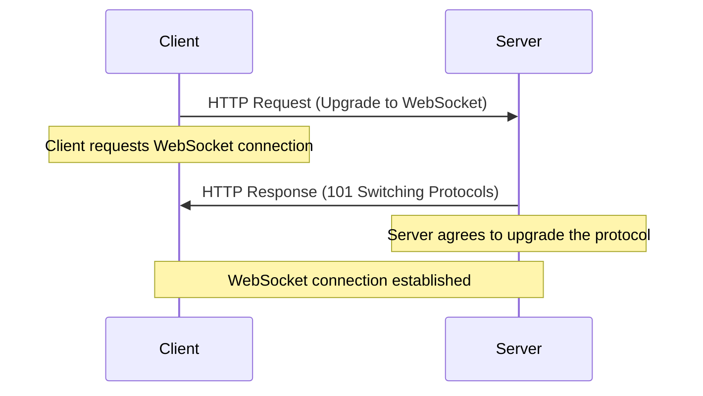
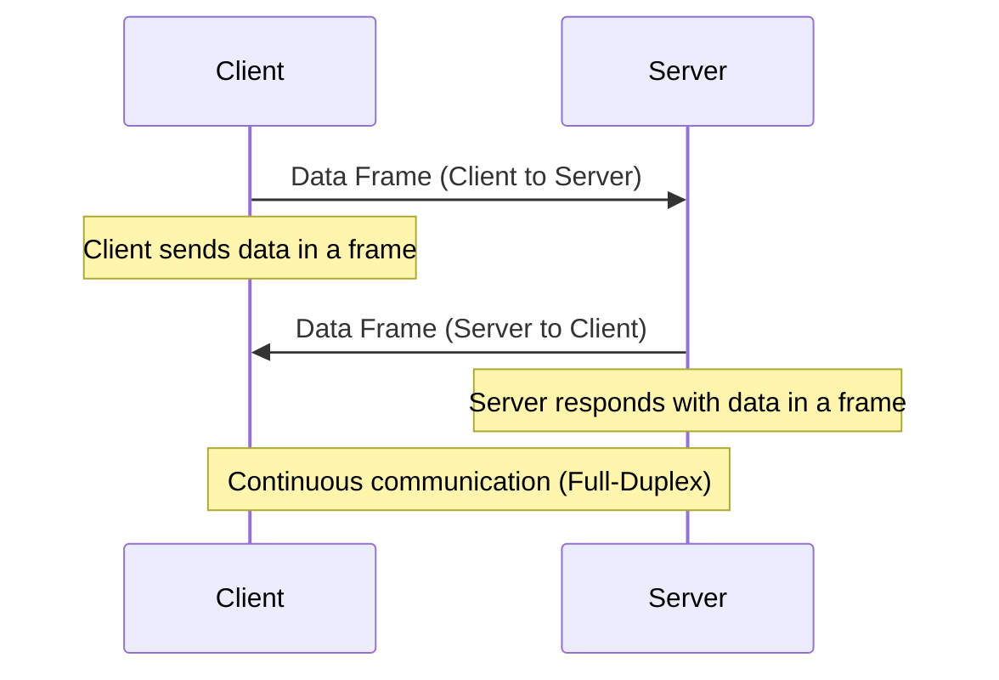
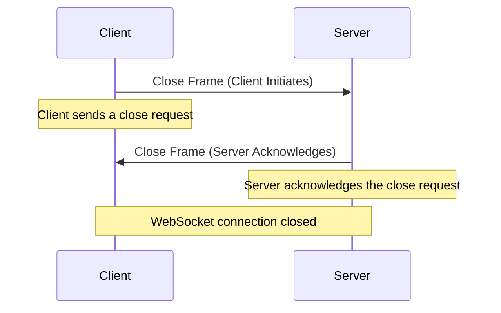
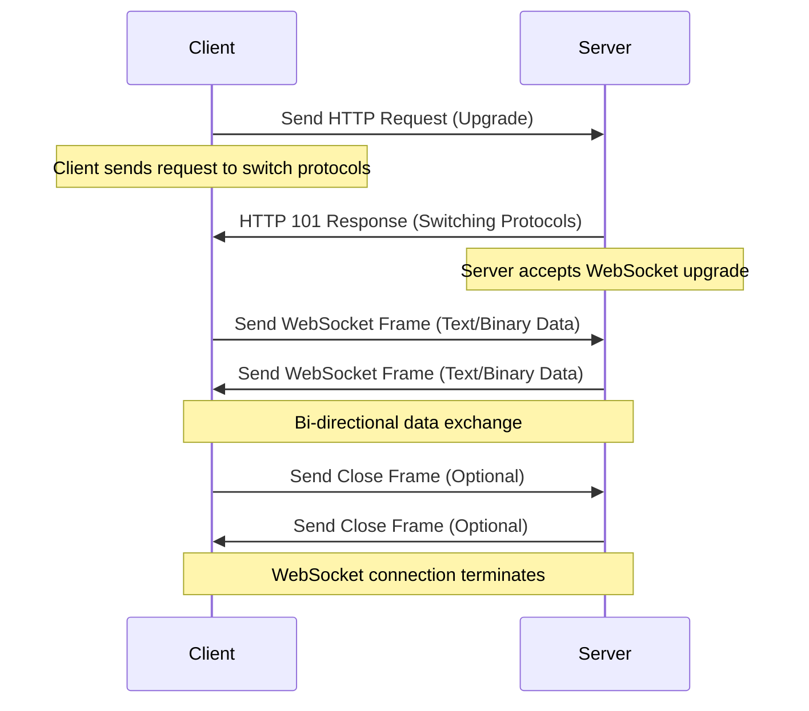
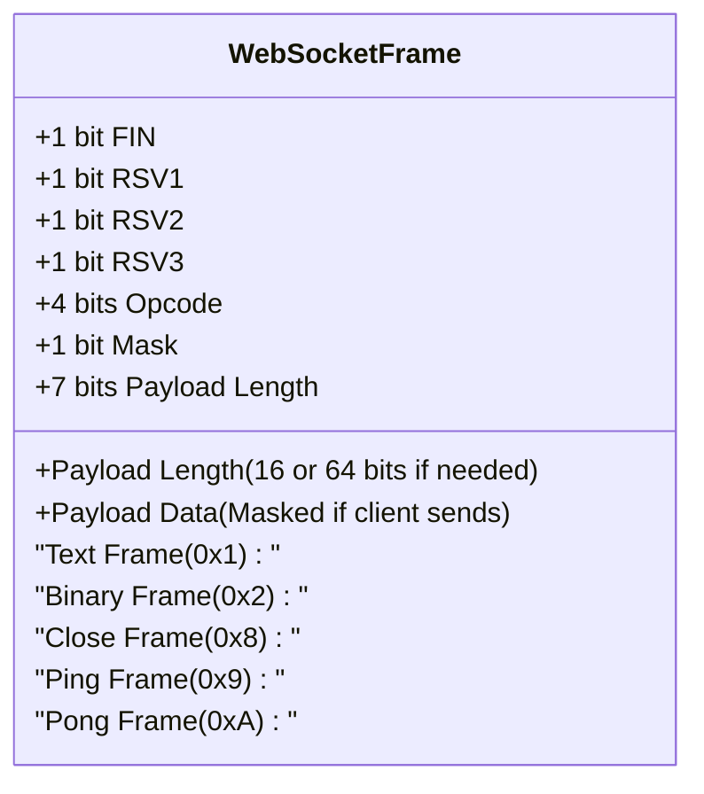

# WebSocket

WebSocket is a communication protocol that provides full-duplex (two-way) communication channels over a single, long-lived TCP connection. Unlike traditional HTTP requests, which are stateless and require a new connection for each exchange, WebSocket enables continuous communication between a client (such as a browser) and a server. WebSocket is particularly useful in scenarios requiring real-time communication, such as chat applications, live notifications, and online gaming.

## Key Features of WebSocket

- **Full-Duplex Communication**: WebSocket allows data to flow in both directions at the same time, whereas HTTP is unidirectional.
- **Low Latency**: By using a single long-lived connection, WebSocket reduces the overhead of creating new connections and establishes faster communication.
- **Bidirectional**: Data can be sent and received over the same connection without re-establishing connections or initiating new requests.
- **Persistent Connection**: The connection remains open, allowing continuous data transfer without the need for repeated handshakes.

## How WebSocket Works Internally

### WebSocket Handshake

The WebSocket connection starts with an HTTP handshake, where the client requests an upgrade from HTTP to WebSocket. After the handshake, the protocol switches to WebSocket, allowing for continuous communication. Here's how the handshake process works:

- **Step 1**: The client sends an HTTP request with an `Upgrade: websocket` header to the server.
- **Step 2**: The server responds with a `101 Switching Protocols` status code, signaling that the protocol is now WebSocket.
- **Step 3**: After the handshake, a WebSocket connection is established, and both client and server can exchange data in real time.

### Data Transmission (Full-Duplex)

Once the WebSocket connection is established, both the client and server can exchange data through frames. These frames can carry either text or binary data, enabling efficient real-time communication.

- **Text Frames**: UTF-8 encoded text data.
- **Binary Frames**: Data such as images or videos.

Both parties can send and receive data simultaneously over the same connection, making communication faster and more efficient than traditional request-response models.

### Connection Closure

Either the client or server can initiate the closure of the WebSocket connection. When this happens, a close frame is exchanged, signaling that the connection is being terminated.

- **Step 1**: The client or server sends a close frame to indicate that the connection should be closed.
- **Step 2**: The receiving party responds with its own close frame, confirming the termination.
- **Step 3**: The connection is fully closed after both parties have acknowledged.

## Internal Flow of WebSocket Communication

The following diagram illustrates the internal flow of WebSocket communication between the client and server:

This flow illustrates the following process:

1. The client sends an HTTP request to the server to upgrade to WebSocket.
2. The server responds by upgrading the connection to WebSocket.
3. Both the client and server can now send and receive data frames, enabling real-time, full-duplex communication.
4. If needed, either side can initiate the closure of the connection by sending a close frame.

## WebSocket Frame

A **WebSocket Frame** is the basic unit of data transfer in the WebSocket protocol. WebSocket communication uses frames to send and receive data between the client and the server once the connection is established. Each frame can carry either **text data** (UTF-8 encoded) or **binary data** (such as images or videos). The WebSocket protocol is designed for low-latency communication and allows the transmission of multiple frames in both directions (client-to-server and server-to-client) simultaneously.

### Frame Structure

A WebSocket frame consists of several parts:

1. **FIN, RSV1, RSV2, RSV3, and Opcode**:

   - These bits define the type and status of the frame.
   - **FIN (1 bit)**: Indicates if this is the final frame in a message.
   - **RSV1, RSV2, RSV3 (1 bit each)**: Reserved for future use; typically set to `0`.
   - **Opcode (4 bits)**: Specifies the type of frame. Some common opcodes are:
     - `0x1`: Text frame
     - `0x2`: Binary frame
     - `0x8`: Close frame
     - `0x9`: Ping frame
     - `0xA`: Pong frame

2. **Mask (1 bit)**:

   - Indicates whether the payload data is masked. In WebSocket communication, data sent from the client must be masked (the mask bit is `1`), while data sent from the server does not require masking.

3. **Payload Length (7 bits or 7+16 bits or 7+64 bits)**:

   - Indicates the length of the payload data. If the payload length is 126 or 127, additional bytes are used to specify the length in 16 or 64 bits, respectively.

4. **Masking Key (optional)**:

   - A 4-byte key used to mask the payload data. Only the client sends this masking key, which is XORed with the payload data.

5. **Payload Data**:
   - The actual data being sent (text or binary). The size of this data depends on the payload length field.

### Frame Types

1. **Text Frames** (`0x1`):

   - Used to send textual data (UTF-8 encoded).

2. **Binary Frames** (`0x2`):

   - Used to send binary data, such as images, videos, or other non-textual content.

3. **Close Frames** (`0x8`):

   - Used to close the WebSocket connection. The frame may contain a status code and an optional reason for the closure.

4. **Ping and Pong Frames** (`0x9` and `0xA`):
   - These frames are used to keep the connection alive and verify that the connection is still open. A `Ping` frame is sent by one party, and a `Pong` frame is sent back as a response.

### Example of WebSocket Frame

- **Text Frame (Opcode `0x1`)**:
  - The client sends a text message `Hello, Server!`.
  - This message is encoded in UTF-8 and sent as a text frame.
- **Binary Frame (Opcode `0x2`)**:
  - The client sends an image in binary format.
  - The binary data is split into multiple frames if necessary.

### Frame Processing

1. **Frame Parsing**:

   - The receiver reads the header of the frame to understand its type (text, binary, close, ping, pong).
   - If the frame contains data, the receiver processes the payload accordingly.

2. **Masking**:
   - If the frame is from the client, the receiver must apply the masking key (XOR operation) to the payload data to retrieve the original content.
   - For the server, no masking is required, so the data is used directly.

### Use of Frames in WebSocket Communication

Frames enable **efficient data transmission** by splitting larger messages into smaller chunks. This makes it possible to handle large amounts of data while maintaining low-latency communication. Moreover, frames allow for **control messages** like ping/pong or connection closure, ensuring the integrity and lifespan of the connection.

## Use Cases of WebSocket

1. **Real-time Communication**:

   - WebSocket is perfect for applications that require continuous data transfer, such as live chat apps, collaborative tools, and instant messaging platforms.

2. **Online Games**:

   - In multiplayer games, WebSocket allows real-time updates and actions between players and the game server, providing an interactive gaming experience.

3. **Live Updates**:

   - WebSocket is used in stock market applications, sports apps, and news platforms, where real-time data feeds are critical.

4. **IoT Devices**:
   - WebSocket is often used to establish persistent communication channels between IoT devices and central servers, where real-time data exchange is necessary.

## Advantages of WebSocket

- **Efficiency**: Reduces overhead by maintaining a persistent connection.
- **Speed**: Lower latency due to the lack of connection overhead.
- **Scalability**: WebSocket allows efficient communication even with large numbers of clients.

## Disadvantages of WebSocket

- **Complexity**: Managing multiple WebSocket connections across different servers can be challenging.
- **Firewall/Proxy Issues**: WebSocket connections may face issues with firewalls and proxies, which are typically configured for HTTP traffic.
