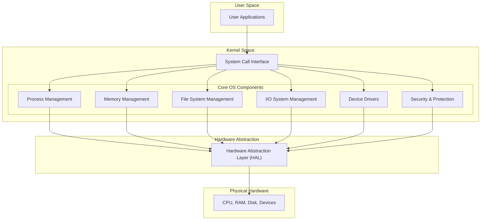

# Components of OS

Operating Systems are complex software systems composed of various components, each responsible for managing different aspects of the computer system. Their architecture defines how these components interact with one another and with hardware and applications.

## Process Management

- A **process** is a running instance of a program.
- OS handles:

  - **Process creation, termination**
  - **Scheduling** (deciding which process runs when)
  - **Context switching**
  - **Inter-Process Communication (IPC)**
  - **Synchronization** and **deadlock handling**

## Memory Management

- Tracks **each byte of memory** in a system: who owns it, how it's used, and how it should be protected.
- Handles:

  - **Allocation/deallocation** of memory to processes
  - **Virtual memory** using paging/segmentation
  - **Swapping** (moving data between RAM and disk)
  - **Protection/isolation** between processes

## File System Management

- Responsible for managing all **persistent storage** (e.g., SSD, HDD).
- Provides:

  - **File and directory structures**
  - **Access control and permissions**
  - **Storage abstraction** (hide hardware details)
  - **File operations** (create, read, write, delete)

## Device Management

- Manages **I/O devices** via **device drivers**.
- Functions include:

  - **Buffering**, **caching**, and **spooling**
  - Providing **device-independent interfaces**
  - **Interrupt handling**

## I/O System Management

- Bridges the gap between the application and hardware-level I/O operations.
- Uses concepts like:

  - **I/O scheduling**
  - **Drivers**
  - **User I/O APIs**

## Security and Protection

- Ensures that **unauthorized access** is prevented.
- Involves:

  - **User authentication**
  - **Access control lists (ACLs)**
  - **Isolation of processes**
  - **Encryption and secure auditing**

## User Interface

- Enables interaction between users and the system.
- Can be:

  - **CLI (Command-Line Interface)** — e.g., bash
  - **GUI (Graphical User Interface)** — e.g., Windows desktop

## Networking

- Manages **communication** between computers via protocols (e.g., TCP/IP).
- Handles:

  - **Sockets**
  - **Protocol stacks**
  - **Network device drivers**

## System Calls Interface

- An API through which **user programs** request services from the OS.
- Acts as the **gateway** between user space and kernel space.

## Summary Table

| **Component**         | **Role**                                    |
| --------------------- | ------------------------------------------- |
| Process Management    | Manages processes, threads, scheduling, IPC |
| Memory Management     | Allocates, protects, and virtualizes memory |
| File System           | Organizes and manages data persistence      |
| Device Management     | Manages hardware devices through drivers    |
| Security              | Handles access control and isolation        |
| User Interface        | Enables user interaction                    |
| Networking            | Manages communication between computers     |
| System Call Interface | API for apps to request OS services         |
