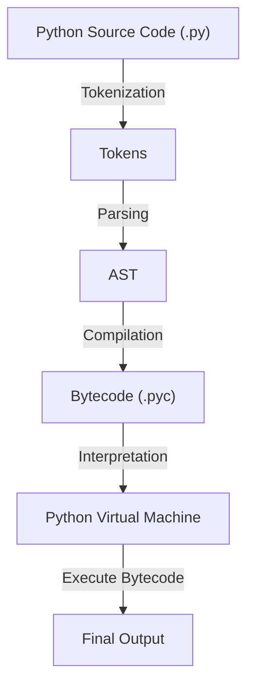
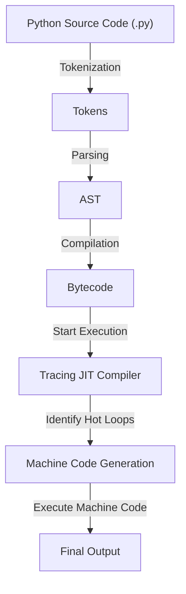

# Execution Flow

## How CPython Works

CPython processes Python code through the following steps:



### Source Code (.py file)

- Python code is written as plain text files with a `.py` extension.

### Lexical Analysis (Tokenizer)

- The source code is converted into a stream of **tokens**, which are the smallest meaningful units of the language (e.g., keywords, operators, identifiers).
- This step ensures the syntax of the code is correct.

Example for `x = 10 + 2`:

- `NAME` (`x`)
- `OP` (`=`)
- `NUMBER` (`10`)
- `OP` (`+`)
- `NUMBER` (`2`)

### Parsing

- Tokens are passed to the **parser**, which organizes them into an **Abstract Syntax Tree (AST)**. This tree represents the code's structure and semantics.
- The AST is used to ensure logical correctness of the code.

Example AST:

```
Assign(
    targets=[Name(id='x', ctx=Store())],
    value=BinOp(
        left=Constant(value=10),
        op=Add(),
        right=Constant(value=2)
    )
)
```

### Compilation to Bytecode

- The AST is compiled into **bytecode**, an intermediate, platform-independent representation.
- Bytecode is stored in `.pyc` files in the `__pycache__` directory for faster re-execution.

Example bytecode:

```
LOAD_CONST 10
LOAD_CONST 2
BINARY_ADD
STORE_NAME x
```

### Execution by the Python Virtual Machine (PVM)

- The PVM (Python Virtual Machine) is a stack-based interpreter that executes the bytecode line by line.
- The PVM handles runtime aspects like function calls, I/O, exception handling, and managing Python objects.

## How PyPy Works

PyPy differs significantly from CPython by introducing a **Just-In-Time (JIT) compiler**. Instead of interpreting bytecode line-by-line, PyPy uses JIT to optimize code execution by dynamically compiling frequently executed code into machine code.



### Source Code Handling

- Like CPython, PyPy also begins with source code written in `.py` files, performs tokenization, parsing, and bytecode generation.

### Tracing JIT Compilation

- PyPy analyzes the running program and identifies "hot loops"—sections of code that are executed repeatedly.
- Instead of interpreting these loops repeatedly, PyPy compiles them into optimized **machine code** during runtime.
- This reduces the overhead of interpretation for frequently executed code, making PyPy significantly faster than CPython in many cases.

### Execution Process

- For code outside of hot loops, PyPy behaves similarly to CPython, interpreting bytecode.
- For hot loops, the machine code generated by JIT is executed directly, bypassing the slower interpretation step.

### Garbage Collection and Memory Management

- PyPy has its own garbage collector and memory management system, separate from CPython, which is tailored for JIT-compiled programs.

## CPython vs. PyPy

| Feature              | CPython                                          | PyPy                                                          |
| -------------------- | ------------------------------------------------ | ------------------------------------------------------------- |
| **Implementation**   | Written in C                                     | Written in RPython (a restricted subset of Python).           |
| **Execution Method** | Interprets bytecode line by line.                | Uses JIT to compile and execute machine code for hot paths.   |
| **Performance**      | Slower for many computational tasks.             | Faster for long-running programs or programs with many loops. |
| **Compatibility**    | The reference implementation; highly compatible. | High compatibility, though not 100% identical.                |
| **Memory Usage**     | Higher memory usage for objects.                 | Typically better memory optimization.                         |

## PyPy JIT Compiler: Key Advantages

- **Dynamic Compilation**: Converts Python bytecode into machine code during runtime.
- **Loop Optimization**: Identifies and compiles frequently executed loops for faster execution.
- **Better Performance for Numeric Code**: Often outperforms CPython for tasks involving heavy computation, such as numerical or scientific computing.
- **Reduced Interpreter Overhead**: By eliminating the need to repeatedly interpret bytecode, PyPy reduces runtime overhead.

## Workflow Comparison

### CPython Execution Workflow

1. Write Python source code (`.py` file).
2. Lexical analysis and parsing into an Abstract Syntax Tree (AST).
3. Compilation into bytecode.
4. Interpretation of bytecode by the Python Virtual Machine (PVM).

### PyPy Execution Workflow

1. Write Python source code (`.py` file).
2. Lexical analysis and parsing into an Abstract Syntax Tree (AST).
3. Compilation into bytecode.
4. Interpretation begins, but JIT analyzes runtime behavior and identifies "hot paths."
5. Hot paths are compiled into machine code for optimized execution.
6. Machine code is cached for reuse during program execution.

## When to Use CPython vs. PyPy

- **CPython**:

  - Best for general-purpose use, especially when compatibility with C extensions or third-party libraries is critical.
  - Recommended for applications with minimal computational bottlenecks.

- **PyPy**:
  - Ideal for programs with performance-critical sections, such as numerical computing, machine learning, or large-scale data processing.
  - Best suited for long-running applications where JIT can optimize performance over time.

## Summary

- **CPython** is the reference implementation of Python that executes bytecode using a Python Virtual Machine.
- **PyPy** is an alternative implementation that uses JIT compilation to dynamically optimize Python code at runtime.
- PyPy achieves significant performance improvements, particularly for computation-heavy or loop-intensive programs, while still providing high compatibility with Python.
