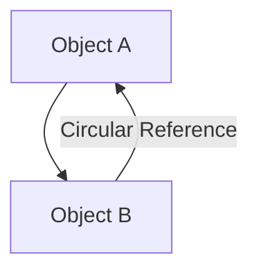
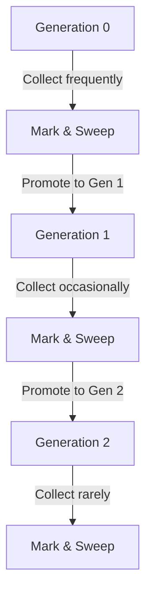
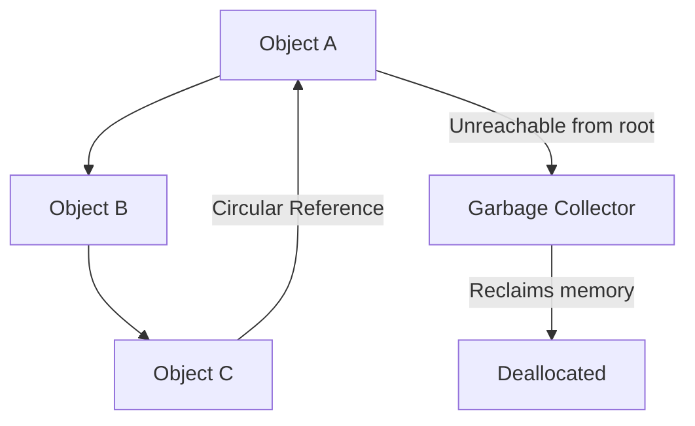

# Generational Garbage Collection

## The Object Graph

In Python, all objects are part of an **object graph**. An **object graph** is a structure that maps out the relationships between objects. Each node in this graph represents an object, and the edges between nodes represent references from one object to another.

For example, if object A references object B, and object B references object A, a **cyclic reference** exists. The object graph looks like this:



In this scenario:

- **Object A** holds a reference to **Object B**.
- **Object B** holds a reference to **Object A**.

The garbage collector must identify and collect these objects when they are no longer reachable, even though their reference counts are not zero.

## How the Garbage Collector Works

Python’s garbage collection system automatically reclaims memory from objects that are no longer referenced. The **garbage collector (GC)** is responsible for:

- **Detecting Unreachable Objects**: Objects that are no longer accessible from any root references (i.e., they cannot be reached via the object graph).
- **Cleaning Up Circular References**: The GC handles cyclic references that reference counting cannot clean up by itself.

### Generational Garbage Collection

Python’s garbage collection uses the **generational garbage collection** model. The idea behind generational GC is that most objects tend to be short-lived, and the longer an object survives, the less likely it is to become garbage.

Python uses three **generations**:

- **Generation 0**: New objects that are most likely to become garbage soon.
- **Generation 1**: Objects that survived at least one garbage collection cycle in Generation 0.
- **Generation 2**: Objects that survived multiple garbage collection cycles and are likely to persist.

### Collection Strategy for Each Generation

- **Generation 0**: Collected frequently (young objects are more likely to be garbage).
- **Generation 1**: Collected less frequently.
- **Generation 2**: Collected the least (older objects are more likely to stay alive).

## How Generational Garbage Collection Solves Circular References

Reference counting alone cannot handle **cyclic references**. If objects reference each other in a cycle (e.g., object A references object B and vice versa), their reference count will never drop to zero, so they will not be collected by reference counting.

**Generational garbage collection** solves this problem by periodically scanning for circular references, even if those objects’ reference counts aren’t zero.

### Object Graph in Generational GC

1. **Marking**: The garbage collector scans the object graph starting from the root references. It marks all objects that can be reached (i.e., reachable objects).
2. **Identifying Cycles**: If an object is not reachable from the root but is still part of a cycle, the garbage collector detects this as a cycle and can safely collect the objects in that cycle.

### Mark-and-Sweep Process

Python’s garbage collection follows a **mark-and-sweep** approach, which works as follows:

1. **Mark Phase**: The GC marks all reachable objects, starting from the root of the object graph. The root can be global variables, function call stacks, or any object that can be directly accessed.
2. **Sweep Phase**: After marking, the GC sweeps through the objects. Any object that is not marked (i.e., unreachable) is considered garbage and is eligible for deallocation.

In the context of circular references, the GC will detect cycles even if the objects involved in the cycle are not directly reachable.

### Example of Circular Reference Collection

```python
class Node:
    def __init__(self, value):
        self.value = value
        self.next = None

# Creating a circular reference
a = Node(1)
b = Node(2)
a.next = b
b.next = a  # Circular reference (a -> b -> a)

# When we delete the objects, they will not be collected by reference counting alone
del a
del b

# Python's GC will detect the cycle and collect the objects
import gc
gc.collect()
```

In the object graph, after `del a` and `del b`, the objects `a` and `b` are no longer reachable from any root, but their reference counts don’t drop to zero due to the circular reference. The garbage collector identifies and cleans up these objects.

## The Garbage Collection Process in Detail

Here’s a step-by-step explanation of how garbage collection works with the generational model:

### Generation 0

- **Frequent Collection**: Objects in Generation 0 are the first to be collected. If any of them reference objects in Generation 1 or 2, those objects’ reference counts are decremented.
- **Circular Reference Check**: The garbage collector checks for circular references in Generation 0. If objects are part of a cycle but not reachable from the root, they are marked as garbage and deallocated.

### Promotion to Generation 1

- If an object survives a garbage collection cycle in Generation 0, it is promoted to Generation 1.

### Generation 1

- **Less Frequent Collection**: Objects in Generation 1 are collected less often. The GC checks Generation 1 for circular references and unreachable objects.
- If objects in Generation 1 survive, they are promoted to Generation 2.

### Generation 2

- **Rarely Collected**: Objects in Generation 2 are collected the least. However, when they are collected, the GC performs a thorough search for cycles.
- **Circular Reference Detection**: The GC will check for cycles between older objects (from Generation 1 and 2), cleaning them up as needed.

## Visualization of the Garbage Collection Process

### Generational Garbage Collection



### Circular Reference Detection in the Object Graph


