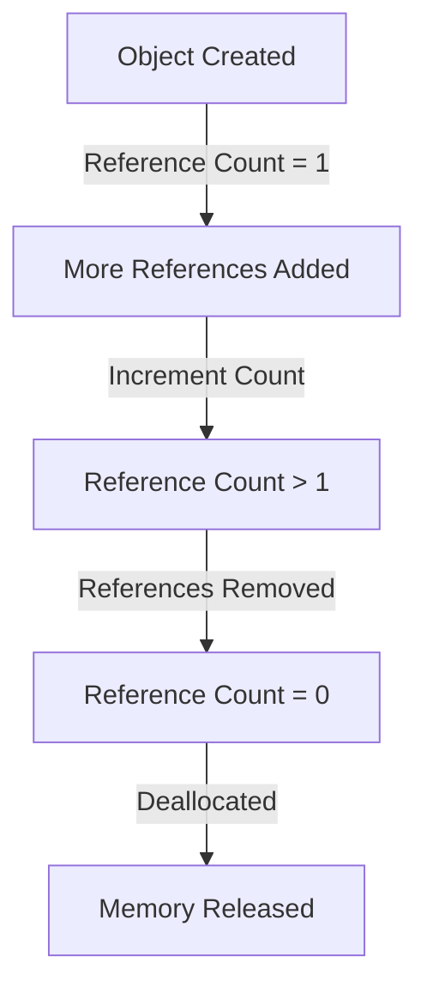
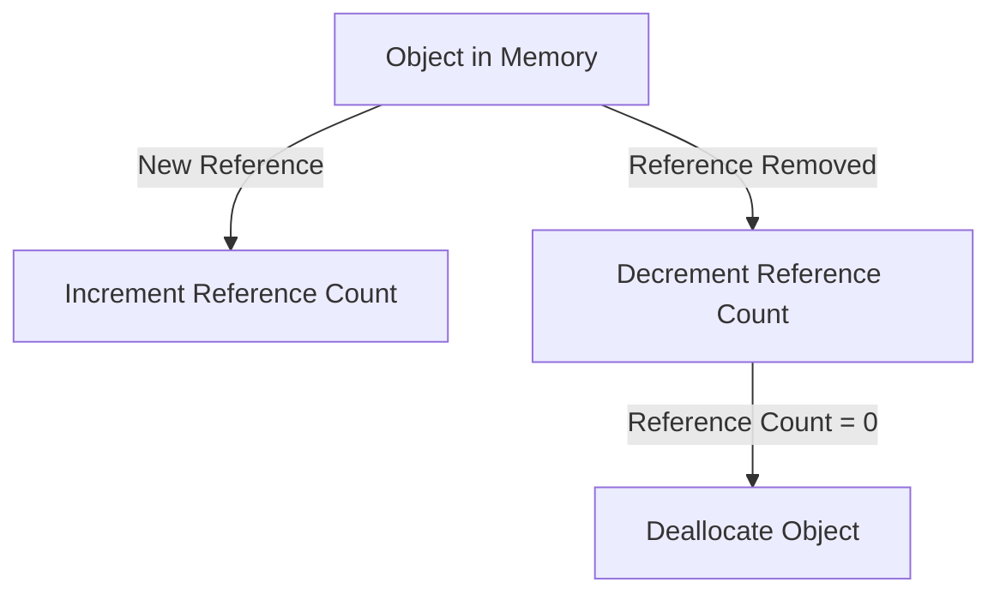
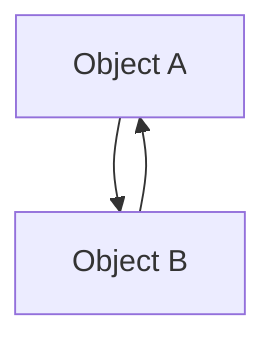

# Reference Counting

Reference counting is the **primary memory management technique** in Python. It keeps track of how many references (or pointers) are pointing to an object in memory. When an object's reference count drops to **zero**, it means the object is no longer accessible and can be safely deallocated by Python's memory manager.

## How Reference Counting Works

Every Python object contains metadata, which includes:

1. **Type Information**: The type of the object (e.g., integer, string, list).
2. **Reference Count**: A counter that keeps track of how many variables or objects reference it.

Whenever an object is **referenced** or **dereferenced**, its reference count is adjusted:

- **Increment the Reference Count**:
  - When a new variable or object refers to an existing object, the reference count is increased.
- **Decrement the Reference Count**:
  - When a reference to the object is removed (e.g., a variable is deleted or goes out of scope), the reference count is decreased.

### Lifecycle of an Object (Reference Counting)



## Reference Count Updates

Reference count updates occur during **assignment**, **function calls**, and when references are explicitly removed.

### Incrementing the Reference Count

1. **Variable Assignment**:

   - Assigning an object to a variable increases the reference count.

   ```python
   x = [1, 2, 3]  # Reference count = 1
   y = x          # Reference count = 2 (x and y point to the same object)
   ```

2. **Adding to a Data Structure**:

   - Adding an object to a container (e.g., list, dictionary) increases its reference count.

   ```python
   my_list = []
   x = [1, 2, 3]
   my_list.append(x)  # Reference count = 2 (x and my_list[0] point to the same object)
   ```

3. **Function Calls**:

   - Passing an object as an argument to a function temporarily increments the reference count.

   ```python
   def my_func(obj):
       pass

   x = [1, 2, 3]
   my_func(x)  # Reference count increases during the function call and decreases afterward
   ```

### Decrementing the Reference Count

1. **Deleting a Variable**:

   - Deleting a variable reduces the reference count.

   ```python
   x = [1, 2, 3]  # Reference count = 1
   del x          # Reference count = 0 (object is deallocated)
   ```

2. **Object Goes Out of Scope**:

   - When a local variable in a function goes out of scope, its reference count decreases.

   ```python
   def my_func():
       x = [1, 2, 3]  # Reference count = 1
   my_func()          # Reference count = 0 after function execution
   ```

3. **Removing from a Data Structure**:
   - Removing an object from a container decreases its reference count.
   ```python
   my_list = []
   x = [1, 2, 3]
   my_list.append(x)  # Reference count = 2
   my_list.remove(x)  # Reference count = 1
   ```

## Advantages of Reference Counting

1. **Immediate Deallocation**:

   - Objects are deallocated as soon as their reference count reaches zero, ensuring memory is released promptly.

2. **Simple to Implement**:

   - Reference counting is straightforward and easy to understand.

3. **Predictability**:
   - The memory lifecycle is predictable since objects are deallocated immediately when they are no longer referenced.

## Limitations of Reference Counting

1. **Circular References**:

   - Reference counting alone cannot handle circular references, where objects reference each other. These objects will never have a reference count of zero, resulting in **memory leaks**.

   **Example of Circular References**:

   ```python
   class Node:
       def __init__(self, value):
           self.value = value
           self.next = None

   a = Node(1)
   b = Node(2)
   a.next = b
   b.next = a  # Circular reference (a -> b -> a)

   del a
   del b
   # Objects are not deallocated because their reference count never reaches 0
   ```

   - **Solution**: Python’s garbage collector (GC) detects and handles circular references using its **generational garbage collection** mechanism.

2. **Performance Overhead**:

   - Reference counting requires incrementing and decrementing counters during every assignment and deletion, which can be computationally expensive.

3. **Not Suitable for Multithreading**:
   - Reference counting may suffer from performance bottlenecks in multithreaded programs, as maintaining reference counts across threads requires synchronization.

## Tools for Inspecting Reference Counts

Python provides tools to inspect and manipulate reference counts for debugging or educational purposes.

### `sys.getrefcount()`

The `sys` module provides a function to get the reference count of an object.

**Example**:

```python
import sys

x = [1, 2, 3]
print(sys.getrefcount(x))  # Output: Reference count (typically 2 due to internal references)
```

### `gc` Module

The `gc` module provides utilities to interact with Python's garbage collector and inspect circular references.

**Example**:

```python
import gc

# Enable or disable garbage collection
gc.disable()
gc.enable()

# Collect unreachable objects (handles circular references)
gc.collect()

# List all objects tracked by the garbage collector
print(gc.get_objects())
```

## Visualization of Reference Counting

### Reference Count Increment/Decrement Flow



### Circular Reference Problem



In this case, `Object A` and `Object B` reference each other, so their reference counts will never reach 0, causing a memory leak unless the garbage collector intervenes.

## Example with Circular Reference and Garbage Collector

```python
import gc

class Node:
    def __init__(self, value):
        self.value = value
        self.next = None

# Create circular reference
a = Node(1)
b = Node(2)
a.next = b
b.next = a

# Break the circular reference
a.next = None
b.next = None

# Run garbage collection
gc.collect()
```

## Summary

| **Feature**            | **Details**                                                                  |
| ---------------------- | ---------------------------------------------------------------------------- |
| **Incrementing Count** | Happens when a new reference is created (e.g., assignment or function call). |
| **Decrementing Count** | Happens when a reference is deleted or goes out of scope.                    |
| **Limitations**        | Cannot handle circular references, and may add performance overhead.         |
| **Tooling**            | Use `sys.getrefcount()` to inspect counts and `gc` for garbage collection.   |
