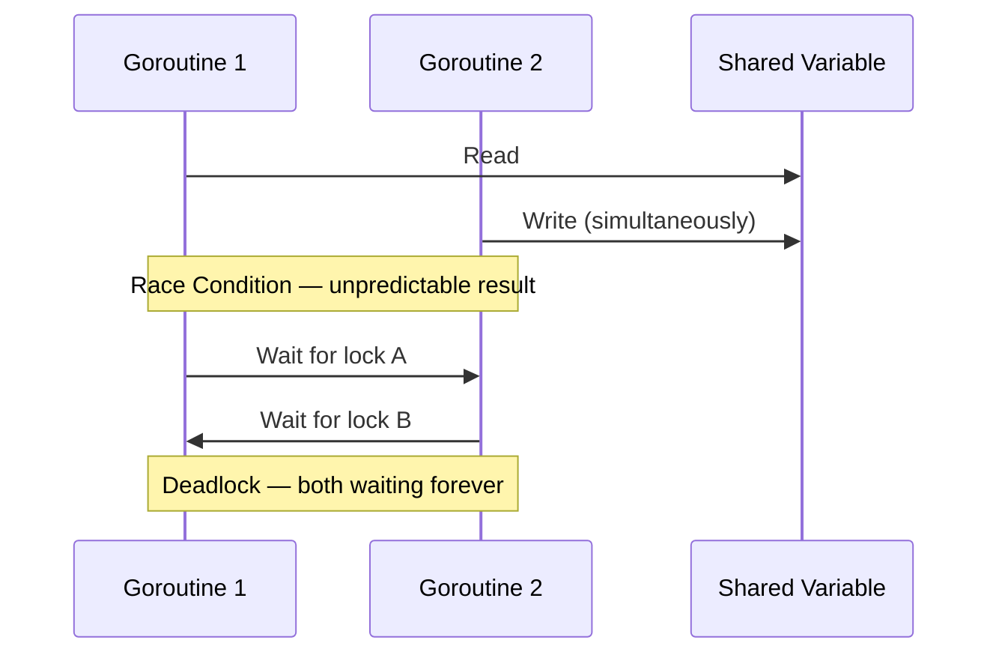

# Tips & Tricks

Goroutines are lightweight, but that doesn’t mean we can spin them up carelessly. In real-world systems, poor goroutine management can lead to resource leaks, excessive memory usage, or subtle concurrency bugs. Here are some important tips and tricks we should keep in mind:

## Goroutine Management Tips

### Always Have a Clear Exit Strategy

- Every goroutine we launch should have a clear condition for termination.
- Use **`context.Context`** to propagate cancellation signals.
- Avoid “fire-and-forget” goroutines unless they truly need to run forever.

**Example:**

```go
func worker(ctx context.Context) {
    for {
        select {
        case <-ctx.Done():
            fmt.Println("Worker stopped")
            return
        default:
            fmt.Println("Working...")
            time.Sleep(500 * time.Millisecond)
        }
    }
}

func main() {
    ctx, cancel := context.WithCancel(context.Background())
    go worker(ctx)
    time.Sleep(2 * time.Second)
    cancel() // stop the worker
}
```

### Use Buffered Channels for Controlled Concurrency

- Buffered channels can help us **limit concurrency** and prevent goroutines from blocking immediately.
- They act like a small queue where goroutines can place results or jobs without waiting for the receiver to be ready.
- Useful when we know the producer can be temporarily faster than the consumer.

**Example: Worker Pool with Buffered Channel:**

```go
func main() {
    jobs := make(chan int, 5) // buffer prevents producer blocking immediately
    results := make(chan int, 5)

    // Start workers
    for w := 1; w <= 3; w++ {
        go func(id int) {
            for j := range jobs {
                fmt.Printf("Worker %d processing job %d\n", id, j)
                time.Sleep(time.Second)
                results <- j * 2
            }
        }(w)
    }

    // Send jobs
    for j := 1; j <= 5; j++ {
        jobs <- j
    }
    close(jobs)

    // Receive results
    for a := 1; a <= 5; a++ {
        fmt.Println(<-results)
    }
}
```

### Limit Goroutines with Worker Pools

- Spawning thousands of goroutines at once may overwhelm the scheduler or memory.
- We should use a **worker pool** pattern to control parallelism.

### Detect Goroutine Leaks

- If a goroutine is blocked forever on a channel read/write, it becomes a **goroutine leak**.
- Use tools like `pprof` to inspect running goroutines.
- Always make sure to close channels or send cancellation signals.

## Avoiding Race Conditions

A **race condition** happens when two or more goroutines access shared data at the same time, and at least one modifies it. The outcome becomes unpredictable.

### Use sync.Mutex or sync.RWMutex

- `Mutex` for exclusive access.
- `RWMutex` when multiple readers are allowed but only one writer at a time.

Example

```go
var counter int
var mu sync.Mutex

func increment() {
    mu.Lock()
    counter++
    mu.Unlock()
}
```

### Prefer Channels Over Shared Memory

- Go encourages **"share memory by communicating"** instead of **"communicate by sharing memory"**.
- Passing data through channels instead of using shared variables removes many race conditions.

### Use the Race Detector

- Run `go run -race main.go` or `go test -race` to detect race conditions at runtime.

## Avoiding Deadlocks

Deadlocks occur when goroutines are stuck waiting for each other forever.

### Avoid Blocking Without Timeout

- Always use `select` with a timeout when possible.

**Example:**

```go
select {
case msg := <-ch:
    fmt.Println(msg)
case <-time.After(2 * time.Second):
    fmt.Println("Timeout waiting for message")
}
```

### Always Close Channels When Done

- If a sender never closes a channel, receivers may block forever.

### Maintain Lock Order

- If multiple locks are needed, always acquire them in the **same order** in all goroutines.

### Avoid Nested Locks When Possible

- Nested locks increase deadlock risk. Instead, restructure code to reduce lock dependencies.

### Diagram: Race Condition & Deadlock Risks

<div style={{textAlign: 'center'}}>



</div>
