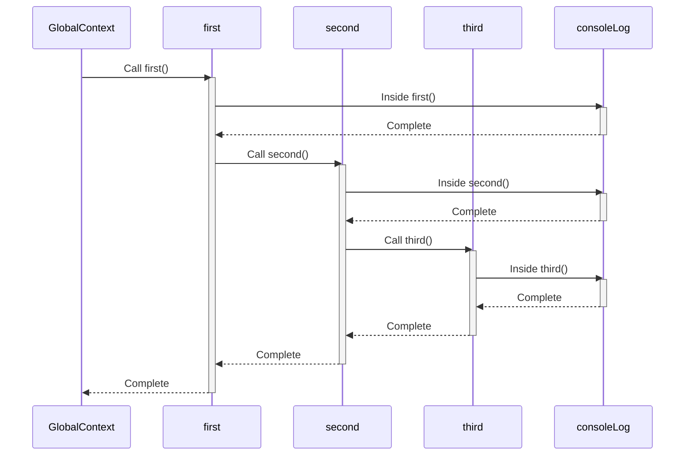

# Call Stack

The **Call Stack** is a data structure that keeps track of the active execution contexts in a program. It follows the **LIFO (Last In, First Out)** principle, meaning the last function added to the stack is the first one to be executed and removed after completion.

- When a function is called, a **Stack Frame** (representing its execution context) is created and pushed onto the stack.
- When the function finishes execution, the corresponding Stack Frame is popped off the stack.

## Purpose of the Call Stack

1. **Manage Function Calls:**

   - The Call Stack keeps track of all functions being executed, in the order they were called.

2. **Handle Nested and Recursive Functions:**

   - Nested or recursive function calls are managed through the Call Stack, ensuring the correct order of execution.

3. **Track Execution Contexts:**
   - Each Stack Frame in the Call Stack represents an **execution context**, which includes information about the function being executed (arguments, variables, `this` binding, etc.).

## What is a Stack Frame?

A **Stack Frame** is an individual entry in the Call Stack, representing the execution context of a specific function. It contains:

1. **Function Arguments:**

   - The arguments passed to the function.

2. **Local Variables:**

   - Variables declared inside the function.

3. **Function Code:**

   - The actual code being executed.

4. **The `this` Binding:**

   - The value of `this` in the function's execution context.

5. **Outer Environment Reference:**
   - A reference to the parent function's lexical environment (for closures or nested functions).

## How the Call Stack Works

To understand the Call Stack, let’s walk through an example with detailed steps and a visualization.

### Example Code

```javascript
function first() {
  console.log("Inside first function");
  second();
  console.log("Exiting first function");
}

function second() {
  console.log("Inside second function");
  third();
  console.log("Exiting second function");
}

function third() {
  console.log("Inside third function");
}

first();
```

### Execution Steps

1. **Global Execution Context (GEC):**

   - When the script starts, the global execution context is created and pushed onto the Call Stack.

2. **`first()` is Called:**

   - A new Stack Frame for `first()` is created and pushed onto the stack.

3. **`console.log()` Inside `first()`:**

   - A `console.log()` statement is called, and its Stack Frame is pushed onto the stack temporarily. Once executed, it is popped off.

4. **`second()` is Called Inside `first()`:**

   - A new Stack Frame for `second()` is created and pushed onto the stack.

5. **`console.log()` Inside `second()`:**

   - The `console.log()` statement is called and then popped off after execution.

6. **`third()` is Called Inside `second()`:**

   - A new Stack Frame for `third()` is created and pushed onto the stack.

7. **Execution Completes for `third()`:**

   - The Stack Frame for `third()` is popped off the stack.

8. **Execution Completes for `second()`:**

   - The Stack Frame for `second()` is popped off the stack.

9. **Execution Completes for `first()`:**

   - The Stack Frame for `first()` is popped off the stack.

10. **Global Execution Context Remains:**
    - Once all functions finish execution, the stack is empty except for the Global Execution Context, which is removed when the program ends.



### Final State

After all executions are complete, the Call Stack is empty except for the Global Execution Context, which is removed when the script finishes execution.

## How Recursive Functions Use the Call Stack

Recursive functions create a new Stack Frame for each recursive call. If recursion depth becomes too large, it can result in a **Stack Overflow**.

### Example of a Recursive Function

```javascript
function recursiveFunction(counter) {
  if (counter === 0) {
    return;
  }
  console.log(counter);
  recursiveFunction(counter - 1);
}

recursiveFunction(3);
```

**Execution Steps:**

1. Each call to `recursiveFunction()` creates a new Stack Frame and pushes it onto the Call Stack.
2. When `counter === 0`, the function starts returning, and the Stack Frames are popped off one by one.

## Errors in the Call Stack

### Stack Overflow

- Occurs when the Call Stack exceeds its size limit due to excessive function calls, often caused by infinite recursion or deeply nested function calls.
- Example:

  ```javascript
  function infiniteRecursion() {
    infiniteRecursion();
  }
  infiniteRecursion(); // Uncaught RangeError: Maximum call stack size exceeded
  ```

### Error Stack Trace

- When an error occurs, JavaScript provides a **stack trace**, showing the sequence of Stack Frames at the time of the error.
- Example:

```javascript
function first() {
  second();
}

function second() {
  third();
}

function third() {
  throw new Error("Something went wrong!");
}

first();
```

**Output:**

```text
Error: Something went wrong!
    at third (<script>:8:11)
    at second (<script>:4:5)
    at first (<script>:2:5)
    at <global> (<script>:12:1)
```

The stack trace shows the sequence of function calls leading to the error, helping in debugging.

## Key Takeaways

1. **Call Stack:**

   - A LIFO data structure that keeps track of the active execution contexts.
   - Functions are pushed onto the stack when called and popped off when they finish.

2. **Stack Frame:**

   - Represents the execution context of a function.
   - Contains arguments, local variables, the `this` binding, and outer environment reference.

3. **Recursive Functions:**

   - Use the Call Stack for each recursive call. Excessive recursion can lead to a **Stack Overflow**.

4. **Error Stack Trace:**

   - Useful for debugging as it shows the sequence of function calls leading to an error.

5. **Single-Threaded Nature:**
   - JavaScript uses the Call Stack to manage synchronous code execution.
