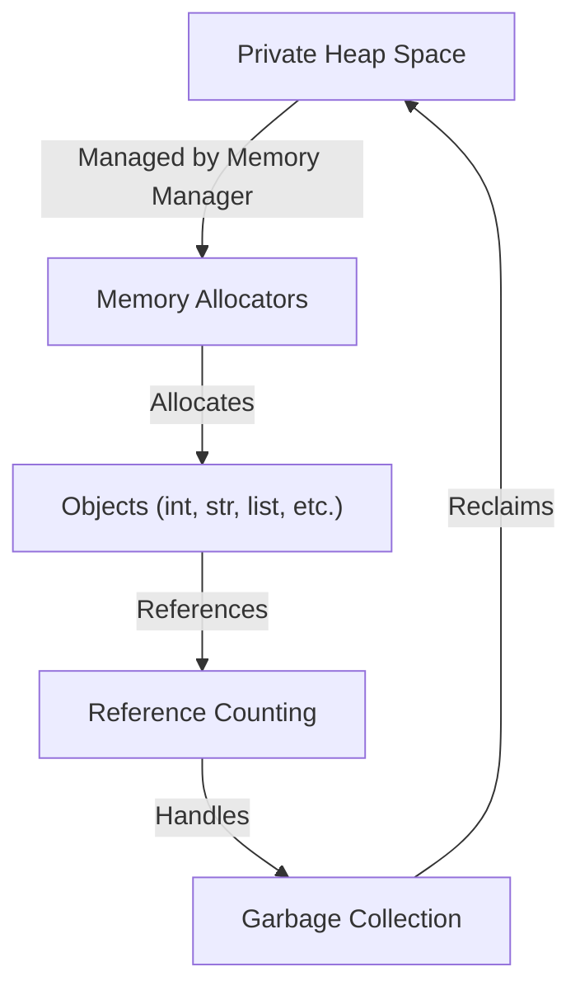
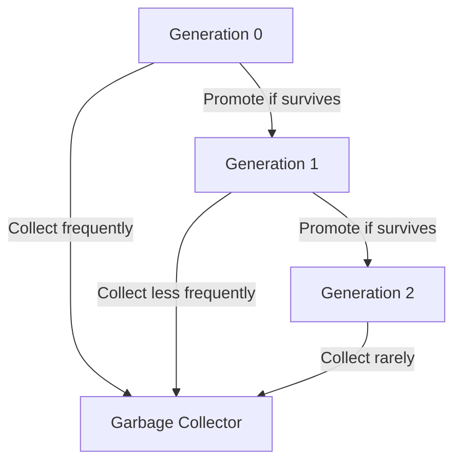

# Memory Management

Memory management in Python is a critical part of its runtime, ensuring efficient use of system resources and proper handling of objects. Python provides automatic memory management using techniques like **reference counting** and **garbage collection** to allocate and deallocate memory efficiently.

## Overview of Memory Management in Python

Python manages memory through:

1. **Private Heap Space**:

   - All Python objects and data structures are stored in a private heap. This space is inaccessible to the programmer directly.
   - The Python interpreter manages this heap.

2. **Memory Manager**:

   - Python has a built-in **memory manager** responsible for allocating memory from the heap to objects and reclaiming it when it’s no longer needed.

3. **Garbage Collection**:

   - Python uses **automatic garbage collection** to remove objects that are no longer in use and free up memory.

4. **Dynamic Typing**:
   - Python objects are dynamically typed, meaning memory is allocated as needed during runtime.

## Key Concepts of Memory Management

Here are the key mechanisms and components of Python’s memory management system:

### Reference Counting

- Python uses a **reference count** to keep track of how many references (variables or objects) point to a particular object in memory.
- When the reference count drops to 0, the object is deallocated automatically.

**Example**:

```python
x = [1, 2, 3]  # A list is created in memory, reference count = 1
y = x          # Reference count = 2 (x and y point to the same object)
del x          # Reference count = 1 (only y points to the object)
del y          # Reference count = 0 (object is deallocated)
```

### Garbage Collection

- While reference counting is the primary mechanism, it struggles with **circular references** (e.g., objects referencing each other). To handle this, Python includes a **garbage collector** that uses **generational garbage collection**.

**Circular Reference Example**:

```python
class Node:
    def __init__(self, value):
        self.value = value
        self.next = None

# Create circular references
a = Node(1)
b = Node(2)
a.next = b
b.next = a  # Circular reference

# Even if 'a' and 'b' are deleted, they won't be garbage-collected by reference counting alone.
```

- Python's **garbage collector** periodically scans for circular references and removes them.

### Generational Garbage Collection

Python organizes objects into **generations** based on their lifespan:

1. **Generation 0**: Newly created objects.
2. **Generation 1**: Surviving objects from Generation 0.
3. **Generation 2**: Surviving objects from Generation 1.

- New objects are allocated in **Generation 0**. If an object survives multiple garbage collection cycles, it gets promoted to the next generation.
- Garbage collection runs more frequently for Generation 0, as younger objects are more likely to be garbage.

**Example**:

```python
import gc
print(gc.get_threshold())  # View thresholds for garbage collection in each generation
```

## Types of Memory in Python

Python uses several types of memory allocation to manage its objects efficiently:

### Stack Memory

- Used for managing function calls and local variables.
- Memory is allocated and deallocated in a **last-in, first-out (LIFO)** order.

### Heap Memory

- All Python objects, including lists, dictionaries, and user-defined objects, are stored in the **heap memory**.
- Managed by Python’s memory manager and garbage collector.

### Object-Specific Allocators

Python optimizes memory usage for small objects through specialized memory allocators:

- **PyObject_Malloc**: Allocates memory for small Python objects like integers, floats, and strings.
- **Pymalloc**: A custom allocator for small objects (less than 512 bytes).

## Memory Optimization in Python

### Immutable Objects and Interning

- Python uses **interning** to optimize memory usage for small immutable objects like integers and strings.
- Small integers (usually between -5 and 256) and some strings are cached and reused instead of creating new objects every time.

**Example**:

```python
a = 100
b = 100
print(a is b)  # True (same memory location)

x = 1000
y = 1000
print(x is y)  # False (different memory locations for larger integers)
```

### Object Reuse

- Immutable objects like `tuples` and `frozensets` are reused when possible to reduce memory overhead.

### Efficient Data Structures

- Use memory-efficient data structures like:
  - `array.array` for homogeneous numeric data instead of lists.
  - `collections.deque` for queues.

### Manual Memory Management

- Python allows you to interact with the garbage collector using the `gc` module.

**Example**:

```python
import gc

# Force garbage collection
gc.collect()

# Disable garbage collection
gc.disable()
gc.enable()
```

## Common Memory Management Issues

### Memory Leaks

- Memory leaks in Python typically occur due to lingering references or circular references that are not garbage-collected.

### High Memory Usage

- Inefficient use of data structures or unnecessary copies of objects can lead to high memory usage.
- Tools like `pympler` and `objgraph` can be used to analyze memory usage.

### Overhead of Python Objects

- Python objects have an overhead due to their dynamic nature (e.g., storing type information, reference counts, etc.).

## Debugging Memory Issues

Python provides several tools to debug and analyze memory usage:

### sys.getsizeof()

- Measures the memory size of an object.
  **Example**:

```python
import sys
x = [1, 2, 3]
print(sys.getsizeof(x))  # Output: Size of the list in bytes
```

### Memory Profiling

- Use libraries like `memory_profiler` to profile memory usage in Python.
  **Example**:

```python
from memory_profiler import profile

@profile
def my_function():
    x = [i for i in range(1000000)]

my_function()
```

### Tracemalloc

- A built-in library to track memory allocations.
  **Example**:

```python
import tracemalloc

tracemalloc.start()
x = [i for i in range(1000000)]
print(tracemalloc.get_traced_memory())  # Current and peak memory usage
tracemalloc.stop()
```

## Memory Management Visualization

### Memory Allocation Flow

<div style={{textAlign: 'center'}}>

</div>

### Garbage Collection Process


