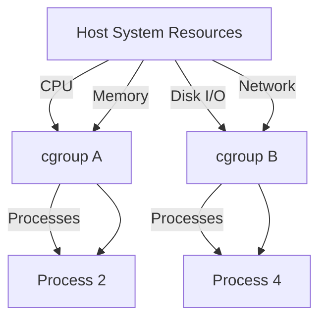
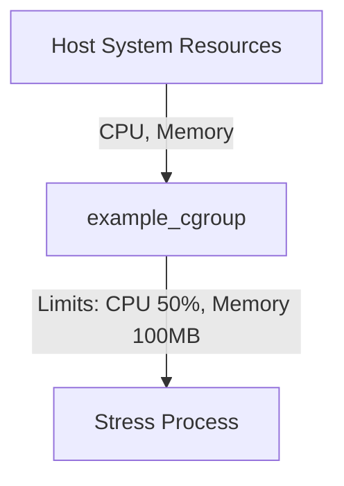

# `cgroups` in Linux

## What Are cgroups?

Control Groups (cgroups) are a Linux kernel feature that provides the ability to allocate, limit, and monitor system resources—such as CPU, memory, disk I/O, and network bandwidth—across groups of processes. cgroups play an essential role in resource management and are a cornerstone of containerization technologies like Docker and Kubernetes.

### Core Features of cgroups

1. **Resource Allocation:** Limit the use of resources such as CPU, memory, and I/O for specific process groups.
2. **Monitoring:** Collect statistics and usage metrics for processes in a cgroup.
3. **Isolation:** Ensure that resource usage in one cgroup does not affect others.
4. **Prioritization:** Allocate resources to high-priority processes.
5. **Dynamic Management:** Add or remove processes from a cgroup without restarting them.

## Visualizing cgroup Resource Allocation

The diagram below illustrates how cgroups divide system resources between groups of processes:



Here:

- System resources are distributed among cgroups (e.g., cgroup A, cgroup B).
- Each cgroup applies specific resource constraints to its processes.

## How cgroups Enable Containerization

Containers use cgroups to:

1. **Enforce Resource Constraints:** Ensure no container monopolizes system resources.
2. **Monitor Usage:** Track resource consumption per container.
3. **Isolate Processes:** Provide isolated resource environments for containers.

For example, Docker utilizes cgroups to enforce CPU, memory, and I/O limits specified in container configurations.

## Managing cgroups with cgroup-tools

`cgroup-tools` is a user-friendly package for managing cgroups. It includes commands like `cgcreate`, `cgset`, and `cgexec` for creating and managing resource limits. Below is a guide to using these tools effectively.

### Install cgroup-tools

Install the package using:

```bash
sudo apt install cgroup-tools
```

### Create a cgroup

To create a new cgroup for CPU and memory management:

#### Create a CPU cgroup:

```bash
sudo cgcreate -g cpu:/my_cgroup
```

#### Create a Memory cgroup:

```bash
sudo cgcreate -g memory:/my_cgroup
```

### Set Resource Limits

Configure resource constraints for the cgroup using `cgset`:

#### Limit CPU Usage:

```bash
sudo cgset -r cpu.cfs_quota_us=50000 my_cgroup
```

This restricts the cgroup to 50% of one CPU core (50,000 microseconds per 100,000 microseconds).

#### Limit Memory Usage:

```bash
sudo cgset -r memory.limit_in_bytes=100M my_cgroup
```

This sets a maximum memory usage limit of 100 MB.

### Run a Process Within a cgroup

Use `cgexec` to execute a process within the cgroup:

```bash
sudo cgexec -g cpu,memory:/my_cgroup stress --cpu 1 --vm 1 --vm-bytes 50M
```

This runs the `stress` tool with the specified CPU and memory limits.

### Monitor Resource Usage

Check cgroup resource consumption using `cgget`:

#### Monitor CPU Usage:

```bash
sudo cgget -r cpuacct.usage my_cgroup
```

#### Monitor Memory Usage:

```bash
sudo cgget -r memory.usage_in_bytes my_cgroup
```

## Complete Example: Managing a Process with cgroup-tools

### Step 1: Create a cgroup

```bash
sudo cgcreate -g cpu,memory:/example_cgroup
```

### Step 2: Set Resource Limits

```bash
sudo cgset -r cpu.cfs_quota_us=50000 example_cgroup
sudo cgset -r memory.limit_in_bytes=100M example_cgroup
```

### Step 3: Run a Process

```bash
sudo cgexec -g cpu,memory:/example_cgroup stress --cpu 1 --vm 1 --vm-bytes 50M
```

### Step 4: Monitor Usage

```bash
sudo cgget -r cpuacct.usage example_cgroup
sudo cgget -r memory.usage_in_bytes example_cgroup
```

## Diagram: Process Constrained by cgroup



In this example:

- The `example_cgroup` cgroup enforces CPU and memory constraints on the `stress` process.
- Other system processes remain unaffected.
