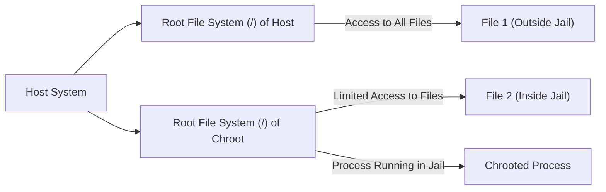
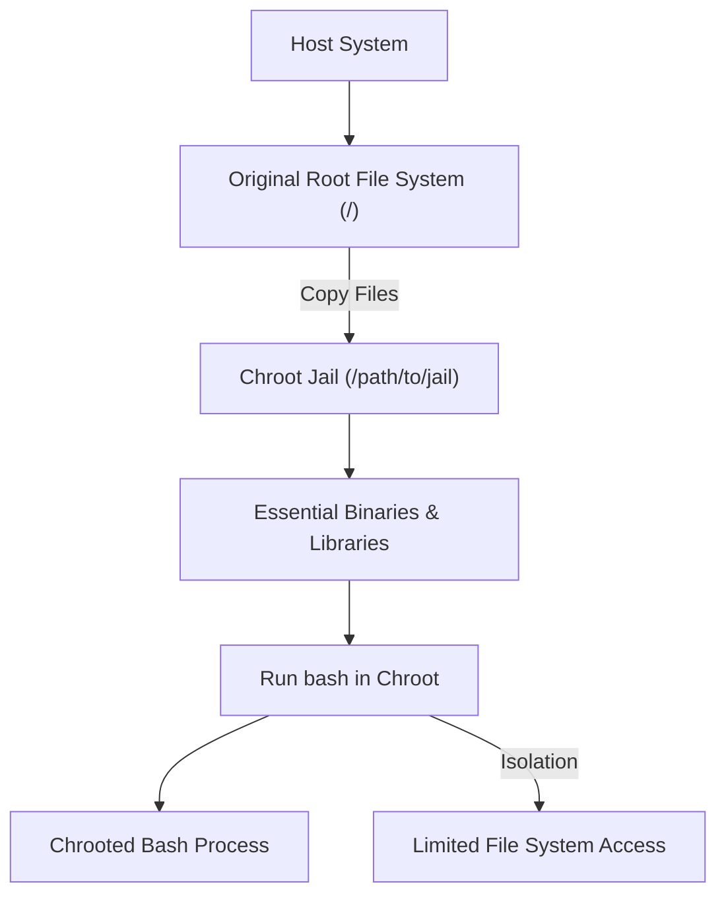

# `chroot` in Linux

## What is `chroot`?

The command `chroot` stands for "change root" and is a Unix/Linux system call and command used to change the apparent root directory of the current running process and its children to a new location in the filesystem. Once a process is "chrooted," it can only access files inside the new root directory, which is effectively isolated from the rest of the filesystem. This is often referred to as a **chroot jail**.

The `chroot` command creates an isolated environment for running processes, which is particularly useful for testing, security, and system recovery.

## How `chroot` Works

When you use `chroot`, you provide a path to the directory that will act as the root directory for the process. This new root is only visible to the chrooted process and its children. The process running inside the chroot jail believes it is operating in a fully functional system, but in reality, it is isolated from the real root directory of the system.

Here’s a high-level view of how `chroot` works:

1. The system call changes the root directory for the process and its children to a specified directory.
2. The process is restricted to the directory tree under that new root.
3. Any attempt to access files outside the chroot directory will result in an error.



In the diagram above:

- The host system has a full filesystem.
- A chroot jail is created in `/path/to/jail`, and processes running inside it can only access files inside the jail.
- The `chroot` command isolates processes, preventing them from accessing files outside of the jail.

**Example**:

```bash
sudo chroot /path/to/jail
```

This command would change the root of the current process to `/path/to/jail`. Any file system operation in the jail will be confined to this directory and its subdirectories.

## Running Bash Inside a Chroot Jail

One common use case for `chroot` is to run a shell, such as `bash`, inside a chroot jail. Here are the steps to achieve it



In the diagram above:

- The **Host System** has a full root filesystem.
- The **Chroot Jail** is created, and essential files like the bash binary and libraries are copied into it.
- **Running bash in the Chroot Jail** leads to a process that is isolated from the rest of the filesystem.

### Create a Directory for the Jail

First, create the directory that will act as the new root directory for the chrooted environment.

```bash
sudo mkdir /path/to/jail
```

### Install Necessary Files

You need to copy essential binaries, libraries, and configuration files into the chroot jail. For a basic bash environment, you will need the `bash` binary, its libraries, and other necessary files.

Here’s an example of how to set up a simple bash environment:

- **Copy the `bash` binary** into the jail:

  ```bash
  sudo cp /bin/bash /path/to/jail/bin/
  ```

- **Copy essential libraries**:
  The bash shell relies on certain shared libraries. You can find out which libraries are needed using `ldd`:

  ```bash
  ldd /bin/bash
  ```

  This will show the list of libraries required by `bash`. You need to copy these libraries into the `lib` directory of the chroot jail. For example:

  ```bash
  sudo cp /lib/x86_64-linux-gnu/libtinfo.so.6 /path/to/jail/lib/x86_64-linux-gnu/
  sudo cp /lib/x86_64-linux-gnu/libc.so.6 /path/to/jail/lib/x86_64-linux-gnu/
  ```

- **Copy any other necessary files**:
  For the environment to work properly, you may need to copy other system files like `/etc/passwd`, `/etc/group`, etc. into the jail to allow the chrooted process to run with basic user information:
  ```bash
  sudo cp /etc/passwd /path/to/jail/etc/
  sudo cp /etc/group /path/to/jail/etc/
  ```

### Chroot into the Jail and Run Bash

After setting up the environment, you can use `chroot` to change the root and run the `bash` shell inside the jail:

```bash
sudo chroot /path/to/jail /bin/bash
```

This command will change the root of the current process to `/path/to/jail` and run `/bin/bash` inside that chroot jail.

### You are now in the chrooted environment

After running the above command, you will be inside the chrooted environment and running `bash` with a root filesystem that is isolated from the host system. Any file system operations inside the jail will only affect files within the jail.

```bash
root@chroot:/#
```

### Exit the Jail

To exit the chroot environment and return to the original system, simply type `exit`:

```bash
root@chroot:/# exit
```

## Limitations of `chroot`

While `chroot` is useful for creating isolated environments, it has some limitations:

1. **No Kernel-Level Isolation**: `chroot` does not provide kernel-level isolation. Processes inside the chroot jail can still potentially break out of the jail if they have root privileges. For example, a process inside the jail can still interact with the kernel directly.
2. **No Resource Limiting**: `chroot` does not provide any mechanism for controlling resources like CPU or memory usage, unlike modern containers (which use cgroups).

3. **Security**: Without additional mechanisms, `chroot` offers limited security. If a process inside the jail has sufficient privileges, it may be able to escape the jail.

4. **No Network Isolation**: Processes inside the chroot jail can still communicate over the network unless additional isolation mechanisms (e.g., network namespaces in containers) are applied.

## Chroot and Containers

Containers, such as Docker, use `chroot` as a part of their isolation process but go much further by leveraging additional technologies like namespaces, cgroups, and a union file system to provide complete process and resource isolation. Docker, for example, uses namespaces to isolate network, process, and filesystem views.
