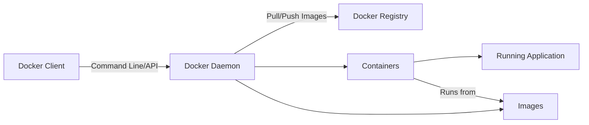
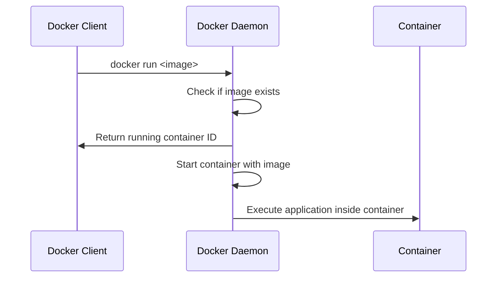
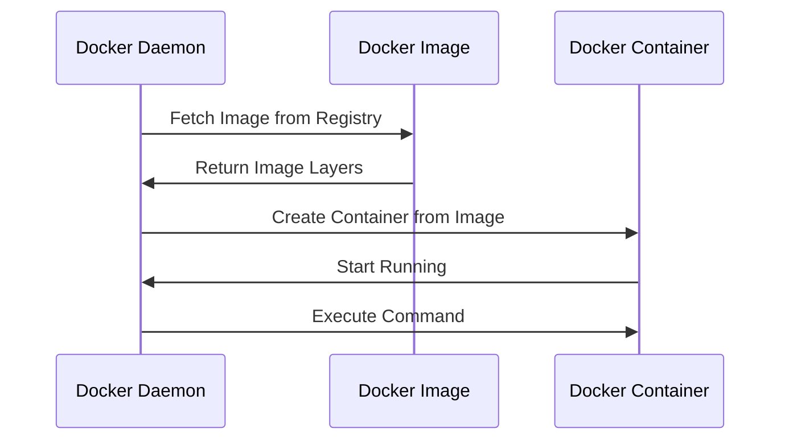
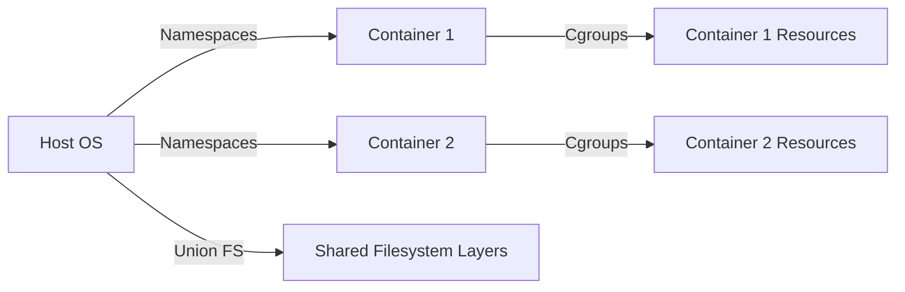
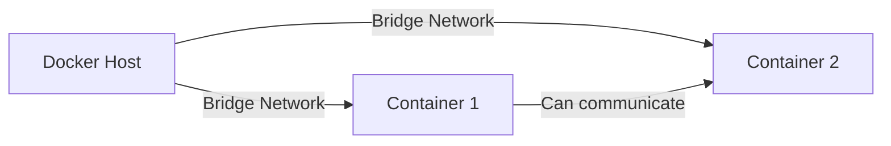

# Docker Internals

Docker is a tool designed to make it easier to create, deploy, and run applications using containers. The internal working of Docker involves several components, each playing a specific role in the containerization process. Below, I will explain the key components and how they interact within Docker using diagrams in **Mermaid**.

## Docker Architecture Overview

The core components of Docker are:

- **Docker Client**: The interface used by users to interact with Docker (CLI or API).
- **Docker Daemon**: The background service that manages Docker containers, images, networks, etc.
- **Docker Images**: Pre-configured templates to create containers.
- **Docker Containers**: Running instances of Docker images.
- **Docker Registry**: A storage for Docker images, often Docker Hub.

Here’s a high-level architecture diagram:

## Docker Client and Daemon Interaction

The **Docker Client** sends commands to the **Docker Daemon** (server-side), which then executes those commands. For example, when you run `docker run`, the Docker Client sends this command to the Docker Daemon, which decides what to do based on the request (e.g., pull an image, create a container, etc.).

## Docker Images and Containers

A **Docker Image** is a lightweight, portable, and executable package that includes everything needed to run a piece of software, including the code, runtime, libraries, and environment variables. A **Container** is a running instance of a Docker Image.

The process of creating a container from an image looks like this:

## Docker Container Internals

Internally, each **Docker container** is isolated using Linux kernel features such as:

- **Namespaces**: Provide isolation for resources (PID, Mount, Network, etc.).
- **Cgroups**: Control resource allocation (CPU, Memory, IO).
- **Union File System (UFS)**: Combines multiple layers of Docker images into a single filesystem.

Here’s a diagram showing the isolation:

## Docker Registry

Docker images are stored in a **Docker Registry** (like Docker Hub). The registry holds different versions of images, which can be pulled to create containers. This allows developers to manage and share images easily.

## Docker Network

Docker uses its own network driver to manage container communication. Containers can be connected to different networks (bridge, host, overlay). Here's a simple diagram showing containers in a Docker network:

