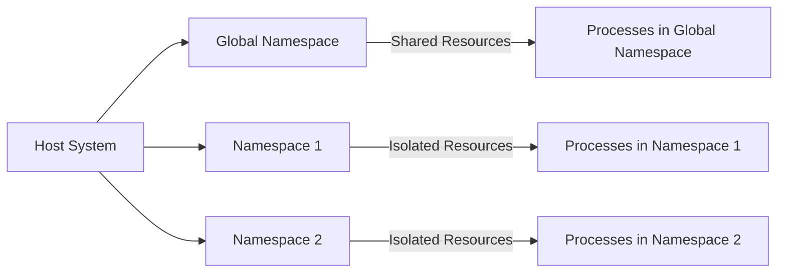
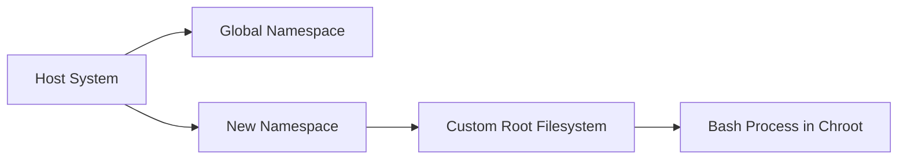

# Linux Namespaces

## Overview of Namespaces

Linux namespaces are a feature of the Linux kernel that allows the isolation of system resources between processes. They form the foundation of containerization technologies like Docker and Kubernetes. By using namespaces, processes can have their own view of system resources, such as:

- **PID (Process ID)**: Isolates the process ID number space.
- **Mount**: Isolates filesystem mount points.
- **UTS (UNIX Timesharing System)**: Isolates the hostname and domain name.
- **Network**: Isolates network interfaces and settings.
- **IPC (Inter-Process Communication)**: Isolates IPC resources like message queues and shared memory.
- **User**: Isolates user and group IDs.

Each namespace type provides isolation for specific resources, ensuring that changes made in one namespace do not affect others.

## Diagram: Relationship Between Host and Namespaces

The following diagram represents a high-level view of how namespaces isolate resources:



In this example:

- The host system can have a global namespace.
- Each namespace isolates its processes and resources.

## Creating and Using Namespaces

To work with namespaces, the `unshare` command is commonly used. Here's a step-by-step guide on creating a new namespace, using a custom root with `chroot`, and running a bash shell inside it.

### Create a Custom Root Filesystem

To use `chroot`, first create a minimal custom root filesystem. This can be done using the `debootstrap` tool (on Debian-based systems) or manually copying necessary binaries and libraries.

#### Example:

```bash
mkdir /tmp/custom-root
cd /tmp/custom-root
mkdir -p bin lib64 etc dev
cp /bin/bash bin/
cp -v /lib64/ld-linux-x86-64.so.2 lib64/
cp -v /lib/x86_64-linux-gnu/libc.so.6 lib64/
cp -v /lib/x86_64-linux-gnu/libdl.so.2 lib64/
```

This creates a minimal root filesystem containing `bash` and its dependencies.

### Run a Shell in a New Namespace

Use the `unshare` command to create and enter new namespaces.

#### Example:

```bash
sudo unshare --mount --uts --ipc --net --pid --fork --user bash
```

This creates a new shell with isolated:

- Mount points (`--mount`)
- Hostname (`--uts`)
- IPC resources (`--ipc`)
- Network interfaces (`--net`)
- PID namespace (`--pid`)
- User IDs (`--user`)

You are now inside a set of isolated namespaces.

### Use `chroot` to Enter the Custom Root

Once inside the new namespace, use `chroot` to change the root filesystem to the custom one created earlier.

#### Example:

```bash
sudo chroot /tmp/custom-root /bin/bash
```

At this point, you are in a completely isolated environment with a new root filesystem. You can verify this by running commands like:

```bash
ls /
```

## Diagram: Namespaces with Custom Root

The following diagram shows the relationship between the host system, namespaces, and the custom root:



In this setup:

- A new namespace is created.
- A custom root is used to isolate filesystem operations.
- Processes in the namespace cannot interact with the host filesystem.
