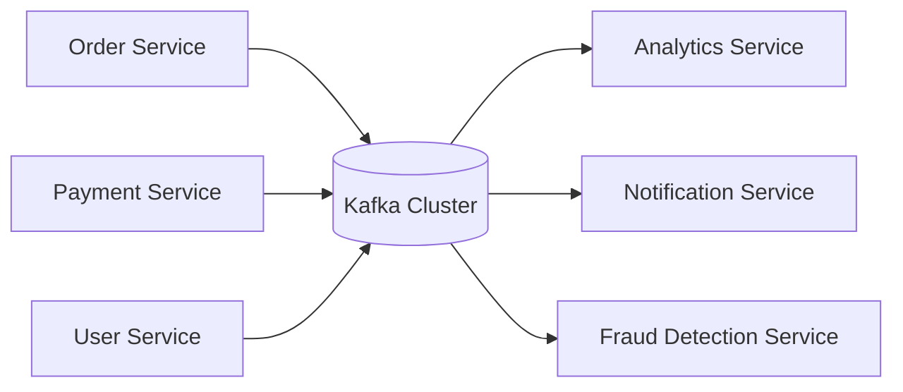
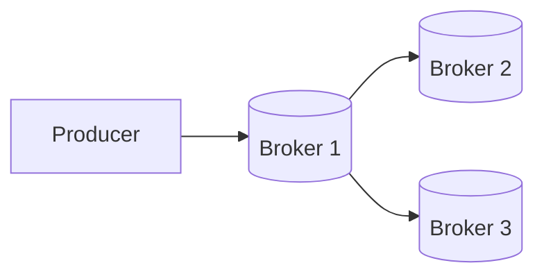
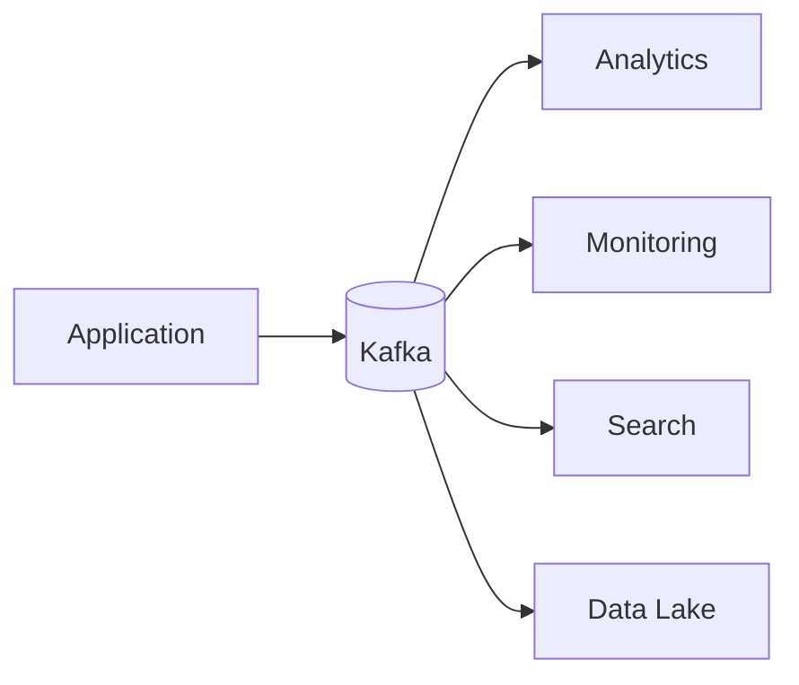

# Introduction

**Apache Kafka** is a distributed event streaming platform designed to handle large volumes of data in real time. It allows applications, services, and systems to continuously exchange data through streams of events while providing high throughput, fault tolerance, scalability, and durability.

Kafka was originally developed at LinkedIn to solve challenges related to processing massive amounts of real-time data and was later open-sourced through the Apache Software Foundation.

At its core, Kafka acts as a highly scalable, distributed commit log where data is written, stored, replicated, and consumed by multiple applications independently.

<div style={{textAlign: 'center'}}>



</div>

In the above example:

- Multiple applications produce data into Kafka.
- Kafka stores the data reliably.
- Multiple consumers can independently read the same data.
- Producers and consumers remain loosely coupled.

## Why Kafka Was Created

Before Kafka, many organizations relied on traditional messaging systems, databases, or custom integrations for exchanging data between services.

As systems grew larger, several challenges emerged:

### Tight Coupling

Applications often communicated directly with one another.

```text
Order Service → Payment Service
Order Service → Email Service
Order Service → Analytics Service
Order Service → Inventory Service
```

As the number of services increased, managing these connections became increasingly complex.

### Scalability Problems

Traditional systems struggled to handle:

- Millions of messages per second
- Thousands of concurrent consumers
- Continuous streams of real-time data

### Data Replay Difficulties

In many messaging systems, once a message was consumed, it disappeared permanently.

If:

- A consumer crashed
- A bug corrupted data
- A new service needed historical data

Recovering the original messages became difficult or impossible.

### Reliability Concerns

Organizations needed guarantees that:

- Messages would not be lost
- Systems could survive failures
- Data remained available during outages

Kafka was designed specifically to address these challenges.

## Core Goals of Kafka

Kafka was built around several key objectives.

### High Throughput

Kafka is capable of handling millions of messages per second by:

- Sequential disk writes
- Efficient batching
- Network optimization
- Distributed architecture

### Fault Tolerance

Failures are expected in distributed systems.

Kafka protects against failures by:

- Replicating data across multiple servers
- Automatically electing new leaders during failures
- Preserving data durability

### Scalability

Kafka clusters can scale horizontally.

<div style={{textAlign: 'center'}}>


</div>

As workload increases, additional brokers can be added to the cluster.

### Durability

Kafka stores data on disk and replicates it across brokers.

This ensures data remains available even if servers fail.

### Decoupling

Kafka separates producers from consumers.

Producers do not need to know:

- Who consumes the data
- How many consumers exist
- Whether consumers are currently online

Consumers can independently read data whenever needed.

## Kafka as a Distributed Commit Log

One of the most important ways to understand Kafka is to think of it as a **distributed commit log**.

A commit log is an append-only data structure where new records are continuously added to the end.

```text
+---------------------------------------------------+
| Record 0 | Record 1 | Record 2 | Record 3 | ... |
+---------------------------------------------------+
```

Existing records are not modified.

New records are simply appended.

This design provides several benefits:

- Fast writes
- Predictable performance
- Ordered storage
- Efficient replication

Kafka extends this concept across multiple machines, making it a distributed commit log.

<div style={{textAlign: 'center'}}>



</div>

Data written by producers can be replicated across multiple brokers, providing durability and fault tolerance.

## Kafka as an Event Streaming Platform

Kafka is often described as an **event streaming platform** rather than simply a message broker.

A message broker primarily focuses on delivering messages between applications.

Kafka goes further by providing:

- Persistent storage
- Stream processing capabilities
- Replayability
- Large-scale event distribution
- Long-term event retention

<div style={{textAlign: 'center'}}>



</div>

A single event written to Kafka can be consumed by many independent systems without affecting other consumers.

## Common Use Cases of Kafka

Kafka is widely used across modern distributed systems.

### Microservices Communication

Services exchange events without direct dependencies.

```text
Order Created
Payment Completed
Inventory Updated
Shipment Delivered
```

### Log Aggregation

Application logs from many servers are collected into Kafka and processed centrally.

### Real-Time Analytics

Business metrics can be calculated as events occur.

Examples:

- User activity
- Purchases
- Clickstreams
- Application metrics

### Event Sourcing

Kafka can serve as the central event store for applications that store state changes as events.

### Data Integration

Kafka acts as a data backbone connecting:

- Databases
- Applications
- Data warehouses
- Analytics systems

## Why Kafka Became Popular

Kafka became one of the most widely adopted data platforms because it combines several capabilities into a single system:

- Message distribution
- Persistent storage
- Horizontal scalability
- Fault tolerance
- Event replay
- Stream processing support

Instead of building separate systems for messaging, storage, replication, and event distribution, organizations can use Kafka as a unified event streaming platform.

This makes Kafka a foundational component in modern data platforms, microservice architectures, real-time analytics systems, and event-driven applications.
