# Architecture

Before learning Producers, Consumers, Replication, or Fault Tolerance, it is important to understand the core building blocks that make up a Kafka cluster.

At its heart, Kafka is a **distributed append-only log system**. Every message produced to Kafka is stored in logs, organized into topics and partitions, and managed by brokers.

The primary building blocks are:

- Kafka Cluster
- Brokers
- Topics
- Partitions
- Records (Messages)
- Offsets

Understanding these concepts is essential because nearly every advanced Kafka feature is built on top of them.

## What is a Kafka Cluster?

A Kafka Cluster is a collection of one or more Kafka brokers working together to store and serve data.

A single broker can run Kafka, but production environments almost always use multiple brokers.

<div style={{textAlign: 'center'}}>

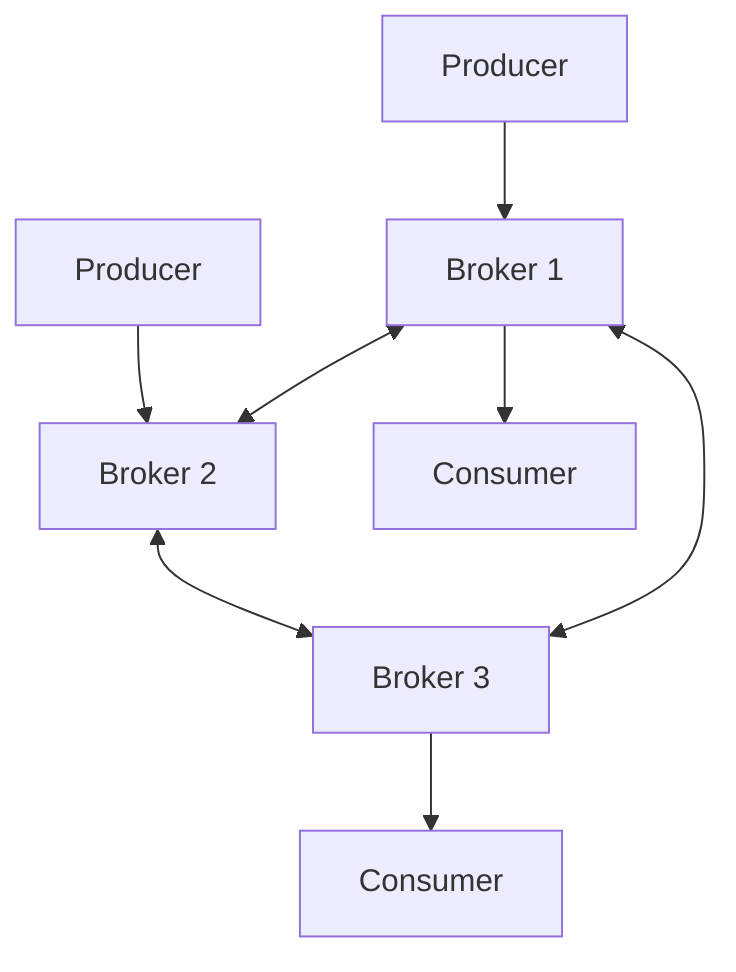

</div>

A cluster provides:

- Scalability
- High Availability
- Fault Tolerance
- Load Distribution

## Why Not Use a Single Server?

Imagine an application generating millions of events every second.

A single machine would eventually face:

- CPU limitations
- Memory limitations
- Disk limitations
- Network limitations

Kafka solves this by distributing data across multiple brokers.

<div style={{textAlign: 'center'}}>

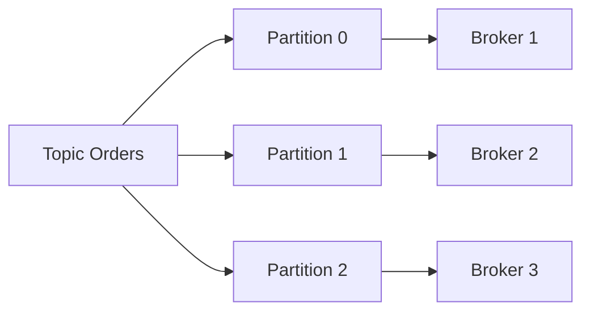

</div>

Data is spread across machines, allowing Kafka to scale horizontally.

## High-Level Data Flow

A typical Kafka workflow looks like:

<div style={{textAlign: 'center'}}>

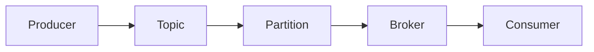

</div>

Step-by-step:

1. Producer sends data.
2. Data is written into a topic.
3. Topic is divided into partitions.
4. Partitions are stored on brokers.
5. Consumers read data.

## Kafka Brokers

A Broker is a Kafka server responsible for storing and serving data.

Every Kafka cluster consists of one or more brokers.

<div style={{textAlign: 'center'}}>

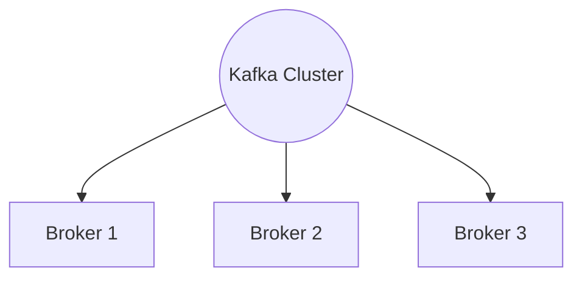

</div>

Think of a broker as a specialized database server that stores Kafka partitions.

> One Kafka broker can store multiple partitions/topics.

### Responsibilities of a Broker

A broker performs several tasks:

- **Store Messages**: Messages are persisted to disk.
- **Serve Consumer Requests**: Consumers fetch messages from brokers.
- **Handle Producer Requests**: Producers send messages to brokers.
- **Replicate Data**: Brokers replicate partitions to other brokers.
- **Participate in Cluster Coordination**: Brokers exchange metadata and coordinate cluster operations.

### Broker Identification

Each broker has a unique identifier.

Example:

```text
Broker 1
Broker 2
Broker 3
```

Kafka uses broker IDs to identify nodes in the cluster.

### Broker Storage

Each broker stores partition data locally.

<div style={{textAlign: 'center'}}>

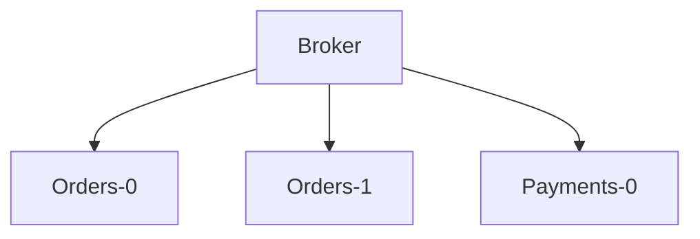

</div>

A broker may host partitions from many topics.

## Topics

A Topic is a logical category used to organize messages.

Examples:

```text
orders
payments
users
notifications
logs
```

A topic acts like a stream of events.

### Real-World Example

Suppose an e-commerce application exists.

Different events may be stored in different topics:

```text
orders
payments
inventory
shipments
```

This separation improves organization and scalability.

### Topic as a Stream

Think of a topic as an endless stream.

<div style={{textAlign: 'center'}}>

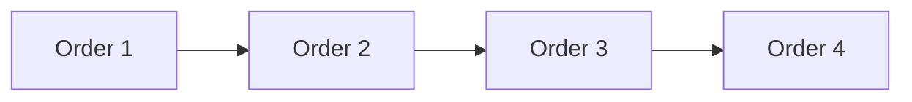

</div>

New messages continue to arrive.

The stream never truly ends.

### Topics are Logical

A common misconception is:

> A topic physically stores data.

This is incorrect.

A topic is a logical abstraction.

Actual data is stored inside partitions.

<div style={{textAlign: 'center'}}>

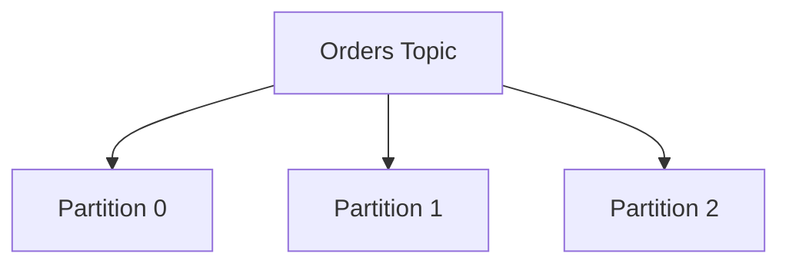

</div>

## Partitions

Without partitions, a topic would become a bottleneck.

Consider:

<div style={{textAlign: 'center'}}>

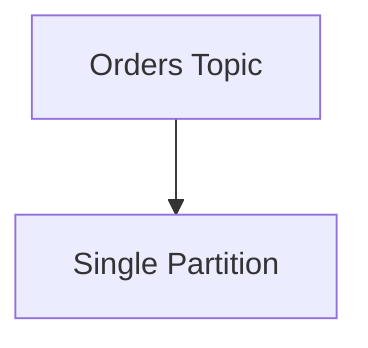

</div>

All traffic would hit one machine. This limits throughput.

### Partitioning for Scalability

Kafka divides topics into partitions.

<div style={{textAlign: 'center'}}>


</div>

Each partition can live on a different broker.

<div style={{textAlign: 'center'}}>

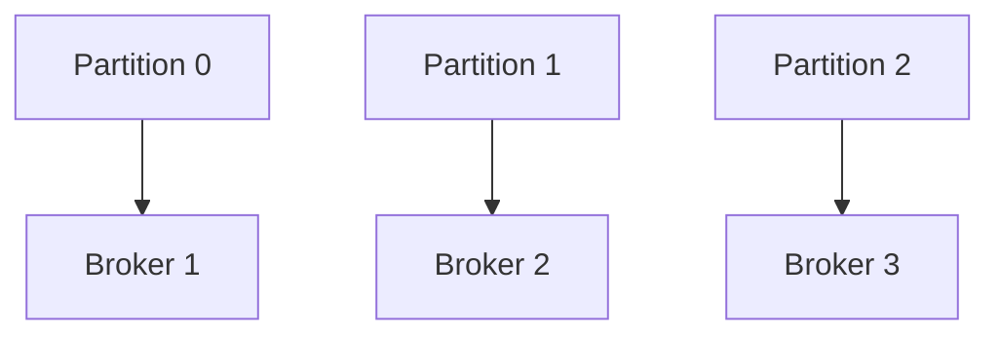

</div>

This allows parallel processing.

### Partition Structure

A partition is an append-only log.

<div style={{textAlign: 'center'}}>

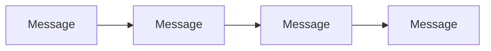

</div>

Messages are always appended to the end.

Existing messages are never modified.

### Ordering Guarantee

Kafka guarantees ordering only within a partition.

Example:

Partition 0

```text
Order Created
Order Paid
Order Shipped
Order Delivered
```

Order is preserved.

Across multiple partitions:

```text
Partition 0 -> Order A
Partition 1 -> Order B
Partition 2 -> Order C
```

Global ordering is not guaranteed.

### Parallel Processing

Partitions enable parallelism.

<div style={{textAlign: 'center'}}>

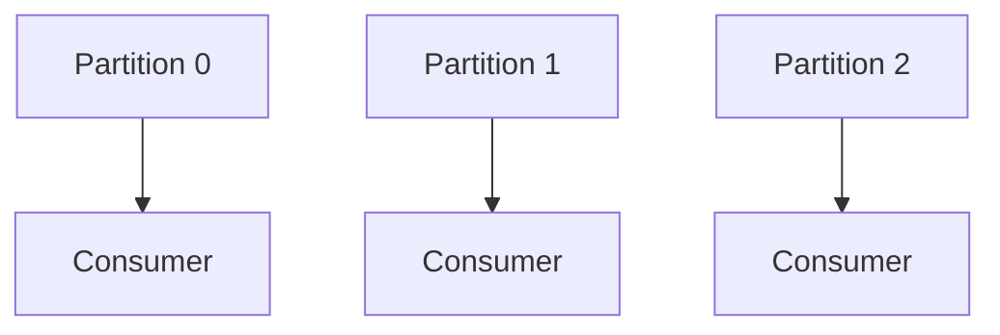

</div>

Multiple consumers can process data simultaneously.

### Partition Keying

Messages may include keys.

Example:

```text
User ID = 101
User ID = 101
User ID = 101
```

Kafka hashes the key.

All messages with the same key go to the same partition.

<div style={{textAlign: 'center'}}>

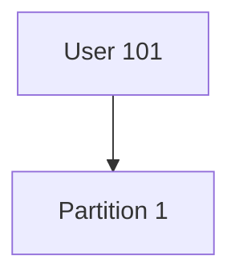

</div>

This preserves ordering for that user.

## Records (Messages)

The smallest unit stored in Kafka is called a Record.

A record contains:

- Key
- Value
- Timestamp
- Headers
- Offset

### Record Structure

```text
Record
├── Key
├── Value
├── Timestamp
├── Headers
└── Offset
```

### Key

The key determines partition placement.

Example:

```text
Key: User-101
```

Messages with identical keys usually land in the same partition.

### Value

The value is the actual payload.

Example:

```json
{
  "orderId": 1001,
  "amount": 500
}
```

### Timestamp

Kafka stores timestamps for records.

Example:

```text
2026-01-10T10:15:00Z
```

Used for:

- Retention
- Monitoring
- Event processing

### Headers

Headers contain metadata.

Example:

```text
source=payment-service
version=v1
```

## Offsets

Every record inside a partition receives a unique sequential number.

This number is called an Offset.

### Example

```text
Partition 0

Offset 0 -> Order Created
Offset 1 -> Order Paid
Offset 2 -> Order Shipped
Offset 3 -> Order Delivered
```

### Visual Representation

<div style={{textAlign: 'center'}}>

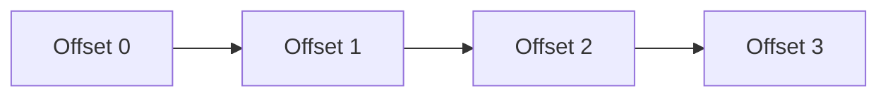

</div>

Offsets always increase.

### Important Rule

Offsets are unique only within a partition.

Example:

```text
Partition 0
Offset 0
Offset 1
Offset 2

Partition 1
Offset 0
Offset 1
Offset 2
```

The same offset value may exist in multiple partitions.

### Why Offsets Matter

Offsets allow consumers to track progress.

Example:

```text
Current Offset = 150
```

Consumer knows:

- Messages before 150 were processed.
- Messages after 150 remain unread.

### Reading from Offsets

Consumers can start reading from:

#### Beginning

```text
Offset 0
```

#### Latest

```text
Most Recent Offset
```

#### Specific Offset

```text
Offset 500
```

This makes replaying historical events possible.

## Relationship Between All Components

The entire hierarchy looks like:

<div style={{textAlign: 'center'}}>

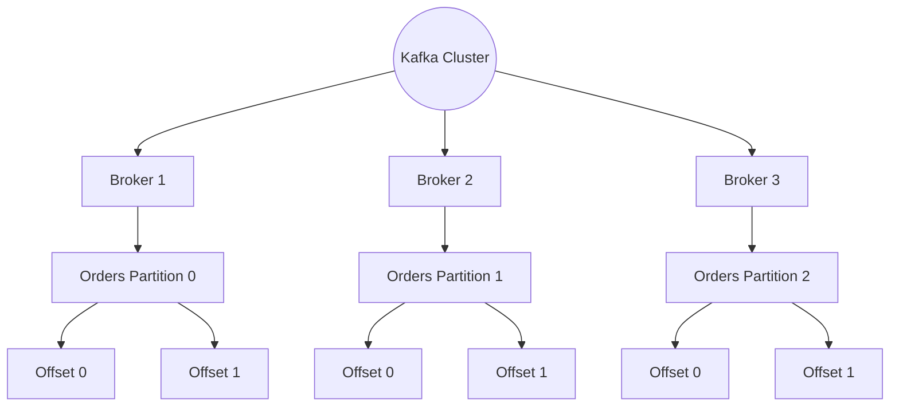

</div>
