# Producers and Consumers

Kafka is fundamentally a data streaming platform that enables applications to exchange events at scale.

At a high level:

- Producers write data into Kafka.
- Kafka stores the data.
- Consumers read the data from Kafka.

<div style={{textAlign: 'center'}}>

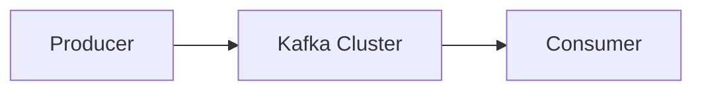

</div>

Everything that happens in Kafka revolves around this simple flow.

Understanding Producers and Consumers is essential because they are the primary interfaces through which applications interact with Kafka.

## The Producer Side

A Producer is an application that publishes records to Kafka.

Examples:

- E-commerce application sending order events
- Payment service sending payment events
- Mobile application sending analytics events
- Web server sending logs

Example event:

```json
{
  "orderId": 1001,
  "customerId": 500,
  "amount": 1500
}
```

The application generating this event is acting as a producer.

### Producer Responsibilities

A Kafka Producer is responsible for:

- Creating records
- Determining the target topic
- Determining the target partition
- Sending records to brokers
- Retrying failed requests
- Handling acknowledgements
- Ensuring delivery guarantees

### Producer Architecture

A producer is not just a simple network client.

Internally it contains several components.

<div style={{textAlign: 'center'}}>

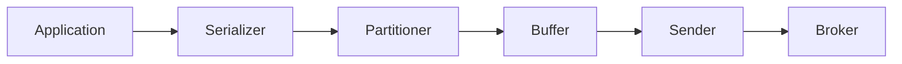

</div>

#### Serializer

Kafka transmits bytes across the network.

Before sending data, Kafka converts objects into byte arrays.

Example:

```json
{
  "orderId": 1001
}
```

may become:

```text
7B226F726465724964223A313030317D
```

Common serializers:

- String Serializer
- JSON Serializer
- Avro Serializer
- Protobuf Serializer

#### Partitioner

The partitioner decides where a record should be stored.

Example:

```text
Topic: orders
Partitions: 3
```

The partitioner chooses:

```text
Partition 0
Partition 1
Partition 2
```

for each record.

#### Buffer Memory

Producers do not immediately send every message.

Instead, records are temporarily stored in memory.

<div style={{textAlign: 'center'}}>

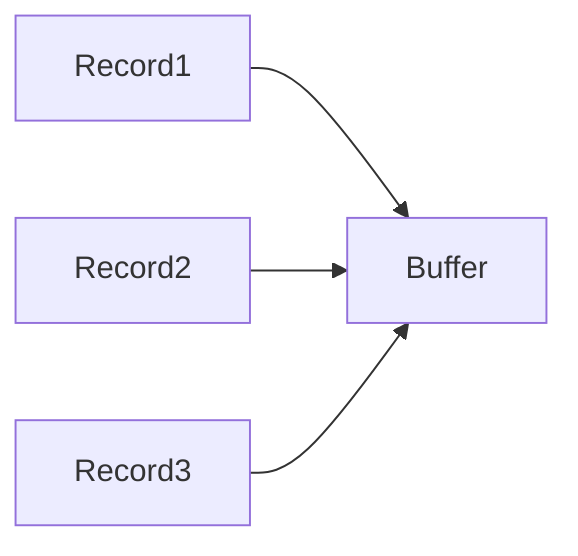

</div>

This allows batching.

#### Sender Thread

A background thread continuously sends accumulated batches to Kafka brokers.

<div style={{textAlign: 'center'}}>

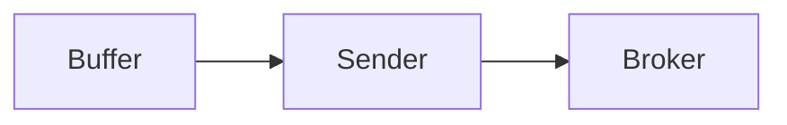

</div>

The application thread remains free to continue processing.

### Producer Workflow

The lifecycle of a record looks like:

<div style={{textAlign: 'center'}}>

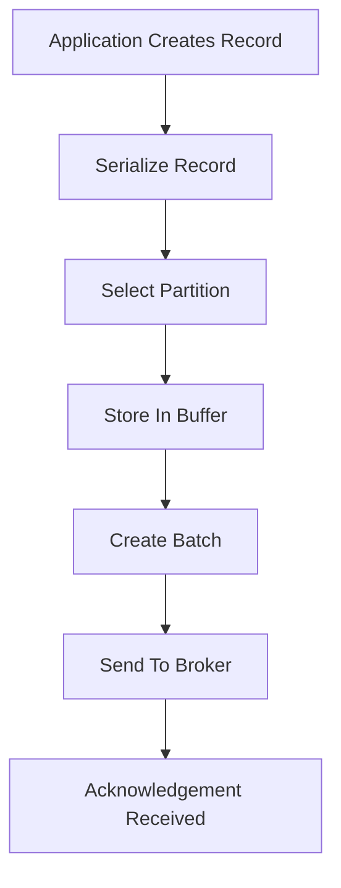

</div>

#### Step 1: Create Record

Application generates an event.

```json
{
  "userId": 101,
  "action": "LOGIN"
}
```

#### Step 2: Serialization

Record converted into bytes.

#### Step 3: Partition Selection

Producer determines target partition.

#### Step 4: Buffering

Record stored in memory.

#### Step 5: Batching

Multiple records combined together.

<div style={{textAlign: 'center'}}>

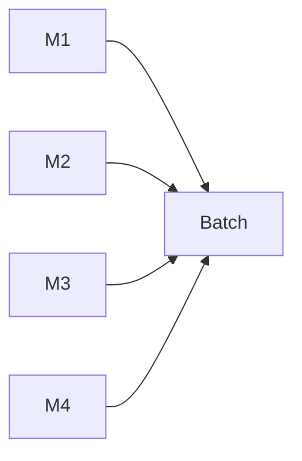

</div>

Batching significantly improves throughput.

#### Step 6: Network Transmission

Batch sent to broker.

#### Step 7: Acknowledgement

Broker confirms successful write.

### Producer Partitioning Strategies

Partitioning is one of Kafka's most important concepts.

It determines:

- Scalability
- Ordering
- Load Distribution

#### Round Robin Partitioning

Messages distributed evenly.

<div style={{textAlign: 'center'}}>

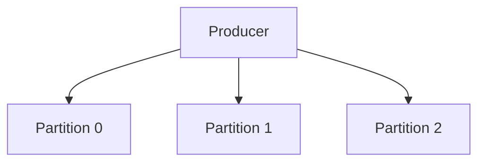

</div>

Example:

```text
Message 1 → Partition 0
Message 2 → Partition 1
Message 3 → Partition 2
Message 4 → Partition 0
```

Advantages:

- Even distribution
- Excellent load balancing

Disadvantages:

- Ordering across related records lost

#### Key-Based Partitioning

Kafka hashes the key.

```text
Partition = hash(key) % totalPartitions
```

Example:

```text
User 101
```

always maps to the same partition.

<div style={{textAlign: 'center'}}>

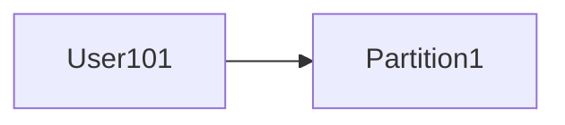

</div>

Advantages:

- Ordering preserved for a given key

Disadvantages:

- Poor key distribution may create hot partitions

#### Sticky Partitioning

When records have no key, Kafka attempts to keep sending records to the same partition temporarily.

<div style={{textAlign: 'center'}}>

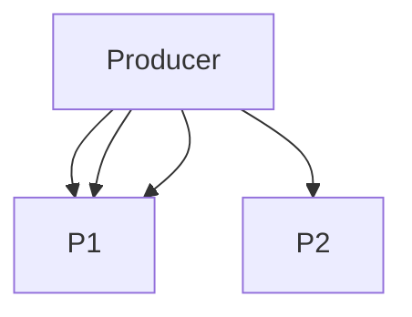

</div>

Benefits:

- Larger batches
- Better throughput

#### Custom Partitioners

Applications may implement custom logic.

Example:

```text
Premium Users → Partition 0
Regular Users → Partition 1
```

Useful for specialized workloads.

### Producer Acknowledgements

After writing data, brokers send acknowledgements.

The producer controls how much confirmation it requires.

#### acks = 0

Producer does not wait.

<div style={{textAlign: 'center'}}>

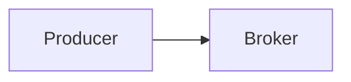

</div>

No confirmation returned.

Advantages:

- Lowest latency

Disadvantages:

- Possible message loss

#### acks = 1

Producer waits for leader acknowledgement.

<div style={{textAlign: 'center'}}>

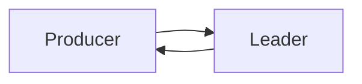

</div>

Advantages:

- Good balance

Disadvantages:

- Data may still be lost if leader crashes before replication

#### acks = all

Producer waits for all in-sync replicas.

<div style={{textAlign: 'center'}}>

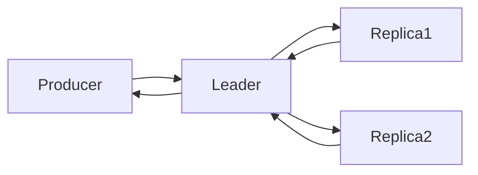

</div>

Advantages:

- Maximum durability

Disadvantages:

- Higher latency

### Producer Delivery Guarantees

Kafka supports three delivery models.

#### At Most Once

Message may be lost.

Message never duplicated.

```text
0 or 1 delivery
```

#### At Least Once

Message never lost.

Duplicate delivery possible.

```text
1 or more deliveries
```

Most common production setup.

#### Exactly Once

Message delivered exactly one time.

```text
Exactly 1 delivery
```

Requires:

- Idempotent Producer
- Transactions

## The Consumer Side

A Consumer reads records from Kafka.

Examples:

- Order Processing Service
- Notification Service
- Analytics Service
- Fraud Detection Service

<div style={{textAlign: 'center'}}>

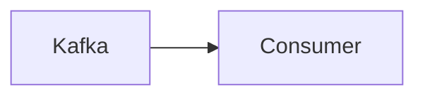

</div>

### Consumer Responsibilities

Consumers:

- Subscribe to topics
- Fetch records
- Process records
- Track offsets
- Handle failures

### Consumer Architecture

Internally, consumers are simpler than producers.

<div style={{textAlign: 'center'}}>

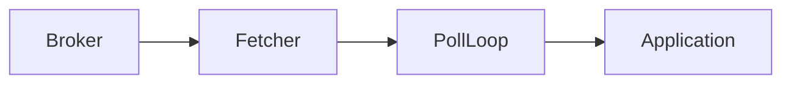

</div>

#### Fetcher

Fetches records from brokers.

#### Poll Loop

Applications continuously call:

```java
consumer.poll(...)
```

to retrieve records.

Kafka uses a pull-based model.

### Why Pull Instead of Push?

Push Model:

<div style={{textAlign: 'center'}}>

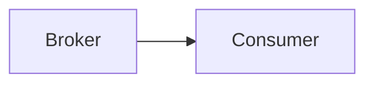

</div>

Potential issue:

Consumer overwhelmed.

Pull Model:

<div style={{textAlign: 'center'}}>

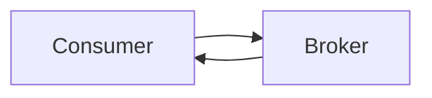

</div>

Consumer controls consumption speed.

This improves scalability.

### Consumer Workflow

<div style={{textAlign: 'center'}}>

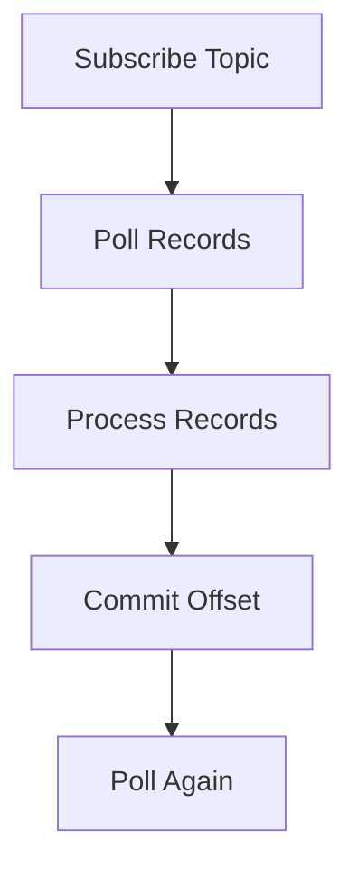

</div>

#### Step 1: Subscribe

Consumer subscribes to topic.

```java
consumer.subscribe(...)
```

#### Step 2: Poll

Fetch records from broker.

#### Step 3: Process

Business logic executes.

Example:

```text
Send Email
Update Database
Generate Invoice
```

#### Step 4: Commit Offset

Consumer stores progress.

#### Step 5: Continue

Process repeats forever.

### Consumer Groups

Consumer Groups are one of Kafka's most powerful features.

#### Why Consumer Groups Exist

Without groups:

<div style={{textAlign: 'center'}}>

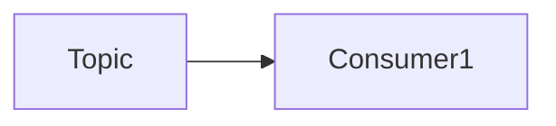

</div>

Only one consumer processes everything.

Scaling becomes difficult.

### Consumer Group Concept

<div style={{textAlign: 'center'}}>

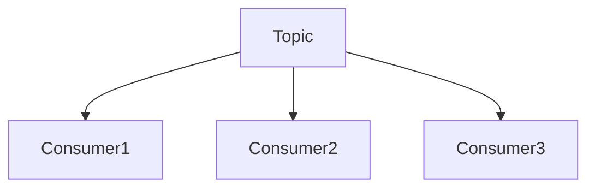

</div>

Kafka distributes partitions among consumers.

#### Partition Assignment

Suppose:

```text
Topic Partitions = 3
Consumers = 3
```

Assignment:

<div style={{textAlign: 'center'}}>

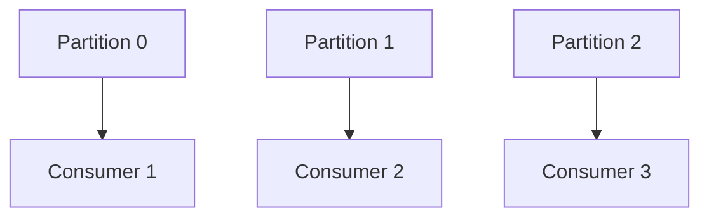

</div>

Each partition belongs to only one consumer within the group.

#### More Consumers Than Partitions

Example:

```text
Partitions = 3
Consumers = 5
```

<div style={{textAlign: 'center'}}>

```mermaid
graph TD

    P0 --> C1
    P1 --> C2
    P2 --> C3

    C4[Consumer 4 Idle]
    C5[Consumer 5 Idle]
```

</div>

Extra consumers remain idle.

#### More Partitions Than Consumers

Example:

```text
Partitions = 6
Consumers = 3
```

<div style={{textAlign: 'center'}}>

```mermaid
graph TD

    P0 --> C1
    P1 --> C1

    P2 --> C2
    P3 --> C2

    P4 --> C3
    P5 --> C3
```

</div>

Consumers process multiple partitions.

### Consumer Rebalancing

A rebalance occurs whenever partition ownership changes.

#### Common Triggers

##### New Consumer Joins

```text
Consumer 4 Added
```

Partitions reassigned.

##### Consumer Leaves

```text
Consumer 2 Crashed
```

Remaining consumers receive its partitions.

##### Partition Count Changes

Topic partitions increased.

Reassignment required.

#### Rebalance Example

Before:

<div style={{textAlign: 'center'}}>

```mermaid
graph TD

    P0 --> C1
    P1 --> C2
```

</div>

After Consumer 3 Joins:

<div style={{textAlign: 'center'}}>

```mermaid
graph TD

    P0 --> C1
    P1 --> C2
    P2 --> C3
```

</div>

### Rebalance Cost

During rebalancing:

- Consumption pauses
- Ownership changes
- Offset synchronization occurs

Frequent rebalances reduce throughput.

#### Consumer Offset Management

Offsets represent consumer progress.

### Automatic Commit

Kafka periodically commits offsets.

```text
enable.auto.commit=true
```

Advantages:

- Simple

Disadvantages:

- Potential message loss

### Manual Commit

Application controls commits.

<div style={{textAlign: 'center'}}>

```mermaid
graph TD

    ProcessRecord --> CommitOffset
```

</div>

Advantages:

- Greater reliability

Disadvantages:

- More complexity

### Commit After Processing

Preferred pattern:

<div style={{textAlign: 'center'}}>

```mermaid
graph TD

    Read --> Process --> Commit
```

</div>

If processing succeeds:

Commit.

If processing fails:

Do not commit.

Record can be retried.

## End-to-End Producer to Consumer Flow

The complete flow looks like:

<div style={{textAlign: 'center'}}>

```mermaid
graph TD

    Producer

    Producer --> Topic

    Topic --> Partition0
    Topic --> Partition1
    Topic --> Partition2

    Partition0 --> Broker1
    Partition1 --> Broker2
    Partition2 --> Broker3

    Broker1 --> Consumer1
    Broker2 --> Consumer2
    Broker3 --> Consumer3
```

</div>

Detailed sequence:

<div style={{textAlign: 'center'}}>

```mermaid
sequenceDiagram

    participant P as Producer
    participant B as Broker
    participant C as Consumer

    P->>B: Send Record
    B-->>P: Acknowledgement

    C->>B: Poll Records
    B-->>C: Return Records

    C->>C: Process Records
    C->>B: Commit Offset
```

</div>
