# Replication and Fault Tolerance

One of Kafka's most important features is its ability to continue operating even when machines fail. In a distributed system, failures are not exceptional events, they are expected events.

- Machines crash.
- Disks fail.
- Networks become unavailable.
- Processes stop unexpectedly.

If Kafka stored every partition on only one broker, the failure of that broker would result in data loss and service unavailability. To solve this problem, Kafka uses:

- Replication
- Leader-Follower Architecture
- In-Sync Replicas (ISR)
- Automatic Failover
- Durable Storage

These mechanisms allow Kafka to provide high availability and strong durability guarantees.

## Why Replication Exists

Consider a Kafka cluster with three brokers.

<div style={{textAlign: 'center'}}>

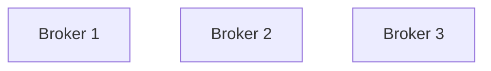

</div>

Suppose a partition exists only on Broker 1.

<div style={{textAlign: 'center'}}>

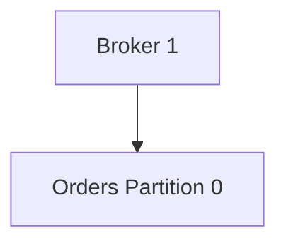

</div>

Everything works normally.

Now Broker 1 crashes.

<div style={{textAlign: 'center'}}>

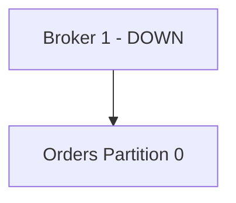

</div>

The partition becomes unavailable. Consumers cannot read. Producers cannot write. If the disk is permanently lost, all data is lost.

This is known as a **Single Point of Failure (SPOF)**. Replication eliminates this problem.

## Kafka Replication

Replication means maintaining multiple copies of the same partition across different brokers.

Instead of storing a partition on a single machine:

<div style={{textAlign: 'center'}}>

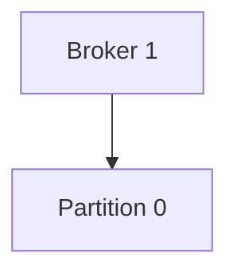

</div>

Kafka stores multiple copies.

<div style={{textAlign: 'center'}}>

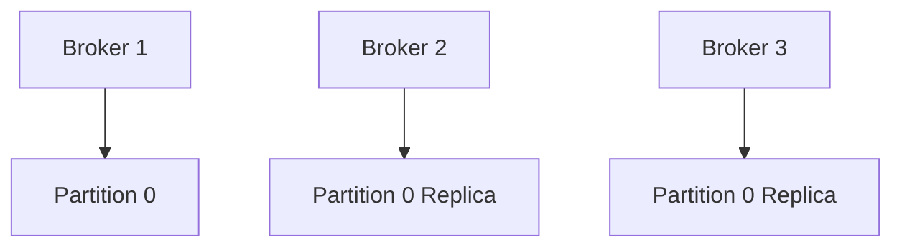

</div>

Now the failure of one broker does not result in partition loss.

### Replication Factor

The number of copies maintained by Kafka is called the **Replication Factor (RF)**.

Example:

```text
Replication Factor = 1
```

One copy exists.

<div style={{textAlign: 'center'}}>

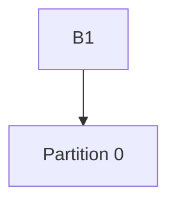

</div>

No fault tolerance.

Example:

```text
Replication Factor = 2
```

Two copies exist.

<div style={{textAlign: 'center'}}>

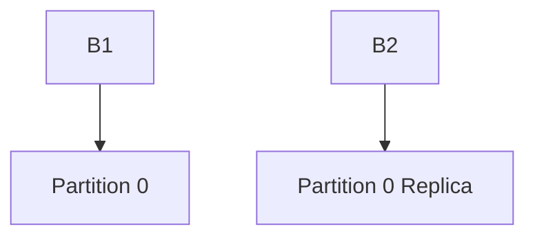

</div>

One broker can fail safely.

Example:

```text
Replication Factor = 3
```

Three copies exist.

<div style={{textAlign: 'center'}}>

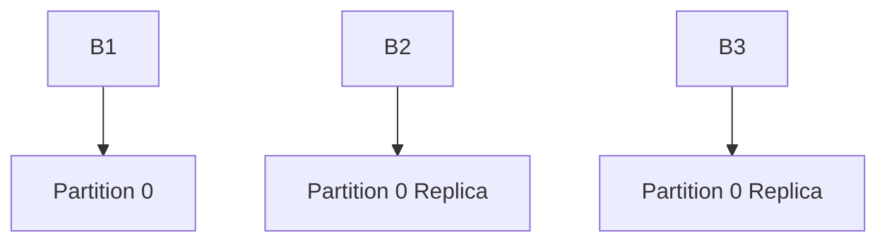

</div>

Two failures can potentially be tolerated depending on ISR state.

### Replication Factor vs Number of Brokers

Replication factor cannot exceed available brokers.

Example:

```text
Brokers = 3
Replication Factor = 5
```

Impossible.

Kafka cannot place five replicas on only three brokers.

Rule:

```text
Replication Factor <= Number of Brokers
```

## Leaders and Followers

Replication alone is not enough. Kafka also needs a mechanism for coordinating reads and writes. This is where Leaders and Followers come in.

### Leader Replica

Every partition has exactly one Leader.

Example:

<div style={{textAlign: 'center'}}>

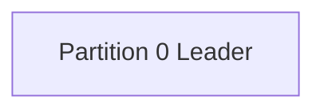

</div>

The leader handles:

- Producer writes
- Consumer reads
- Replica synchronization

All client traffic flows through the leader.

### Follower Replicas

The remaining replicas are Followers.

<div style={{textAlign: 'center'}}>

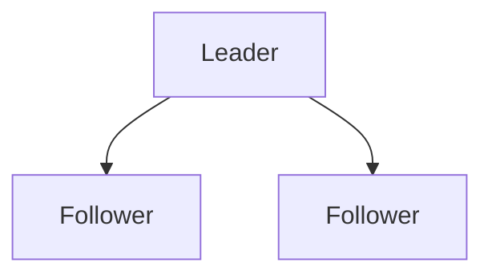

</div>

Followers do not serve normal client requests.

Their primary responsibility is to copy data from the leader.

### Leader-Follower Architecture

Consider:

```text
Partition 0
Replication Factor = 3
```

<div style={{textAlign: 'center'}}>

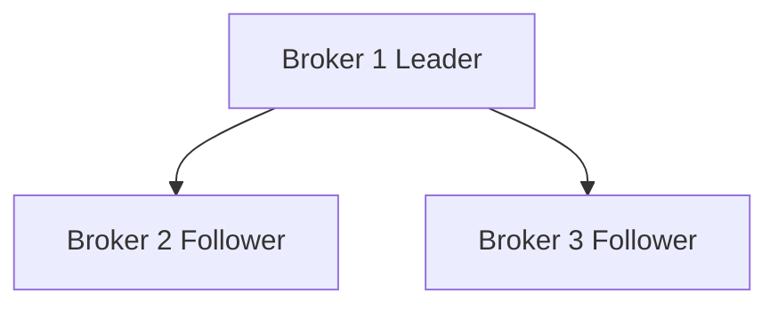

</div>

Producer writes:

<div style={{textAlign: 'center'}}>

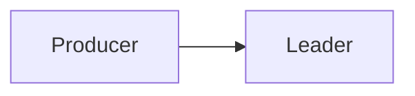

</div>

Consumer reads:

<div style={{textAlign: 'center'}}>

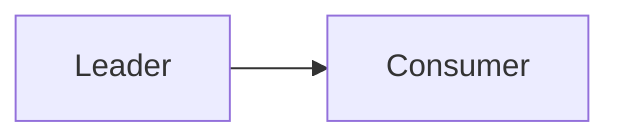

</div>

Replication:

<div style={{textAlign: 'center'}}>

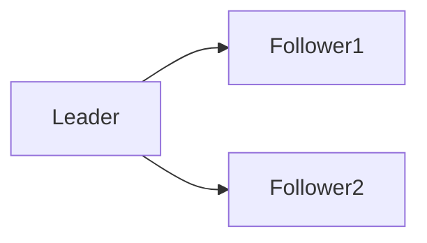

</div>

This architecture simplifies consistency management.

### Why Not Allow Writes to Followers?

Imagine allowing writes to all replicas.

<div style={{textAlign: 'center'}}>

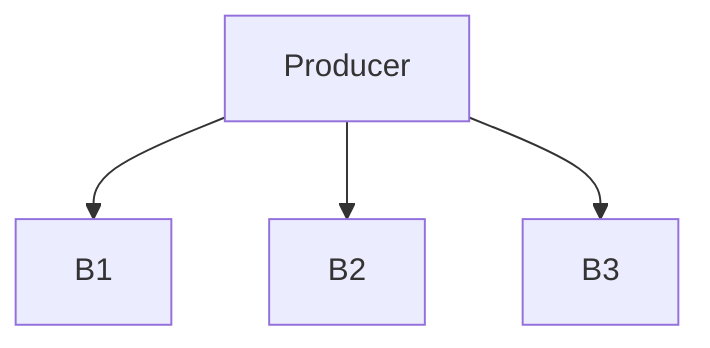

</div>

Potential problems:

- Conflicting writes
- Ordering issues
- Complex synchronization

Kafka avoids these problems by making the leader the single source of truth.

## Replication Workflow

Consider a producer sending a record.

```json
{
  "orderId": 1001
}
```

### Step 1: Producer Sends Record

<div style={{textAlign: 'center'}}>


</div>

### Step 2: Leader Appends Record

<div style={{textAlign: 'center'}}>

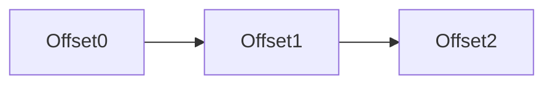

</div>

New record appended.

<div style={{textAlign: 'center'}}>

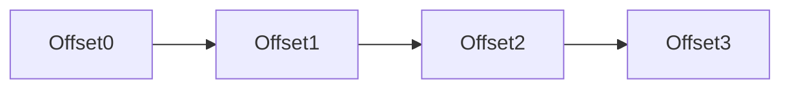

</div>

### Step 3: Followers Fetch Data

Followers continuously pull updates from leader.

<div style={{textAlign: 'center'}}>


</div>

### Step 4: Followers Append Record

Followers write the same record.

<div style={{textAlign: 'center'}}>

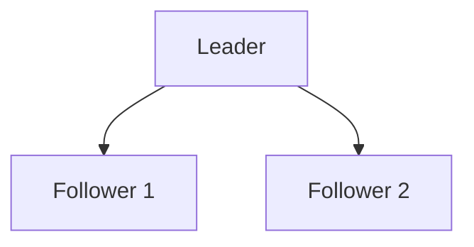

</div>

### Step 5: Acknowledgement

Depending on producer configuration:

```text
acks=0
acks=1
acks=all
```

Kafka may acknowledge immediately or wait for replica synchronization.

## In-Sync Replicas (ISR)

Not every replica is always healthy.

Some replicas may:

- Fall behind
- Experience network issues
- Become overloaded

Kafka therefore maintains a special set called the **In-Sync Replica Set (ISR)**.

ISR contains replicas that are sufficiently caught up with the leader.

### Example ISR

<div style={{textAlign: 'center'}}>

```mermaid
graph TD

    L[Leader]
    F1[Follower 1]
    F2[Follower 2]

    L --> F1
    L --> F2
```

</div>

All replicas synchronized.

ISR:

```text
ISR = {Leader, Follower1, Follower2}
```

### Lagging Replica

Suppose Follower 2 falls behind.

<div style={{textAlign: 'center'}}>

```mermaid
graph TD

    L[Leader]
    F1[Follower 1]
    F2[Follower 2 Lagging]
```

</div>

Kafka removes it from ISR.

```text
ISR = {Leader, Follower1}
```

Follower 2 still exists.

It simply is not considered fully synchronized.

### Why ISR Matters

Kafka uses ISR for:

- Durability decisions
- Acknowledgements
- Leader elections
- Failure recovery

ISR is one of the most important concepts in Kafka.

## Producer Acknowledgements and ISR

Recall:

```text
acks=all
```

This means:

> Do not acknowledge until all ISR replicas have stored the record.

Example:

<div style={{textAlign: 'center'}}>

```mermaid
graph TD

    Producer --> Leader

    Leader --> F1
    Leader --> F2

    F1 --> Leader
    F2 --> Leader

    Leader --> Producer
```

</div>

Only after ISR confirmation does producer receive success.

This provides maximum durability.

## Leader Failure

Now consider the leader crashing.

Initial state:

<div style={{textAlign: 'center'}}>

```mermaid
graph TD

    L[Leader]
    F1[Follower 1]
    F2[Follower 2]
```

</div>

Producer writes normally.

Suddenly:

<div style={{textAlign: 'center'}}>

```mermaid
graph TD

    L[Leader DOWN]
    F1[Follower 1]
    F2[Follower 2]
```

</div>

Without failover:

- Partition unavailable
- Consumers blocked
- Producers blocked

Kafka solves this using leader election.

## Leader Election

When a leader fails: Kafka selects a new leader from ISR.

Example:

Before failure:

```text
ISR = {Leader, Follower1, Follower2}
```

Leader crashes.

```text
ISR = {Follower1, Follower2}
```

Kafka elects:

<div style={{textAlign: 'center'}}>

```mermaid
graph TD

    F1[New Leader]
    F2[Follower]
```

</div>

Clients continue operating.

The partition remains available.

## Why Only ISR Members Become Leaders?

Suppose a lagging replica becomes leader.

<div style={{textAlign: 'center'}}>

```mermaid
graph TD

    OldLeader[Leader]
    LaggingReplica[Lagging Replica]
```

</div>

Some records may never have reached the lagging replica. Promoting it could cause data loss. Therefore Kafka elects leaders from ISR.

## Fault Tolerance in Kafka

Fault tolerance is the ability of a system to continue operating despite failures.

Kafka is designed with failure as a normal operating condition.

### Scenario 1: Broker Failure

Initial cluster:

<div style={{textAlign: 'center'}}>

```mermaid
graph TD

    B1[Broker 1]
    B2[Broker 2]
    B3[Broker 3]
```

</div>

Broker 1 crashes.

<div style={{textAlign: 'center'}}>

```mermaid
graph TD

    B1[Broker 1 DOWN]
    B2[Broker 2]
    B3[Broker 3]
```

</div>
Replicas on Brokers 2 and 3 continue serving traffic. System remains operational.

### Scenario 2: Disk Failure

If one broker loses storage:

<div style={{textAlign: 'center'}}>

```mermaid
graph TD

    B1[Disk Failure]
    B2[Replica]
    B3[Replica]
```

</div>

Replica copies still exist.

Partition survives.

### Scenario 3: Network Partition

A broker may become temporarily unreachable.
<div style={{textAlign: 'center'}}>

```mermaid
graph TD

    Cluster[Kafka Cluster]

    Cluster --> B1
    Cluster --> B2
    Cluster --> B3

    B3 -. Network Issue .- Cluster
```

</div>

Kafka removes unhealthy replicas from ISR.

Cluster continues operating.

### Scenario 4: Consumer Failure

Consumer crashes.

<div style={{textAlign: 'center'}}>

```mermaid
graph TD

    Consumer[Consumer DOWN]
```

</div>

Data remains safely stored in Kafka.

Another consumer can resume processing using offsets.

## Data Durability

Durability means:

> Once Kafka acknowledges a record, the record should survive failures.

Durability is one of Kafka's most important guarantees.

### How Kafka Achieves Durability

Kafka combines:

- Disk Storage
- Replication
- ISR
- Acknowledgements
- Leader Election

to provide durability.

### Persistent Storage

Kafka stores records on disk.

<div style={{textAlign: 'center'}}>

```mermaid
graph TD

    Memory --> Disk
```

</div>

Unlike in-memory systems, data survives process restarts.

### Append-Only Log

Records are appended sequentially.
<div style={{textAlign: 'center'}}>

```mermaid
graph LR

    O0 --> O1 --> O2 --> O3 --> O4
```

</div>

Sequential writes are:

- Fast
- Reliable
- Durable

### Durability Levels

#### Lowest Durability

```text
Replication Factor = 1
acks = 0
```

Fastest. Highest risk of loss.

#### Medium Durability

```text
Replication Factor = 3
acks = 1
```

Good balance. Most common for non-critical workloads.

#### Highest Durability

```text
Replication Factor = 3
acks = all
min.insync.replicas = 2
```

Strong durability guarantees. Widely used in production systems.

## Understanding min.insync.replicas

This configuration defines the minimum number of ISR replicas required for writes.

Example:

```text
Replication Factor = 3
min.insync.replicas = 2
```

Valid:

```text
ISR = {Leader, Follower1}
```

Writes continue.

Invalid:

```text
ISR = {Leader}
```

Writes rejected.

Kafka prioritizes durability over availability.

## High Availability vs Durability

Distributed systems always involve trade-offs.

### Favor Availability

```text
acks=1
```

System continues serving writes more easily.

Potentially less durable.

### Favor Durability

```text
acks=all
min.insync.replicas=2
```

Stronger guarantees.

May reject writes under severe failures.

## Complete Replication Flow

<div style={{textAlign: 'center'}}>

```mermaid
sequenceDiagram

    participant P as Producer
    participant L as Leader
    participant F1 as Follower 1
    participant F2 as Follower 2

    P->>L: Produce Record

    L->>L: Append Record

    L->>F1: Replicate Record
    L->>F2: Replicate Record

    F1-->>L: Acknowledgement
    F2-->>L: Acknowledgement

    L-->>P: Success
```

</div>
