# Storage Internals

Most messaging systems are thought of as network-based systems:

```text
Producer → Broker → Consumer
```

However, one of Kafka's greatest innovations is not networking, it is the persistent storage. Many engineers assume Kafka is fast because it keeps data in memory. Kafka is fast because it is designed around efficient disk access patterns.

In fact, Kafka was specifically built with the assumption that:

> Disk is cheap, memory is limited, and sequential disk operations are extremely fast.

To understand Kafka's performance, durability, scalability, and retention behavior, we must understand how Kafka stores data internally.

This note covers:

- Kafka's Log-Based Storage Model
- Partition Storage Structure
- Segment Files
- Index Files
- Active and Closed Segments
- Log Compaction
- Tombstones
- Retention Policies
- Data Lifecycle

## Why Kafka Uses a Log-Based Storage Model

Traditional databases support operations such as:

```sql
INSERT
UPDATE
DELETE
SELECT
```

Records can be modified at any time.

For example:

```text
User 101 → Premium
```

Later:

```text
User 101 → Basic
```

The original value is overwritten here. Kafka on the other hand very works differently. Kafka treats data as a stream of events. Instead of updating existing data:

```text
User 101 → Premium
User 101 → Basic
User 101 → Premium
```

Every change becomes a new event. Nothing is modified. Nothing is overwritten. Events are simply appended. This design is called an **Append-Only Log**.

### What is a Log?

A log is an ordered sequence of records.

<div style={{textAlign: 'center'}}>

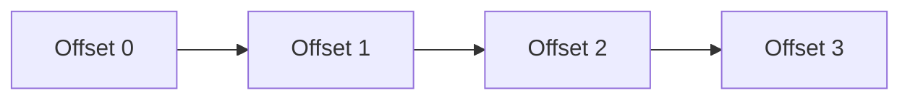

</div>

New records are always added at the end.

<div style={{textAlign: 'center'}}>

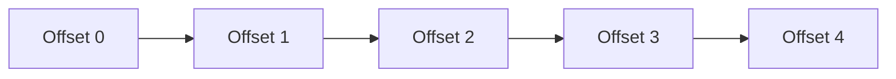

</div>

Existing records remain unchanged.

## Kafka Storage Hierarchy

Kafka organizes storage in several layers.

<div style={{textAlign: 'center'}}>

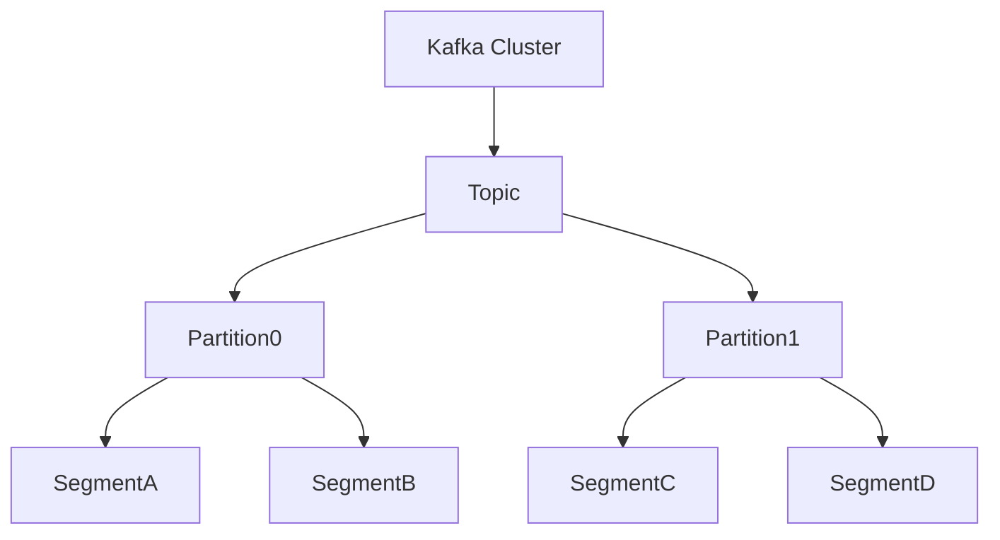

</div>

Hierarchy:

```text
Cluster
 └── Topic
      └── Partition
            └── Segment
                  └── Records
```

This hierarchy is fundamental to Kafka's storage engine.

### Topics Do Not Store Data

One common misconception is:

> Topics contain messages.

Not exactly. Topics are logical constructs. Actual storage happens inside partitions.

<div style={{textAlign: 'center'}}>

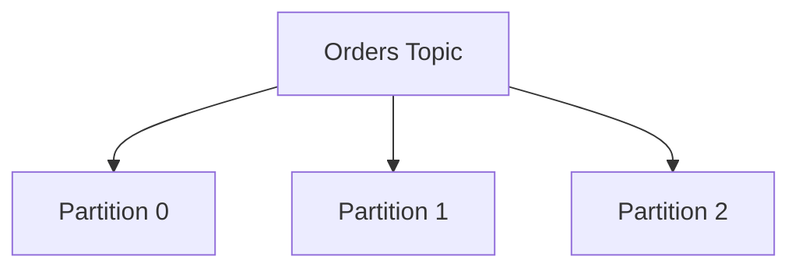

</div>

Each partition is stored independently.

### Partitions Are Logs

Internally, every partition is an append-only log.

Example:

```text
Orders Topic

Partition 0
```

<div style={{textAlign: 'center'}}>


</div>

Every new message is appended at the end. Kafka never inserts records in the middle or never reorders records or never updates records in place. This simplicity is one of Kafka's biggest performance advantages.

### Why Append-Only Storage is Fast

In traditional random writes, disk head needs constantly move. Becuase of this performance decreses significantly.

```text
Write Block 10
Write Block 500
Write Block 1000
Write Block 25
```

Kafka on the other hand writes sequentially:

```text
Offset 0
Offset 1
Offset 2
Offset 3
Offset 4
```

The disk writes continuously.

<div style={{textAlign: 'center'}}>

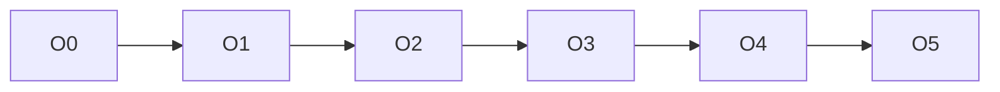

</div>

Sequential I/O is significantly faster than random I/O. This is one reasons why Kafka achieves extremely high throughput.

### Partition Storage on Disk

Each partition corresponds to a directory on disk.

Example:

```text
orders-0
orders-1
orders-2
```

Directory structure:

```text
kafka-logs/

├── orders-0/
├── orders-1/
├── orders-2/
```

Each partition maintains its own storage files.

### Segment Files

A partition does not store everything in one giant file. Instead, Kafka divides partitions into smaller pieces called **Segments**.

#### Why Segments Exist

Imagine a partition storing:

```text
500 GB
```

Single file:

```text
orders.log
```

Problems:

- Hard to manage
- Hard to delete old data
- Recovery becomes expensive

Kafka solves this using segment files.

#### Partition Segmentation

Instead of:

```text
Partition
 └── 500 GB Log
```

Kafka creates:

```text
Partition
 ├── Segment 1
 ├── Segment 2
 ├── Segment 3
 ├── Segment 4
```

<div style={{textAlign: 'center'}}>

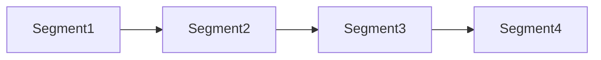

</div>

Each segment contains a portion of the partition.

#### Segment Naming

Example:

```text
00000000000000000000.log
00000000000000050000.log
00000000000000100000.log
```

The filename represents the base offset.

Example:

```text
00000000000000100000.log
```

Means:

```text
First Offset = 100000
```

Records:

```text
100000
100001
100002
100003
```

#### Active Segment

Only one segment accepts writes. This is called the **Active Segment**.

<div style={{textAlign: 'center'}}>

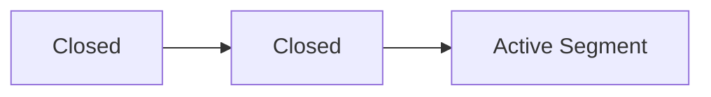

</div>

All new records go into the active segment.

#### Segment Rolling

Eventually the active segment becomes too large. Kafka closes it and creats a new active one.

<div style={{textAlign: 'center'}}>

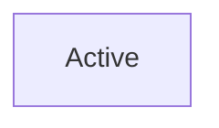

</div>

Becomes:

<div style={{textAlign: 'center'}}>

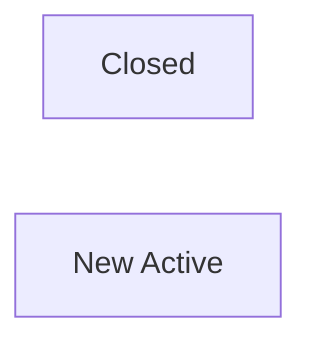

</div>

This process is called **Segment Rolling**.

#### Why Roll Segments?

Because Kafka must efficiently:

- Delete old data
- Compact logs
- Recover partitions
- Manage storage

Working with smaller files is significantly easier.

### Index Files

Suppose a consumer wants:

```text
Offset 800000
```

Without indexing:

```text
Read Offset 0
Read Offset 1
Read Offset 2
...
Read Offset 800000
```

Kafka has to read entire sigment which is extremely inefficient. To solve this Kafka maintains indexes.

<div style={{textAlign: 'center'}}>

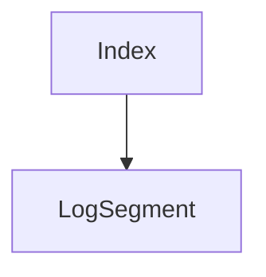

</div>

The index maps:

```text
Offset → File Position
```

Example:

```text
Offset 1000 → Byte Position 20480
Offset 2000 → Byte Position 40560
Offset 3000 → Byte Position 60120
```

Using the index, Kafka can jump directly to the desired location.

#### Offset Index

The Offset Index allows Kafka to quickly locate records within a segment file.

Without an index, Kafka would need to scan the segment from the beginning to find a requested offset.

Conceptually, the index stores mappings like:

```text
Offset → File Position
```

Example:

```text
Offset 50000 → Byte Position 1,048,576
```

When a consumer requests a specific offset, Kafka first consults the Offset Index, jumps close to the record's location in the segment, and then performs a small sequential scan to find the exact record.

This approach keeps index files small while allowing efficient reads from very large partitions.

### Time Index

The Offset Index helps Kafka answer:

> "I know the offset. Where is the record on disk?"

The Time Index solves a different problem:

> "I know the timestamp. Which offset should I start reading from?"

Imagine a partition containing hundreds of millions of records. A consumer wants all events that occurred after:

```text
2026-01-01 10:00:00
```

Without a Time Index, Kafka would need to scan a huge portion of the log looking for the first record with a matching timestamp.

Instead, Kafka maintains a Time Index that maps timestamps to offsets.

This allows Kafka to efficiently support time-based replay without scanning the entire log.

## Reading Data

Now that we understand segments and indexes, let's see what actually happens when a consumer requests a record.

Suppose a consumer asks for:

```text
Partition 0
Offset 100000
```

Kafka does not start reading from Offset 0 and scan forward until it reaches Offset 100000. That would be far too expensive for large partitions.

Instead, Kafka uses its index structures to jump almost directly to the requested record.

Kafka process:

<div style={{textAlign: 'center'}}>

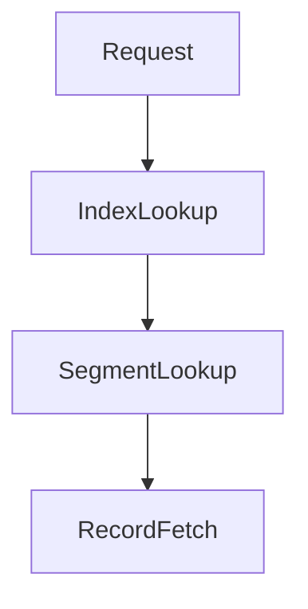

</div>

Steps:

1. Locate segment.
2. Consult index.
3. Seek file position.
4. Read records.

Very efficient even for large partitions.

## Storage Lifecycle of a Record

Understanding the complete lifecycle of a record helps connect all the storage concepts together.

Consider a producer sending:

```json
{
  "orderId": 1001
}
```

The record goes through several stages before it is eventually deleted or compacted.

Step 1:

Producer sends record.

<div style={{textAlign: 'center'}}>

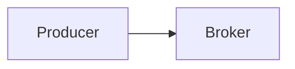

</div>

Step 2:

Broker appends record.

<div style={{textAlign: 'center'}}>

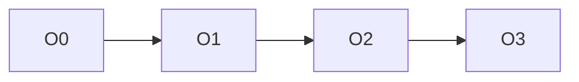

</div>

Step 3:

Record stored in active segment.

Step 4:

Segment eventually closes.

Step 5:

Retention or compaction determines future lifetime.

## Log Compaction

### Why Log Compaction Exists

Many systems care only about the latest state.

Example:

```text
User 101 → Basic
User 101 → Premium
User 101 → Gold
```

Current state:

```text
User 101 → Gold
```

Earlier values may no longer matter.

Without compaction:

```text
Basic
Premium
Gold
```

All versions stored forever.

Storage grows indefinitely.

### What is Log Compaction?

Log compaction removes obsolete records while preserving the latest value for each key.

Example Before Compaction

```text
Offset 0 → User101 = Basic
Offset 1 → User102 = Free
Offset 2 → User101 = Premium
Offset 3 → User101 = Gold
```

After Compaction

```text
Offset 1 → User102 = Free
Offset 3 → User101 = Gold
```

Older versions removed.

Latest state preserved.

### Compaction Visualization

Before:

<div style={{textAlign: 'center'}}>

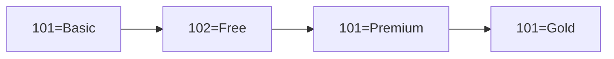

</div>

After:

<div style={{textAlign: 'center'}}>

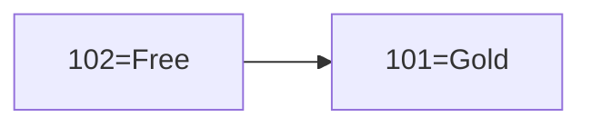

</div>

### Important Property

Compaction does NOT guarantee immediate removal. Kafka compacts in the background. Old records may exist temporarily.

### Tombstones

Kafka uses Tombstones to delete a record. Basically Kafka marks a record to indicate that this record will be deleted.

Example:

```text
User101 = null
```

This special record indicates deletion.

Before:

```text
User101 = Gold
```

Tombstone:

```text
User101 = null
```

After compaction:

```text
User101 removed
```

After the compaction, the key disappears entirely from the segment.

### Retention Policies

Kafka cannot store data forever. Over time, partitions continue to grow as new records are appended.

To prevent unlimited storage growth, Kafka uses **Retention Policies**, which define when old data should be removed from a topic.

Unlike Log Compaction, which keeps the latest value for each key, retention is primarily concerned with **how long data should be kept**.

Most Kafka topics use retention because event streams often have a limited useful lifetime, such as a few days, weeks, or months.

#### What is Retention?

As producers continue writing data, Kafka partitions grow indefinitely.

To prevent disks from eventually filling up, Kafka uses **Retention Policies**, which determine when old data should be removed.

Unlike traditional message queues, Kafka does not delete messages after consumers read them. Records remain in the log until they are removed by the configured retention policy.

Eventually, Kafka deletes old **segments**, freeing disk space.

#### Time-Based Retention

Time-based retention removes data that is older than a configured age.

Example:

```text
retention.ms = 604800000
```

Equivalent to:

```text
7 days
```

Once a segment contains only records older than seven days, Kafka can delete that segment.

<div style={{textAlign: 'center'}}>

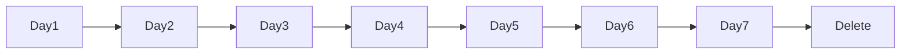

</div>

It is important to note that Kafka deletes data at the **segment level**, not the individual record level. As a result, data may remain slightly longer than the configured retention period until the entire segment becomes eligible for deletion.

#### Size-Based Retention

Retention can also be based on total storage usage.

Example:

```text
retention.bytes = 100 GB
```

Kafka attempts to keep the total size of a partition below the configured limit.

When the limit is exceeded, Kafka removes the oldest segments first.

<div style={{textAlign: 'center'}}>


</div>

Storage exceeds the configured limit.

Kafka removes the oldest segment:

<div style={{textAlign: 'center'}}>

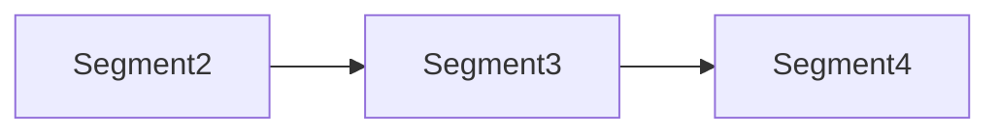

</div>

This process continues until storage falls below the configured threshold.

## Cleanup Policies

A cleanup policy determines **how Kafka removes old data**.

Kafka supports two primary cleanup strategies:

- Delete
- Compact

### Delete Policy

```text
cleanup.policy=delete
```

This is the default and most commonly used cleanup policy.

Kafka removes old segments when they exceed the configured retention period or storage limit.

<div style={{textAlign: 'center'}}>

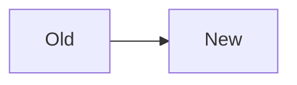

</div>

As data ages out, older segments are deleted.

This policy is commonly used for event streams, logs, metrics, and analytics pipelines where historical data only needs to be retained for a limited period.

### Compact Policy

```text
cleanup.policy=compact
```

Log Compaction preserves the latest value for each key instead of deleting data based on age.

This is commonly used for:

- User profiles
- Application configuration
- Kafka Streams state stores
- Reference data

The goal is not to keep historical changes forever, but to ensure the latest state of each key can always be reconstructed.

## Compact + Delete

Kafka supports both cleanup strategies simultaneously.

```text
cleanup.policy=compact,delete
```

This configuration preserves the latest value for each key while still allowing very old data to be removed.

It combines:

- State preservation through compaction
- Storage management through retention

### Retention vs Compaction

Retention and Compaction solve different problems and are often confused.

| Retention                      | Compaction                               |
| ------------------------------ | ---------------------------------------- |
| Controls how long data is kept | Controls which versions of data are kept |
| Based on age or storage size   | Based on record keys                     |
| Deletes old segments           | Removes obsolete versions of records     |
| Common for event streams       | Common for state-oriented topics         |

Retention asks:

```text
How long should data exist?
```

Compaction asks:

```text
Which versions of data should exist?
```

Example:

```text
Retention:
Delete data older than 30 days
```

```text
Compaction:
Keep only the latest value per key
```

## Complete Storage Architecture

<div style={{textAlign: 'center'}}>

```mermaid
graph TD

    Topic

    Topic --> Partition0
    Topic --> Partition1

    Partition0 --> SegmentA
    Partition0 --> SegmentB
    Partition0 --> SegmentC

    SegmentA --> IndexA
    SegmentB --> IndexB
    SegmentC --> IndexC

    SegmentC --> ActiveSegment
```

</div>
