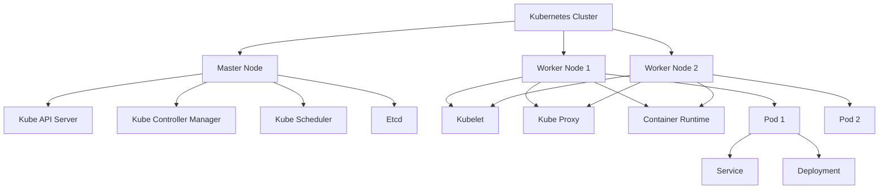

# Components of Kubernetes

Kubernetes has a rich architecture that includes a variety of components working together to enable the deployment, scaling, and management of containerized applications. These components can be divided into two main categories: **Master Node** components and **Worker Node** components.

## Master Node Components

The **Master Node** is the control plane of Kubernetes, responsible for managing the overall state of the cluster and ensuring that the desired state of the applications is achieved. It contains several components:

1. **Kube API Server**

   - **Function**: The API server is the front-end for the Kubernetes control plane. All communication with the Kubernetes cluster (from external clients, nodes, or other components) happens through the API server.
   - **Details**: It exposes the Kubernetes REST API, through which users, management tools, and other components can query and manipulate the state of the cluster.
   - **Role**: Acts as the central hub where all components interact and is responsible for validating and processing REST requests, including those for scheduling and managing containers.

2. **Kube Controller Manager**

   - **Function**: The controller manager runs a set of controllers that handle routine tasks in the cluster, ensuring that the current state of the cluster matches the desired state.
   - **Controllers** include:
     - **Replication Controller**: Ensures the correct number of replicas of a pod are running.
     - **Deployment Controller**: Manages updates to application deployments.
     - **StatefulSet Controller**: Manages stateful applications.
     - **Job Controller**: Manages batch jobs and ensures they complete successfully.
   - **Role**: Handles the lifecycle of resources and reacts to changes in the cluster state.

3. **Kube Scheduler**

   - **Function**: The scheduler watches for newly created pods that have no assigned node, and then it selects an appropriate node for them to run on.
   - **Details**: It makes decisions based on resource requirements, policies, and constraints (like affinity rules, resource availability, etc.).
   - **Role**: Ensures that Pods are scheduled to run on nodes with the necessary resources (CPU, memory, etc.) and within the defined constraints.

4. **Etcd**
   - **Function**: Etcd is a distributed key-value store used by Kubernetes to store all cluster data, including configurations, secrets, and state information.
   - **Details**: It holds the entire cluster's state and configuration, ensuring consistency and availability in the event of a failure.
   - **Role**: Serves as the backing store for all Kubernetes data. Changes to the cluster state are recorded in etcd, which allows other components to track the cluster’s current state.

## Worker Node Components

The **Worker Nodes** are responsible for running the actual applications (containers). Each node in the cluster contains the necessary components to execute containers, manage the networking, and report back to the master node.

1. **Kubelet**

   - **Function**: The kubelet is an agent that runs on every worker node in the cluster. It ensures that the containers running on the node are healthy and are running as specified by the pod specifications.
   - **Role**: It manages container lifecycles and ensures containers are running in the desired state (e.g., starting, stopping, and killing containers).

2. **Kube Proxy**

   - **Function**: Kube proxy is responsible for maintaining network rules on each node. It ensures that network traffic is correctly routed to the appropriate pods.
   - **Details**: It handles load balancing, service discovery, and traffic routing. It creates the necessary iptables (or IPVS) rules to route traffic to pods.
   - **Role**: Acts as a network proxy and load balancer for services.

3. **Container Runtime**

   - **Function**: The container runtime is responsible for pulling container images from a registry and running the containers on the node. Kubernetes supports multiple runtimes, with Docker being the most widely used.
   - **Examples**: Docker, containerd, CRI-O.
   - **Role**: Responsible for the actual execution of containers inside pods.

4. **Pods**
   - **Function**: A pod is the smallest and simplest Kubernetes object. A pod can host one or more containers that share the same network, storage, and namespace.
   - **Role**: Pods are the basic unit of deployment in Kubernetes. Each pod runs on a worker node and encapsulates the application containers, storage volumes, and networking.

## Other Important Concepts in Kubernetes

While the above components are core to the Kubernetes architecture, there are additional concepts and tools that work in tandem with Kubernetes components to manage and enhance the system's operation:

1. **Namespace**

   - **Function**: Provides a mechanism for isolating resources within a cluster.
   - **Role**: Allows multiple teams or projects to coexist within a single cluster without interfering with each other’s resources.

2. **Service**

   - **Function**: A service in Kubernetes is an abstraction that defines a logical set of pods and provides a way to expose them to the network (internally or externally).
   - **Role**: Acts as a load balancer, allowing access to Pods in a consistent way, even when the underlying Pods are dynamic or constantly changing.

3. **Deployment**

   - **Function**: A deployment ensures that a specific number of replicas of a pod are running at any given time. It also manages rolling updates and rollbacks.
   - **Role**: Provides declarative updates to applications, enabling scaling and version control.

4. **ReplicaSet**

   - **Function**: Ensures that a specified number of pod replicas are running at any given time.
   - **Role**: It’s automatically created by a deployment, and it ensures the right number of pod replicas are running to maintain application availability.

5. **StatefulSet**
   - **Function**: Similar to a Deployment but designed for stateful applications, where the identity and storage persist across pod restarts.
   - **Role**: Manages stateful applications that require stable, unique network identifiers and stable persistent storage.

## Summary Diagram

Here’s a simple visual diagram that summarizes the Kubernetes architecture:

- **Master Node Components**: API Server, Controller Manager, Scheduler, and Etcd.
- **Worker Node Components**: Kubelet, Kube Proxy, Container Runtime, and Pods.

This gives an overall view of how the components work together in Kubernetes to manage containerized applications and ensure the cluster runs smoothly.
