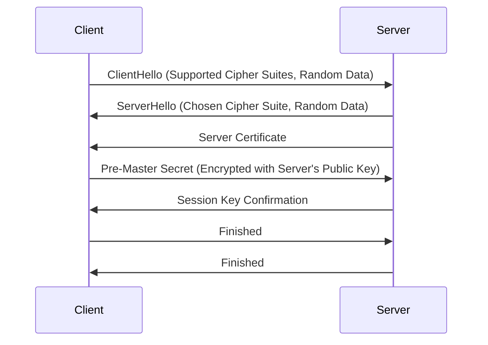

# Transport Layer Security (TLS)

Transport Layer Security (TLS) is a cryptographic protocol that ensures secure communication over a computer network. It is the successor to Secure Sockets Layer (SSL) and provides confidentiality, integrity, and authentication between applications. TLS is widely used in securing web traffic (HTTPS), email, voice over IP (VoIP), and other internet services.

## Advantages of TLS

- **Encryption**: TLS encrypts data transmitted between the client and server, protecting it from eavesdropping.
- **Data Integrity**: Ensures that the data is not tampered with during transmission using message authentication codes (MAC).
- **Authentication**: Uses certificates to authenticate the server (and optionally the client), verifying the identity of the communicating parties.
- **Interoperability**: Supported across major platforms and applications, making it a versatile solution.
- **Performance**: TLS 1.3 introduces improvements that reduce latency and enhance performance compared to previous versions.

## Components of TLS

1. **Handshake Protocol**:
   - Establishes a secure session between the client and server.
   - Negotiates cryptographic algorithms and keys.
2. **Record Protocol**:
   - Secures application data by fragmenting, compressing, encrypting, and attaching a MAC.
3. **Change Cipher Spec Protocol**:
   - Signals a switch to the agreed-upon cryptographic parameters.
4. **Alert Protocol**:
   - Communicates errors or warnings, such as invalid certificates or handshake failures.

## How Handshakes Work

The TLS (Transport Layer Security) handshake is a crucial process for establishing a secure connection between a client and a server. This process ensures confidentiality, integrity, and authentication before any data is transmitted. Below is an overview of how the TLS handshake works:

### Client Hello

- The client (e.g., a web browser) initiates the handshake by sending a **ClientHello** message to the server.
- This message includes:
  - **Supported TLS versions** (e.g., TLS 1.2, TLS 1.3).
  - **Cipher suites** (encryption algorithms supported by the client).
  - **Random data** (a random number generated by the client, used later for key generation).
  - Optionally: Session IDs or extensions like Server Name Indication (SNI).

### Server Hello

- The server responds with a **ServerHello** message.
- This message includes:
  - The chosen **TLS version**.
  - The selected **cipher suite**.
  - Another **random number** generated by the server.
  - Optionally: The server's session ID or extensions.

### Server Certificate (Authentication)

- The server sends its **digital certificate** (usually an X.509 certificate) to prove its identity.
- This certificate contains:

  - The server's public key.
  - Information about the server and its identity.
  - A digital signature from a trusted Certificate Authority (CA).

  **Client Action:** The client verifies the certificate's validity by:

  - Checking the signature against the CA's public key.
  - Ensuring the certificate matches the server's domain name.
  - Confirming the certificate is not expired or revoked.

### Key Exchange

- Depending on the selected cipher suite, the client and server establish a shared secret:
  - **TLS 1.2**:
    - Often uses RSA or Diffie-Hellman (DH) for key exchange.
    - The client generates a **pre-master secret**, encrypts it using the server's public key, and sends it to the server.
    - Both parties derive the same session key from the pre-master secret.
  - **TLS 1.3**:
    - Uses **Elliptic Curve Diffie-Hellman Ephemeral (ECDHE)**.
    - Both client and server exchange ephemeral public keys and derive the shared secret directly without transmitting it.

### Finished Messages

- Both the client and server independently compute a **session key** (derived from the random numbers and shared secret).
- They exchange "Finished" messages, which are encrypted with the session key.
- This step confirms:
  - The session key is successfully established.
  - The handshake integrity is verified (no tampering occurred).

### Secure Communication

- Once the handshake is complete, all further communication between the client and server is encrypted using the session key.
- The session key ensures:
  - **Confidentiality**: Data is encrypted.
  - **Integrity**: Data is not altered.
  - **Authentication**: The server's identity is verified (client authentication is optional).

## Issues with TLS 1.2

- **Handshake Latency**: TLS 1.2 requires multiple round trips to establish a session.
- **Cipher Suite Complexity**: Many insecure cipher suites (e.g., RC4) are still supported.
- **Forward Secrecy**: Not enforced by default, making session keys vulnerable to future attacks if the private key is compromised.
- **Weak Algorithms**: Relies on outdated cryptographic algorithms such as RSA for key exchange, which are computationally expensive.

## Diffie-Hellman Algorithm

The Diffie-Hellman algorithm is a secure method for two parties to establish a shared secret over an insecure communication channel. Here's how it works in detail:

1. **Public Parameters**:

   - Both parties agree on a large prime number `p` (modulus) and a base `g` (generator), which are publicly known. These values can be reused for multiple sessions.

2. **Private Key Generation**:

   - Each party generates a private key:
     - Party A chooses a private key `a` (a large random number).
     - Party B chooses a private key `b` (another large random number).

3. **Compute Public Keys**:

   - Both parties calculate their public keys using the formula:
     - Party A computes `A = g^a mod p` and sends `A` to Party B.
     - Party B computes `B = g^b mod p` and sends `B` to Party A.

4. **Shared Secret Derivation**:

   - Each party uses the other’s public key and their private key to compute the shared secret:
     - Party A computes `S = B^a mod p`.
     - Party B computes `S = A^b mod p`.
   - Both computations yield the same result because `(g^b)^a mod p = (g^a)^b mod p`.

5. **Result**:
   - The shared secret `S` is now known to both parties but remains unknown to eavesdroppers, as they would need to solve the discrete logarithm problem, which is computationally infeasible for large values of `p`.

## Diffie-Hellman in TLS (DHE/ECDHE)

### DHE (Diffie-Hellman Ephemeral)

- **What is it?**
  - DHE uses ephemeral (temporary) keys for each session. The private key is generated dynamically and discarded after the session ends.
- **Advantages**:
  - Provides **Perfect Forward Secrecy (PFS)**, meaning that even if the server's private key is compromised, past sessions cannot be decrypted.
- **Steps in DHE**:
  1. The client and server agree on public parameters `p` and `g`.
  2. Both parties generate temporary private keys (`a` and `b`) and compute corresponding public keys (`A` and `B`).
  3. Public keys are exchanged, and the shared secret is derived using the same steps as the basic Diffie-Hellman algorithm.
  4. The shared secret is used to derive session keys for encryption and MAC.

### ECDHE (Elliptic Curve Diffie-Hellman Ephemeral)

- **What is it?**
  - ECDHE is a variant of DHE that uses elliptic curve cryptography (ECC) instead of modular arithmetic with large prime numbers.
- **Why ECDHE?**
  - **Smaller Keys**: ECDHE offers the same security level as DHE but with much smaller key sizes, leading to better performance.
  - **Efficiency**: Faster computations and reduced overhead, making it suitable for devices with limited resources.
- **Steps in ECDHE**:
  1. Both parties agree on an elliptic curve and a generator point `G` on that curve.
  2. Each party generates a private key (random scalar) and computes a public key by multiplying the private key with the generator point.
  3. Public keys are exchanged.
  4. Each party computes the shared secret by multiplying their private key with the other party's public key. This operation results in the same shared secret because of the commutative property of elliptic curve point multiplication.

### **Comparison: DHE vs. ECDHE**

| Feature         | DHE                        | ECDHE                        |
| --------------- | -------------------------- | ---------------------------- |
| **Key Size**    | Large (1024-4096 bits)     | Smaller (256-512 bits)       |
| **Performance** | Slower                     | Faster                       |
| **Security**    | Strong                     | Equally strong (or stronger) |
| **Use Case**    | High-security environments | Resource-constrained systems |
